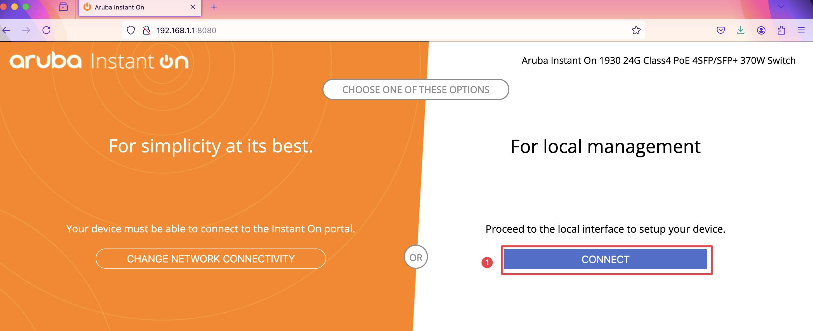
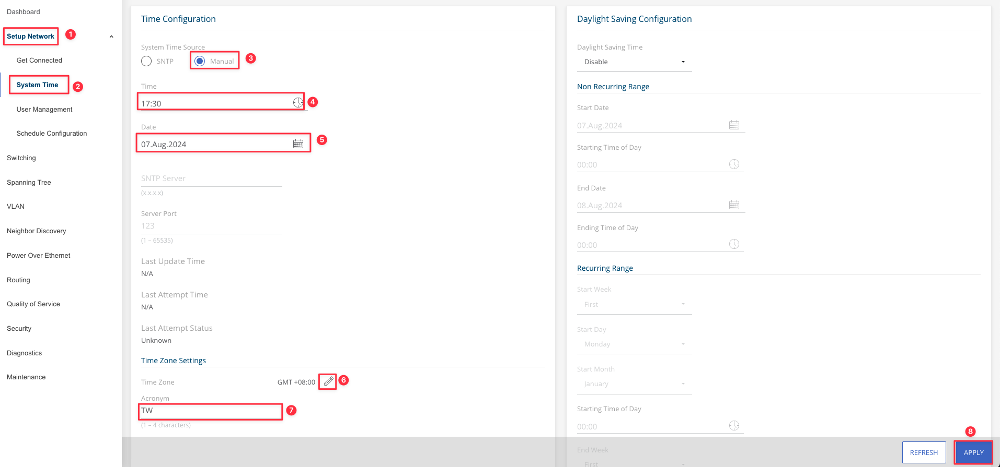
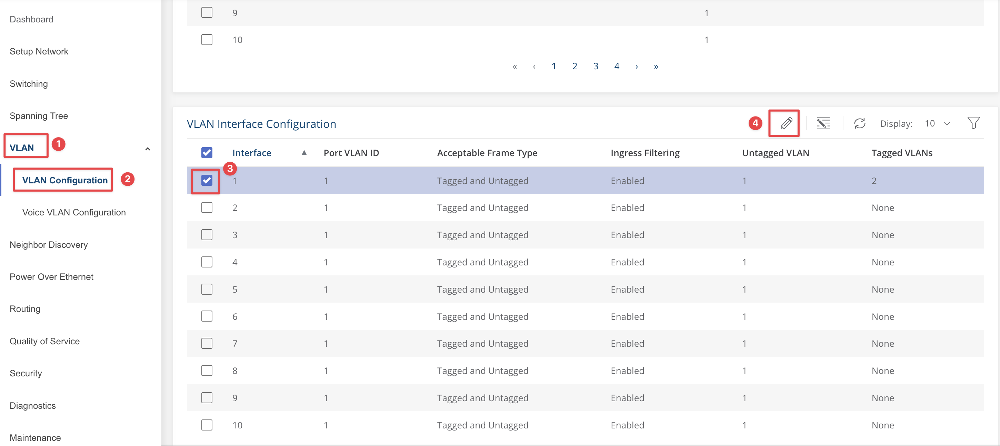
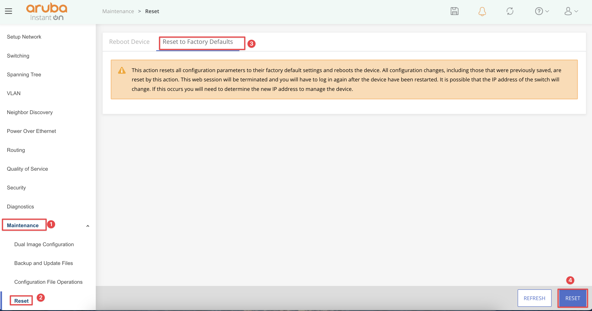

<h2>目錄</h2>

- [1. 環境說明](#1-環境說明)
- [2. 連接方式](#2-連接方式)
- [3. 設定](#3-設定)
  - [3.1. 注意事項](#31-注意事項)
  - [3.2. 初始化設定](#32-初始化設定)
    - [3.2.1. 選擇For Local management](#321-選擇for-local-management)
    - [3.2.2. 登入系統](#322-登入系統)
    - [3.2.3. 建立帳號](#323-建立帳號)
  - [3.3. 設備資訊設定](#33-設備資訊設定)
  - [3.4. 時間設定](#34-時間設定)
    - [3.4.1. 手動設定時間](#341-手動設定時間)
    - [3.4.2. SNTP同步時間](#342-sntp同步時間)
  - [3.5. VLAN設定](#35-vlan設定)
    - [3.5.1. 新增VLAN](#351-新增vlan)
    - [3.5.2. 刪除VLAN](#352-刪除vlan)
    - [3.5.3. 設定VLAN Membership](#353-設定vlan-membership)
    - [3.5.4. 設定VLAN Interface Configuration](#354-設定vlan-interface-configuration)
  - [3.6. Routing設定](#36-routing設定)
    - [3.6.1. 啟用Routing功能](#361-啟用routing功能)
    - [3.6.2. VLAN IP設定](#362-vlan-ip設定)
    - [3.6.3. 設定預設閘道](#363-設定預設閘道)
  - [3.7. Link Aggregation設定](#37-link-aggregation設定)
    - [3.7.1. Global Configuration](#371-global-configuration)
    - [3.7.2. 新增Interface至Link Aggregation Group內](#372-新增interface至link-aggregation-group內)
  - [3.8. 重新開機](#38-重新開機)
  - [3.9. 回覆原廠預設值](#39-回覆原廠預設值)
  - [3.10. 設備升級](#310-設備升級)

## 1. 環境說明

- 設備：Aruba Instant On 1930 24G Class4 PoE 4SFP/SFP+ 370W Switch JL684B
- 版本： 2.6.0

## 2. 連接方式

1. 電腦使用網路線連接Switch的任一Port
2. 電腦設定為192.168.1.0/24任一個IP，但不要是192.168.1.1
3. 使用瀏覽器連線<http://192.168.1.1:8080>

## 3. 設定

### 3.1. 注意事項

!!! info
    部分設定修改後需要Apply才會在running config生效
    

!!! info
    最後一定要save config才不會導致重開後設定遺失
    

### 3.2. 初始化設定

#### 3.2.1. 選擇For Local management

#### 3.2.2. 登入系統

| 編號 |   欄位名稱   | 欄位描述                |
| :--: | :----------: | ----------------------- |
|  1   | **Username** | 使用者帳號，預設為admin |

#### 3.2.3. 建立帳號

| 編號 |   欄位名稱   | 欄位描述                                |
| :--: | :----------: | --------------------------------------- |
|  1   | **Username** | 使用者帳號，可自定義也可輸入預設值admin |
|  2   | **Password** | 使用者密碼                              |
|  3   | **Confirm**  | 使用者密碼確認                          |

### 3.3. 設備資訊設定

| 編號 |      欄位名稱       | 欄位描述             |
| :--: | :-----------------: | -------------------- |
|  2   |   **System Name**   | 設備名稱             |
|  3   | **System Location** | 設備位置(optional)   |
|  4   | **System Contact**  | 設備保管人(optional) |

### 3.4. 時間設定

可選擇手動設定時間或SNTP同步時間

#### 3.4.1. 手動設定時間

| 編號 |   欄位名稱    | 欄位描述           |
| :--: | :-----------: | ------------------ |
|  4   |   **Time**    | 時間               |
|  5   |   **Date**    | 日期               |
|  6   | **Time Zone** | 時區               |
|  7   |  **Acronym**  | 時區縮寫，可自定義 |

#### 3.4.2. SNTP同步時間

| 編號 |    欄位名稱     | 欄位描述           |
| :--: | :-------------: | ------------------ |
|  4   | **SNTP Server** | SNTP Server IP位址 |
|  5   | **Server Port** | SNTP Server Port   |
|  6   |  **Time Zone**  | 時區               |
|  7   |   **Acronym**   | 時區縮寫，可自定義 |

### 3.5. VLAN設定

#### 3.5.1. 新增VLAN

| 編號 |   欄位名稱    | 欄位描述           |
| :--: | :-----------: | ------------------ |
|  1   |  **VLAN ID**  | VLAN ID            |
|  2   | **VLAN Name** | VLAN名稱(optional) |

#### 3.5.2. 刪除VLAN

#### 3.5.3. 設定VLAN Membership

| 編號 |      欄位名稱      | 欄位描述                                                     |
| :--: | :----------------: | ------------------------------------------------------------ |
|  1   | **Tagged VLAN(s)** | 封包由此介面{==出去==}時需要加Tag的VLAN ID，可設定多個VLAN     |
|  2   | **Untagged VLAN**  | 封包由此介面{==出去==}時不需要加Tag的VLAN ID，僅能設定一個VLAN |

#### 3.5.4. 設定VLAN Interface Configuration

| 編號 |         欄位名稱          | 欄位描述                                                                                |
| :--: | :-----------------------: | --------------------------------------------------------------------------------------- |
|  1   |     **Port VLAN ID**      | 封包從此介面{==進來==}時若沒有VLAN Tag則會加上此VLAN ID的Tag。此部分設定要與Untagged VLAN ID設定相同，不然會造成進來的封包是被轉發到Port VLAN ID而要出去的Untagged封包則會是Untagged VLAN ID                              |
|  2   | **Acceptable Frame Type** | 封包由此介面{==進來==}時允許的類型                                                            |
|      |         **- All**         | 不論是Tagged或Untagged封包均允許                                                        |
|      |     **- Tagged Only**     | 只允許Tagged封包，若是Untagged封包則丟棄                                                |
|      |    **- Untagged Only**    | 只允許Untagged封包，若是Tagged封包則丟棄                                                |
|  3   |   **Ingress Filtering**   | 是否針對進入封包篩選實施篩選，若是啟用則進入的封包若沒有在介面設定的VLAN ID範圍內則丟棄 |

!!! tip "此交換器沒有所謂的Port Type為Access、Trunk等設定，故若要達到一樣效果設定方式如下"
      - Access：
          1. 於[Vlan Membership](#353-設定vlan-membership)中設定Untagged VLAN為想要設定的VLAN ID，Tagged VLAN(s)則為空白
          2. 於[Vlan Interface Configuration](#354-設定vlan-interface-configuration)中設定該Interface的Acceptable Frame Type為Untagged Only
          3. 設定Port VLAN ID與Untagged VLAN ID相同
      - Trunk：
          1. 於[Vlan Membership](#353-設定vlan-membership)中設定Untagged VLAN為想要設定的VLAN ID或None，Tagged VLAN(s)為想要的VLAN ID列表
          2. 於[Vlan Interface Configuration](#354-設定vlan-interface-configuration)中設定該Interface的Acceptable Frame Type為All或Tagged Only
          3. 若設定為All且也有設定Untagged VLAN ID則Port VLAN ID需與Untagged VLAN ID相同

### 3.6. Routing設定

#### 3.6.1. 啟用Routing功能

`啟用Routing`

:   此設備就可以擔任路由器功能，做為其他設備的閘道時，可依據路由表路由封包至外部閘道

`不啟用Routing`

:   此設備僅具有交換器功能，做為其他設備的閘道時，不會依據路由表路由封包至外部閘道，但自己本身的封包仍可依據路由表路由至外部，故若單純只是要可以在不同網段管理此台設備的話並不需要啟用Routing

#### 3.6.2. VLAN IP設定

#### 3.6.3. 設定預設閘道

### 3.7. Link Aggregation設定

#### 3.7.1. Global Configuration

#### 3.7.2. 新增Interface至Link Aggregation Group內

原有Interface上的VLAN相關設定將會無效，會以TRK介面設定為主，故可至[VLAN Membership](#設定vlan-membership)設定TRK介面VLAN

### 3.8. 重新開機

### 3.9. 回覆原廠預設值

### 3.10. 設備升級

