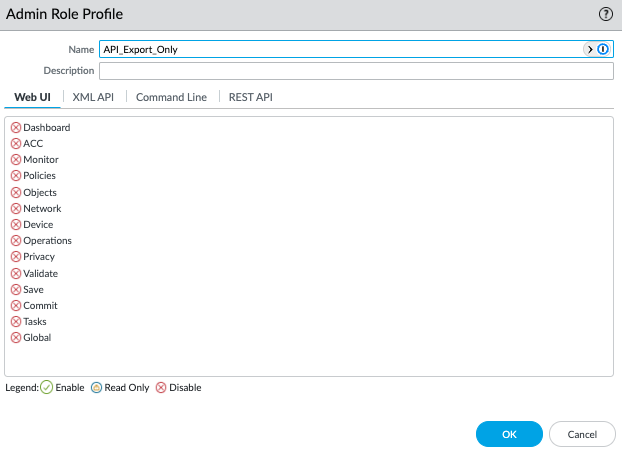

## 1. 環境說明

- 防火牆型號：PA-820
- 防火牆版本： 2.6.0
- 執行備份任務腳本電腦作業系統版本： Windows Server 2019

## 設定

### 新增Admin Roles

建立一個新的Admin Roles僅具有使用XML API Export功能，其餘均禁止以達到權限最小化原則


禁止Web UI所有功能


### Script

``` batch
@echo off
:: 設定備份目的地，依實際狀況修改
set "backup_dir=C:\backup"
:: 設定防火牆IP，依實際狀況修改
set "api_ip=192.168.1.254"
:: 設定API Key，依實際狀況修改
set "api_key=LUFRa1F0SQ=="

:: 獲取日期時間，並將 Year, Month, Day, Hour, Minute, Second 設置為環境變數
for /f %%i in ('WMIC Path Win32_LocalTime Get /Format:value') do @for /f %%j in ("%%i") do @set %%j

:: 補零處理（若為個位數則補零）
set Month=0%Month%
set Month=%Month:~-2%
set Day=0%Day%
set Day=%Day:~-2%
set Hour=0%Hour%
set Hour=%Hour:~-2%
set Minute=0%Minute%
set Minute=%Minute:~-2%

:: 格式化日期和時間為 YYYY-MM-DD_HH-MM
set "date_str=%Year%-%Month%-%Day%"
set "time_str=%Hour%-%Minute%"

:: 設定備份檔案名稱
set "backup_file=fw1-config_%date_str%_%time_str%.xml"
set "log_file=%backup_dir%\backup_log.txt"

:: 檢查 backup 資料夾是否存在，若不存在則建立
if not exist "%backup_dir%" (
    mkdir "%backup_dir%"
)

:: 執行 curl，並將標準輸出寫入到備份檔案中，錯誤訊息寫入日誌檔案
curl -s -kG "https://%api_ip%/api/?type=export&category=configuration&key=%api_key%" > "%backup_dir%\%backup_file%" 2>> "%log_file%"

:: 檢查 curl 是否成功執行，若失敗則刪除可能已經創建的文件，並記錄錯誤
if %errorlevel% neq 0 (
    del "%backup_dir%\%backup_file%" >nul 2>&1
    echo [%date_str% %time_str%] [ERROR] 備份失敗，curl錯誤：%errorlevel% >> "%log_file%"
    exit /b 1
)
```
