## 需求

### 授權需求

需有SDWAN License

### 軟體版本

PANOS 9.1以上

### 支援型號

- PA-220 and PA-220R
- PA-400 Series
- PA-820 and PA-850
- PA-1400 Series
- PA-3200 Series
- PA-3400 Series
- PA-5200 Series
- PA-5400 Series
- PA-7000 Series
- VM-Series firewalls

## 設定流程與名詞說明

### 流程

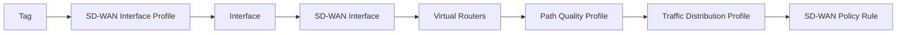

### 名詞說明

[Tags](#tags)
:   Tag是用於區分不同用途的線路例如備份線路、一般用途線路等，同個Tag可以關聯至多個SD-WAN Interface Profile，而SD-WAN Interface
    Profile又會再套用至Interface上，所以一個Tag可以代表多個Interface，後續Traffic Distribution Profile將會使用Tag去選擇Interface而不是直接選擇Interface

[SD-WAN Interface Profile](#sd-wan-interface-profile)
:   設定線路類型（ADSL、Ethetnet Link、MPLS Link等）、最大上下傳速度以及線路監控方式、頻率，後續會套用在介面上，此設定檔會關聯一個Tag

[Interfaces](#interfaces)
:   Layer 3 Ethetnet Interface才支援SD-WAN功能，故當要將一個Interface納入SD-WAN的選擇時須於此處啟用SD-WAN功能並關聯SD-WAN Interface
    Profile

[SD-WAN Interface](#sd-wan-interface)
:   SD-WAN Interface為一個虛擬Interface，是由一個或多個Interface所組成

[Virtual Routers](#virtual-routers)
:   用以設定路由相關設定

[Path Quality Profile](#path-quality-profile)
:   設定線路的最大Latency、Jitter、Packet Loss閥值，當偵測到目前使用線路超過閥值時就需要選擇其他線路，此設定檔會於SD-WAN Policy Rule使用

[Traffic Distribution Profile](#traffic-distribution-profile)
:   設定線路選擇方式，僅有當線路符合Path Quality Profile條件時才會納入選擇，此設定檔會於SD-WAN Policy Rule使用

[SD-WAN Policy Rule](#sd-wan-policy-rule)
:   可依據不同的來源目的地及服務種類選擇不同的Path Quality Profile、Traffic Distribution Profile

## 設定

### Tags

#### 點選Objects -> Tags -> Add

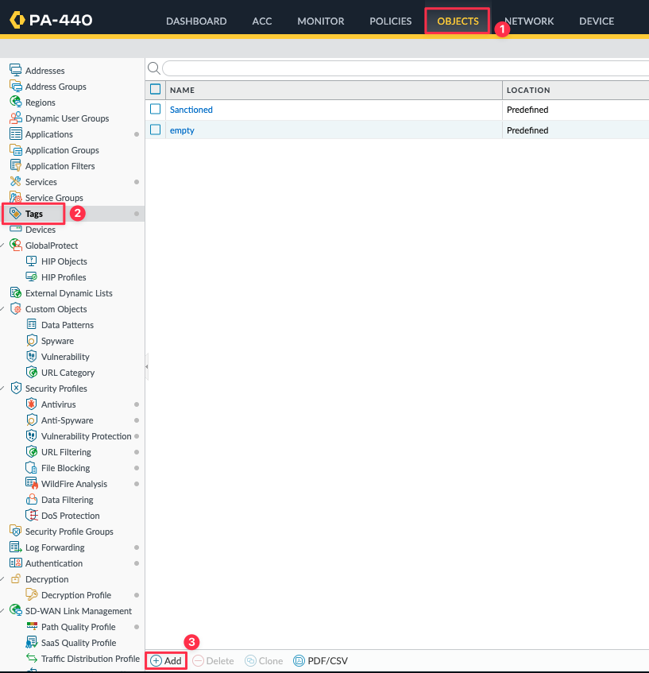

#### 設定Tag

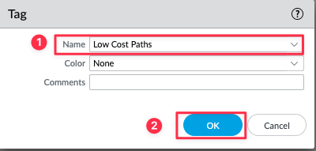

| 編號 | 欄位名稱 | 欄位值         | 欄位描述       |
| :--: | :------: | -------------- | -------------- |
|  1   | **Name** | Low Cost Paths | 名稱，可自定義 |

### SD-WAN Interface Profile

#### 點選 NETWORK -> SD-WAN Interface Profile -> Add

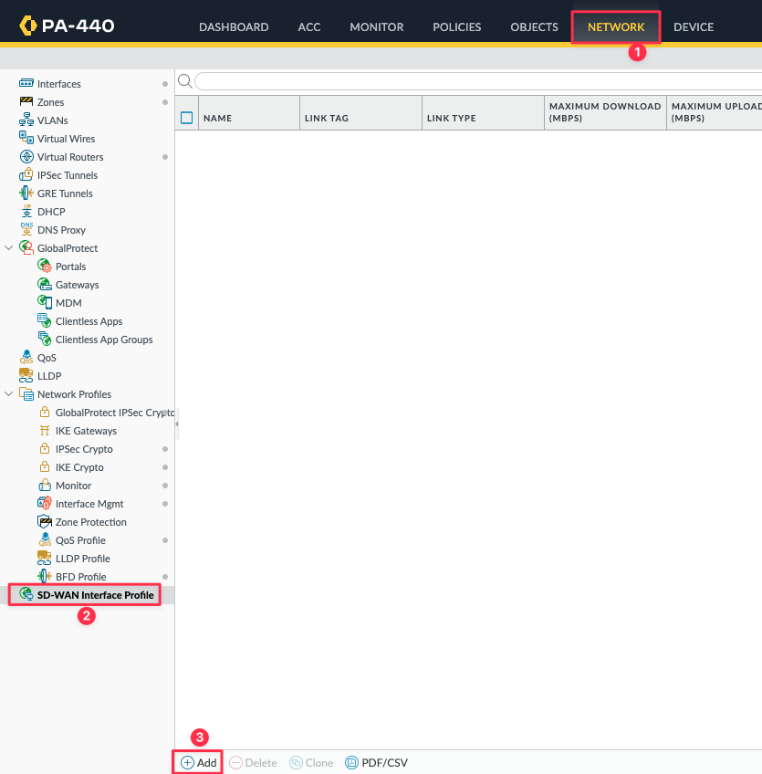

#### 設定SD-WAN Interface Profile

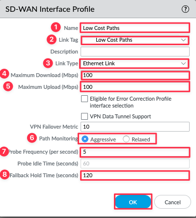

| 編號 |        欄位名稱        | 欄位值          | 欄位描述                                                                                |
| :--: | :--------------------: | --------------- | --------------------------------------------------------------------------------------- |
|  1   |        **Name**        | Low Cost Paths  | 名稱，可自定義                                                                          |
|  2   |      **Link Tag**      | Lost Cost Paths | 選擇此Profile要關聯的Tag名稱                                                            |
|  3   |     **Link Type**      | Ethetnet Link   | 選擇此Profile會套用到哪一種線路類型                                                     |
|  4   |  **Maximum Download**  | 100             | 最大下載速率                                                                            |
|  5   |   **Maximum Upload**   | 100             | 最大上傳速率                                                                            |
|  6   |  **Path Monitoring**   | Aggressive      | 選擇線路監控方式                                                                        |
|      |    **- Aggresive**     | V               | 不會有Probe Idle Time設定，故每秒鐘都會發送偵測封包，適用於大多數線路                   |
|      |     **- Relaxed**      |                 | 會有Probe Idle Time設定，故偵測封包會間隔Probe Idle Time設定的秒數後才發送，適用於LTE等 |
|  7   |  **Probe Frequency**   | 5               | 每秒發送幾個偵測封包                                                                    |
|  8   | **Fallback Hold Time** | 120             | 線路恢復正常後需等待多久才開始納入使用                                                  |

### Interfaces

#### 點選NETWORK -> Interfaces -> Ethernet

點選要設定的Interface

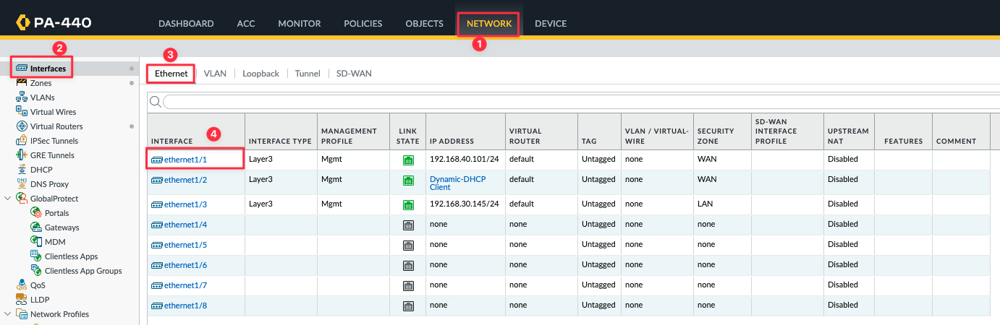

#### 設定Interface

=== "Interface Type"
    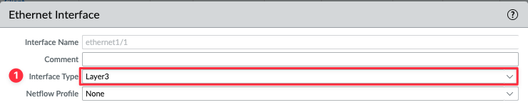

    | 編號 |      欄位名稱      | 欄位值 | 欄位描述     |
    | :--: | :----------------: | ------ | ------------ |
    |  1   | **Interface Type** | Layer3 | 設定介面類型 |

=== "Config"

    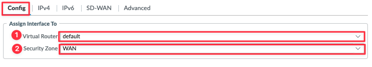

    | 編號 |    欄位名稱    | 欄位值  | 欄位描述                             |
    | :--: | :------------: | ------- | ------------------------------------ |
    |  1   | Virtual Router | default | 選擇此介面要放入哪一個Virtual Router |
    |  2   | Security Zone  | WAN     | 設定此介面屬於哪一個Security Zone    |

=== "IPv4"

    === "Static設定方式"

        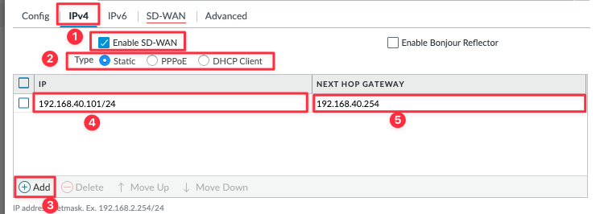

        | 編號 |     欄位名稱     | 欄位值                            | 欄位描述                 |
        | :--: | :--------------: | --------------------------------- | ------------------------ |
        |  1   |  Enable SD-WAN   | :material-checkbox-marked-circle: | 是否啟用此介面SD-WAN設定 |
        |  2   |       Type       | Static                            | 選擇介面IP獲取方式       |
        |  4   |        IP        | 192.168.40.101/24                 | 介面IP                   |
        |  5   | Next HOP Gateway | 192.168.40.254                    | 此介面下一跳IP           |

    === "DHCP Cleint設定方式"

        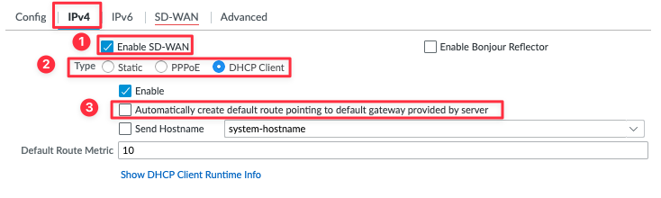

        | 編號 |                                     欄位名稱                                      | 欄位值                                   | 欄位描述                                  |
        | :--: | :-------------------------------------------------------------------------------: | ---------------------------------------- | ----------------------------------------- |
        |  1   |                                   Enable SD-WAN                                   | :material-checkbox-marked-circle:        | 是否啟用此介面SD-WAN設定                  |
        |  2   |                                       Type                                        | DHCP Client                              | 選擇介面IP獲取方式                        |
        |  3   | Automatically create default route pointing to default gateway provided by server | :material-checkbox-blank-circle-outline: | 是否自動建立從DHCP Server獲取到的預設路由 |

        !!! warning
            預設Automatically create default route pointing to default gateway provided by server選項是勾選起來的，
            務必要取消勾選不然會導致所有流量都是經由此條路由而不是後續設定的預設路由

=== "SD-WAN"

    

    | 編號 |   欄位名稱    | 欄位值         | 欄位描述                                                                    |
    | :--: | :-----------: | -------------- | --------------------------------------------------------------------------- |
    |  1   | Enable SD-WAN | Low Cost Paths | 選擇於[SD-WAN Interface Profile](#sd-wan-interface-profile)設定的對應設定檔 |

### SD-WAN Interface

#### 點選NETWORK -> Interfaces -> SD-WAN -> Add

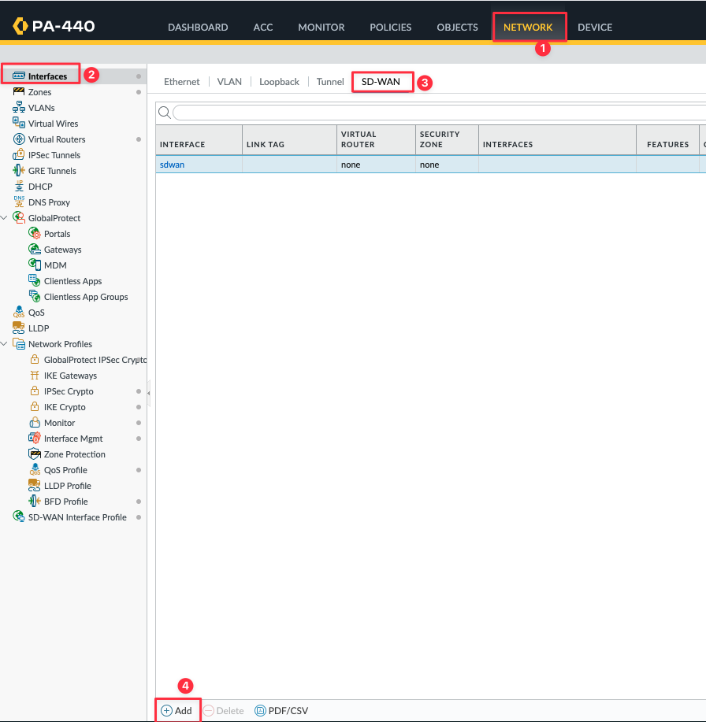

#### 設定SD-WAN Interface

=== "ID"

    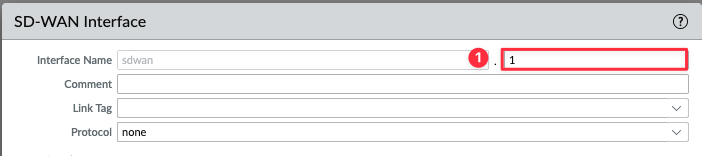

    | 編號 |    欄位名稱    | 欄位值 | 欄位描述                   |
    | :--: | :------------: | ------ | -------------------------- |
    |  1   | Interface Name | 1      | 設定此SD-WAN Interface編號 |

=== "Config"

    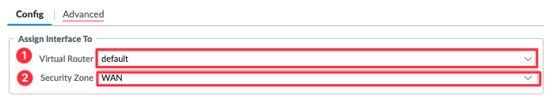

    | 編號 |    欄位名稱    | 欄位值  | 欄位描述                             |
    | :--: | :------------: | ------- | ------------------------------------ |
    |  1   | Virtual Router | default | 選擇此介面要放入哪一個Virtual Router |
    |  2   | Security Zone  | WAN     | 設定此介面屬於哪一個Security Zone    |

    !!! warning
        此處設定要與選擇的Interface相同

=== "Advanced"

    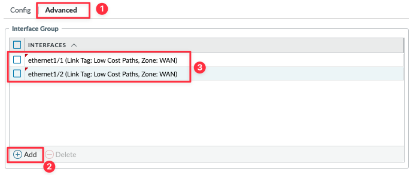

### Virtual Routers

#### 點選NETWORK -> Virtual Routers

點選要新增路由的Virtual Routers

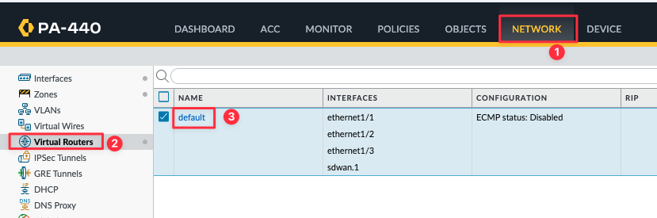

#### 點選Static Routes -> IPv4 -> Add

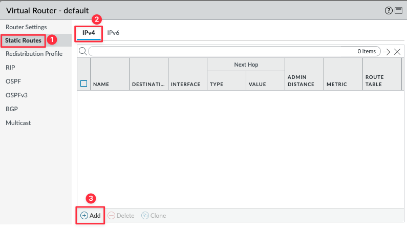

#### 新增路由

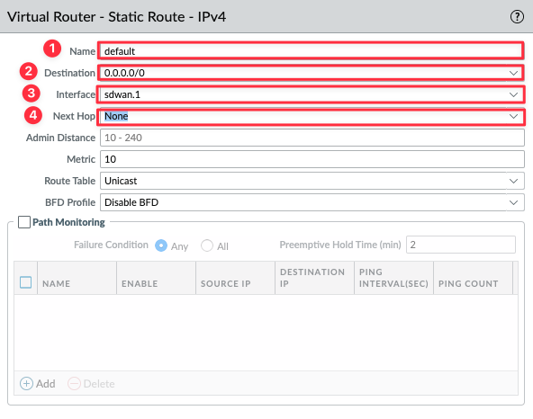

| 編號 |    欄位名稱     | 欄位值    | 欄位描述                                                                |
| :--: | :-------------: | --------- | ----------------------------------------------------------------------- |
|  1   |    **Name**     | default   | 名稱，可自定義                                                          |
|  2   | **Destination** | 0.0.0.0/0 | 目的地位址，0.0.0.0/0代表所有網段                                       |
|  3   |  **Interface**  | sdwan.1   | 封包出口介面，選擇於[SD-WAN-Interface](#sd-wan-interface)設定的虛擬介面 |
|  4   |  **Next Hop**   | None      | 下一跳，因為虛擬介面所以選擇None即可                                    |

### Path Quality Profile

#### 點選OBJECTS -> SD-WAN Link Management -> Path Quality Profile -> Add

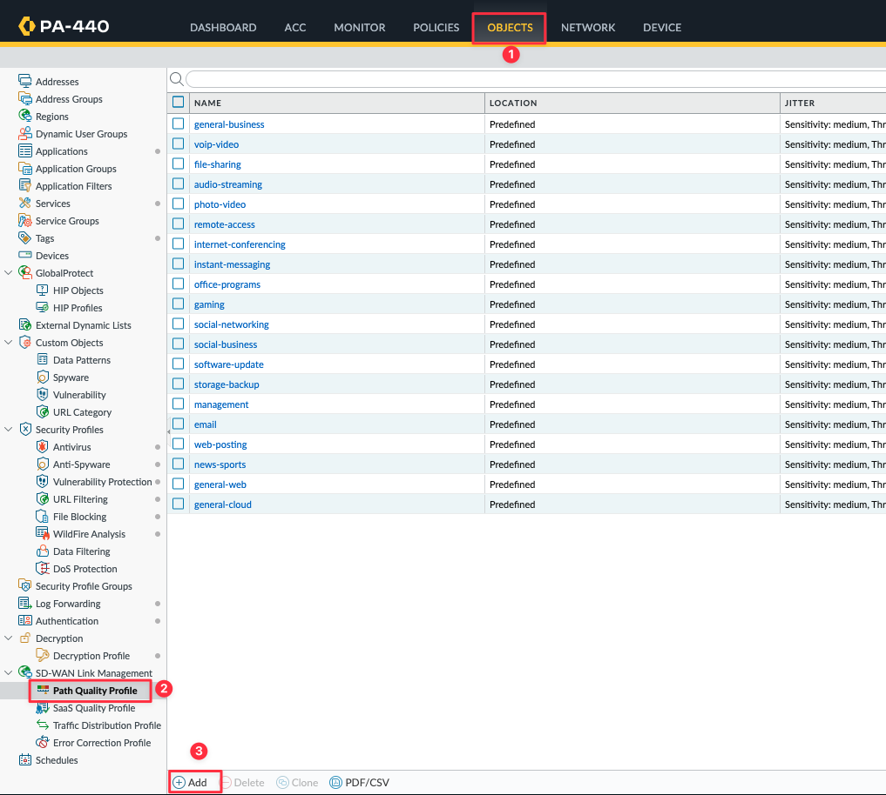

#### 設定Path Quality Profile

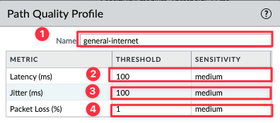

| 編號 |    欄位名稱     | 欄位值           | 欄位描述       |
| :--: | :-------------: | ---------------- | -------------- |
|  1   |    **Name**     | general-internet | 名稱，可自定義 |
|  2   |   **Latency**   | 100              | 封包延遲       |
|  3   |   **Jitter**    | 100              | 封包抖動       |
|  4   | **Packet Loss** | 1                | 封包遺失       |

!!! info
    **SENSITIVITY**設定代表該測量值的優先級，若全部都是相同的情況則順序為Packet Loss -> Latency -> Jitter

#### 設定Saas Quality Profile(可選項)

10.0.2版開始才有的功能，此功能主要是因為Path Quality Profile是監控線路下一跳，但有時候下一跳是正常但實際上卻是不可用

### Traffic Distribution Profile

#### 點選OBJECTS -> SD-WAN Link Management -> Traffic Distribution Profile -> Add

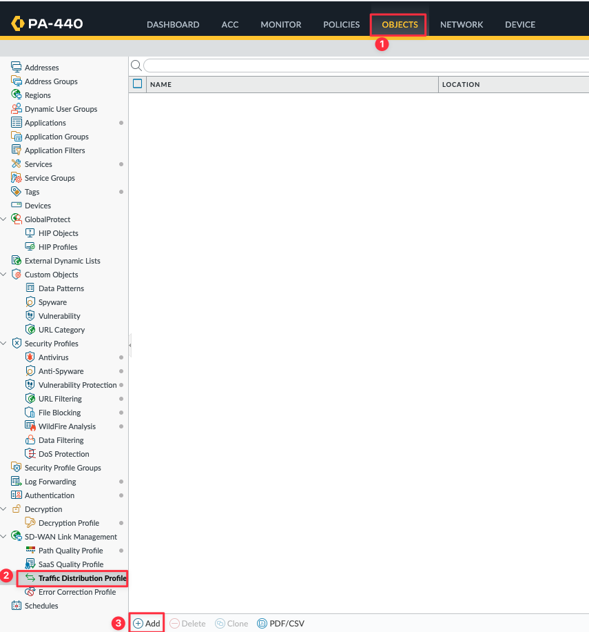

#### 設定Traffic Distribution Profile

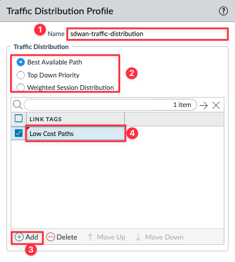

| 編號 |              欄位名稱               | 欄位值                            | 欄位描述                               |
| :--: | :---------------------------------: | --------------------------------- | -------------------------------------- |
|  1   |              **Name**               | sdwan-traffic-distribution        | 名稱，可自定義                         |
|  2   |      **Traffic Distribution**       |                                   | 選擇流量分配的方式                     |
|      |      **- Best Available Path**      | :material-checkbox-marked-circle: |                                        |
|      |       **- Top Down Priority**       |                                   |                                        |
|      | **- Weighted Session Distribution** |                                   |                                        |
|  4   |            **LINK TAGS**            | Low Cost Paths                    | 選擇要納入流量分配的[Link TAGS](#tags) |

### SD-WAN Policy Rule

#### 點選POLICIES -> SD-WAN -> Add

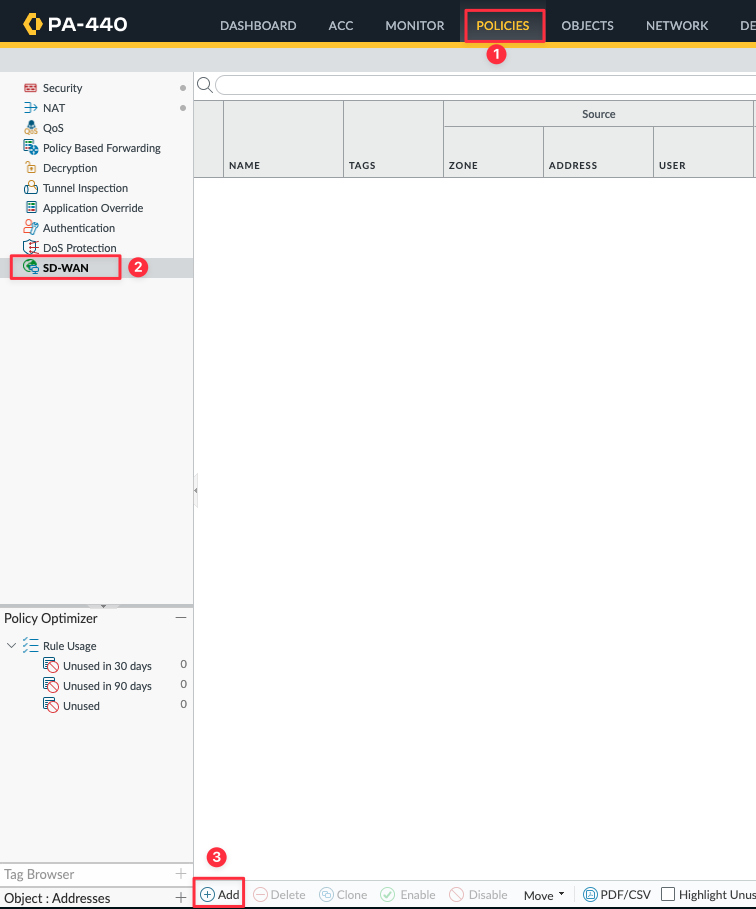

#### 設定SD-WAN Policy

=== "General"

    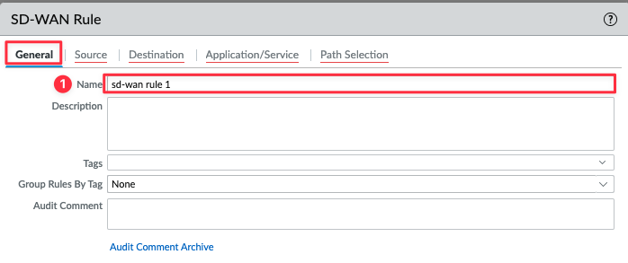

    | 編號 | 欄位名稱 | 欄位值       | 欄位描述       |
    | ---- | -------- | ------------ | -------------- |
    | 1    | **Name** | sd-wan rule1 | 名稱，可自定義 |

=== "Source"

    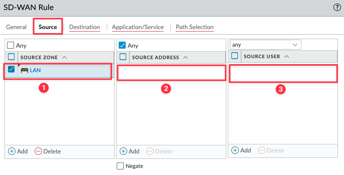

    | 編號 | 欄位名稱           | 欄位值 | 欄位描述   |
    | ---- | ------------------ | ------ | ---------- |
    | 1    | **SOURCE ZONE**    | LAN    | 來源區域   |
    | 2    | **SOURCE ADDRESS** | Any    | 來源IP     |
    | 3    | **SOURCE USER**    | Any    | 來源使用者 |

=== "Destination"

    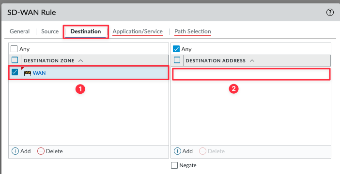

    | 編號 | 欄位名稱           | 欄位值 | 欄位描述   |
    | ---- | ------------------ | ------ | ---------- |
    | 1    | **SOURCE ZONE**    | LAN    | 目的地區域 |
    | 2    | **SOURCE ADDRESS** | Any    | 目的地IP   |

=== "Application/Service"

=== "Path Selection"
