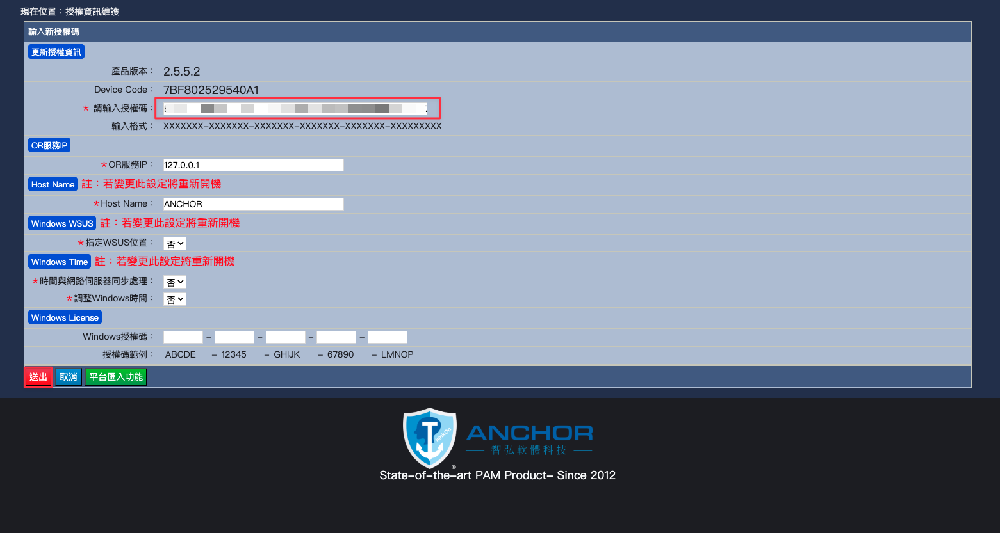

<h2>目錄</h2>

## 部署

**依據官方給予下載連結下載對應壓縮檔解壓縮後可以得到OVA檔案並部署至Vmware環境內**

**建議使用完整佈建**

**編輯虛擬機器設定更改 CPU 為8 vCPU 以上，記憶體為 16 GB 以上**

## 初始化設定

**開機後輸入 Bitlocker密碼：gl0b@lwisdom**

**開機完成後輸入登入帳號：anchor_op ， 密碼：P@mP@ssw0rd@nch0r**

**登入後設定ANCHOR 系統 IP Address**

!!! info
    此處密碼一樣是輸入anchor_op密碼

**完成IP Address設定後即可使用瀏覽器開啟 https://<ANCHOR_IP\> ，預設帳號：sysadmin ， 密碼：gl0b@lwisdom**

**截取此畫面申請授權**

**依據收到的授權碼輸入**

