<h2>目錄</h2>

- [1. 環境說明](#1-環境說明)
- [2. 架構](#2-架構)
- [3. 硬體規格建議](#3-硬體規格建議)
- [4. 軟體需求](#4-軟體需求)
  - [4.1. Digital Vault](#41-digital-vault)
  - [4.2. Password Vault Web Access (PVWA)](#42-password-vault-web-access-pvwa)
  - [4.3. Central Policy Manager (CPM)](#43-central-policy-manager-cpm)
  - [4.4. Privileged Session Manager (PSM)](#44-privileged-session-manager-psm)
- [5. 安裝](#5-安裝)
  - [5.1. Digital Vault](#51-digital-vault)
    - [5.1.1. Primary Vault](#511-primary-vault)
      - [5.1.1.1. 安裝.NET Framework 4.8 Runtime](#5111-安裝net-framework-48-runtime)
      - [5.1.1.2. 安裝Microsoft Visual C++ Redistributable for Visual Studio 2015-2022 32-bit and 64-bit versions](#5112-安裝microsoft-visual-c-redistributable-for-visual-studio-2015-2022-32-bit-and-64-bit-versions)
      - [5.1.1.3. 安裝Digital Vault應用程式](#5113-安裝digital-vault應用程式)
      - [5.1.1.4. 安裝Disaster Recovery應用程式](#5114-安裝disaster-recovery應用程式)
    - [5.1.2. PrivateArk Client](#512-privateark-client)
      - [5.1.2.1. 安裝](#5121-安裝)
    - [5.1.3. DR Vault](#513-dr-vault)
      - [5.1.3.1. 建立DR User帳號](#5131-建立dr-user帳號)
      - [5.1.3.2. 安裝.NET Framework 4.8 Runtime](#5132-安裝net-framework-48-runtime)
      - [5.1.3.3. 安裝Microsoft Visual C++ Redistributable for Visual Studio 2015-2022 32-bit and 64-bit versions](#5133-安裝microsoft-visual-c-redistributable-for-visual-studio-2015-2022-32-bit-and-64-bit-versions)
      - [5.1.3.4. 安裝Digital Vault應用程式](#5134-安裝digital-vault應用程式)
      - [5.1.3.5. 安裝Disaster Recovery應用程式](#5135-安裝disaster-recovery應用程式)
  - [5.2. PVWA](#52-pvwa)
    - [5.2.1. Installation requirements](#521-installation-requirements)
    - [5.2.2. Pre-installation tasks](#522-pre-installation-tasks)
    - [5.2.3. Installation](#523-installation)
    - [5.2.4. Registration](#524-registration)
  - [5.3. CPM](#53-cpm)
    - [5.3.1. Installation requirements](#531-installation-requirements)
    - [5.3.2. Pre-installation tasks](#532-pre-installation-tasks)
    - [5.3.3. Installation](#533-installation)
    - [5.3.4. Registration](#534-registration)
  - [5.4. PSM](#54-psm)
    - [5.4.1. Installation requirements](#541-installation-requirements)
    - [5.4.2. Installation](#542-installation)

<div class="page-break"/>

## 1. 環境說明

- PAM版本： 14.6
- Windows版本：Windows Server 2022 Standard English Version

<div class="page-break"/>

## 2. 架構

| 元件名稱                          | 元件描述                                                                                                             |
| --------------------------------- | -------------------------------------------------------------------------------------------------------------------- |
| Digital Vault                     | 負責安全地儲存和保護所有的機密（例如密碼、SSH 金鑰和憑證）。它使用高級加密技術，確保資料只有經過授權的使用者可以存取 |
| Password Vault Web Access (PVWA)  | 基於網頁的使用者介面，用於管理特權帳戶和資產。使用者可以透過 PVWA 來檢視、請求和管理特權憑證，並審核活動記錄         |
| Central Policy Manager (CPM)      | 責自動更改和管理特權帳戶的密碼。它可以根據預定義的安全策略來定期輪替密碼，降低密碼被盜用的風險                       |
| Privileged Session Manager (PSM)  | 允許使用者透過安全的方式連線到目標系統，並自動記錄會話。它能防止特權濫用並支援即時監控                               |
| Privileged Threat Analytics (PTA) | 用於監控和檢測特權使用的異常行為或潛在威脅，例如未經授權的登入嘗試或異常的操作模式                                   |

## 3. 硬體規格建議

下方為當管理帳號數量低於 20,000 時建議的規格，可以實際情況修正。

| 元件名稱                          | CPU | Memory | Disk1 | Disk2 | Disk3  |
| --------------------------------- | --- | ------ | ----- | ----- | ------ |
| Digital Vault                     | 8   | 32     | 80    | 80    | 依需求 |
| Password Vault Web Access (PVWA)  | 4   | 8      | 80    | 80    |        |
| Central Policy Manager (CPM)      | 4   | 8      | 80    | 80    |        |
| Privileged Session Manager (PSM)  | 8   | 8      | 80    | 80    |        |
| Privileged Threat Analytics (PTA) | 4   | 16     | 500   |       |        |

## 4. 軟體需求

### 4.1. Digital Vault

- [Microsoft Visual C++ Redistributable 2022](https://learn.microsoft.com/en-us/cpp/windows/latest-supported-vc-redist?view=msvc-170#visual-studio-2015-2017-2019-and-2022){:target="_blank"} 32-bit and 64-bit versions
- [.NET Framework 4.8 Runtime](https://dotnet.microsoft.com/zh-tw/download/dotnet-framework/net48){:target="_blank"}

### 4.2. Password Vault Web Access (PVWA)

- [Microsoft Visual C++ Redistributable 2022](https://learn.microsoft.com/en-us/cpp/windows/latest-supported-vc-redist?view=msvc-170#visual-studio-2015-2017-2019-and-2022){:target="_blank"} 32-bit and 64-bit versions
- [.NET Framework 4.8 Runtime](https://dotnet.microsoft.com/zh-tw/download/dotnet-framework/net48){:target="_blank"}

### 4.3. Central Policy Manager (CPM)

- [.NET Framework 4.8 Runtime](https://dotnet.microsoft.com/zh-tw/download/dotnet-framework/net48){:target="_blank"}

### 4.4. Privileged Session Manager (PSM)

- [.NET Framework 4.8 Runtime](https://dotnet.microsoft.com/zh-tw/download/dotnet-framework/net48){:target="_blank"}

## 5. 安裝

### 5.1. Digital Vault

此處僅說明Primary-DR Vault安裝方式

#### 5.1.1. Primary Vault

##### 5.1.1.1. 安裝.NET Framework 4.8 Runtime

下載並完成[.NET Framework 4.8 Runtime](https://dotnet.microsoft.com/zh-tw/download/dotnet-framework/net48){:target="_blank"} 安裝

##### 5.1.1.2. 安裝Microsoft Visual C++ Redistributable for Visual Studio 2015-2022 32-bit and 64-bit versions

下載並完成[Microsoft Visual C++ Redistributable for Visual Studio 2015-2022 32-bit and 64-bit versions](https://learn.microsoft.com/en-us/cpp/windows/latest-supported-vc-redist?view=msvc-170#visual-studio-2015-2017-2019-and-2022){:target="_blank"} 安裝

!!! warning
    以上兩項安裝完畢務必要重新開機

##### 5.1.1.3. 安裝Digital Vault應用程式

以Administrator權限執行setup.exe

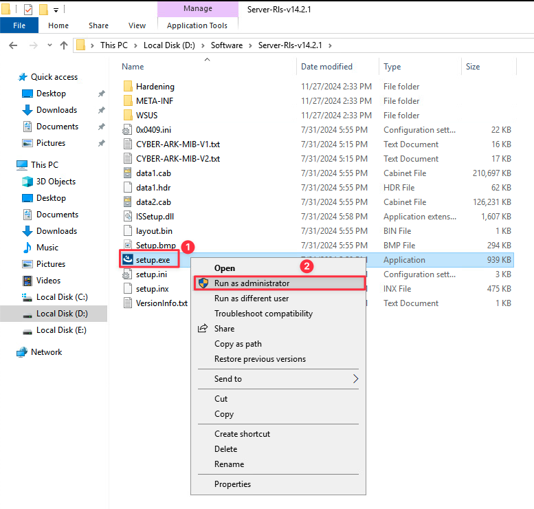

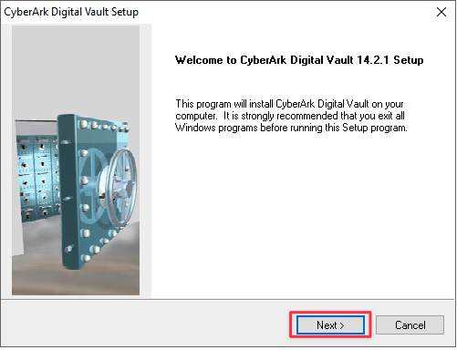

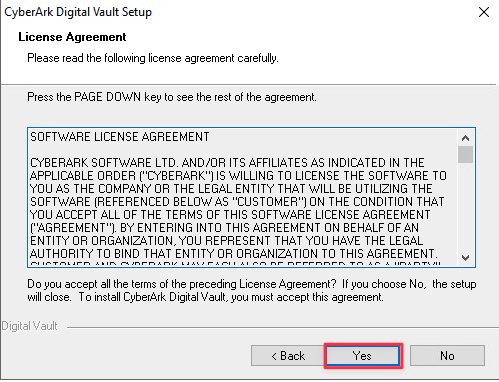

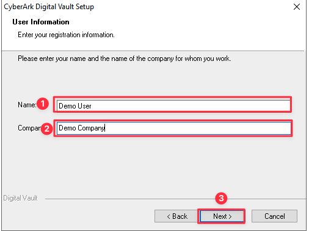

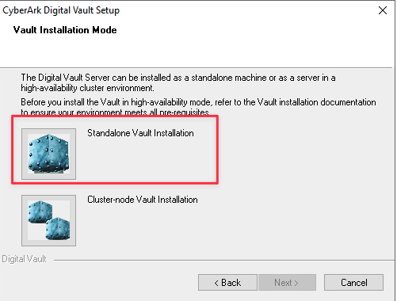

應用程式安裝位置，若後續有要使用分散式架構則此處一定要使用預設值

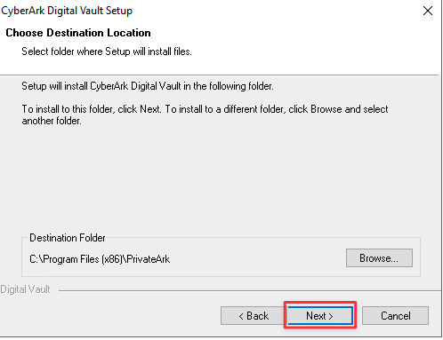

金鑰庫存放位置建議放置於不同硬碟

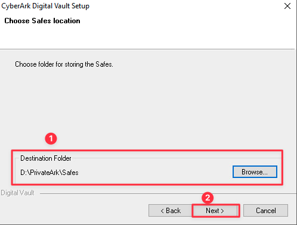

需要將收到的License檔名更改為為{==License.xml==}並選擇該檔案存放位置

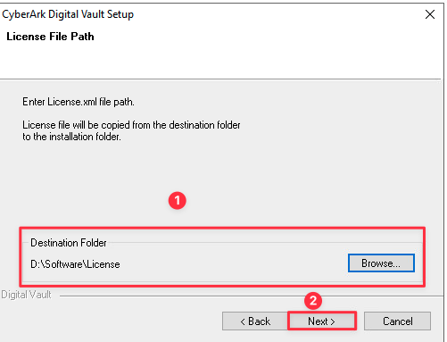

Operator CD內包含server key及recovery public key，在安裝Digital Vault及每次重啟Digital Vault時會需要，原廠建議除以上情形外的其他時候需移除Operator CD以確保安全
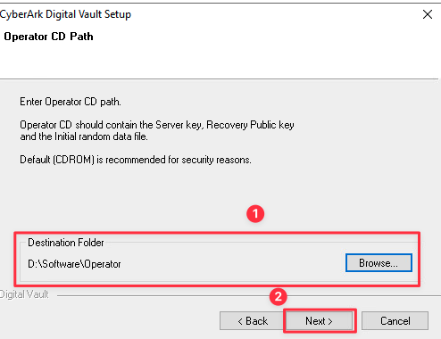

此處用於設定是否允許遠端操作Digital Vault，若不需要選擇Skip就好

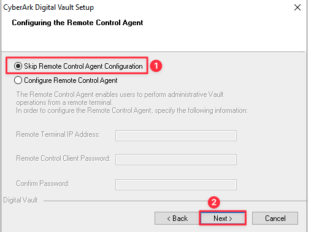

此處是當有需要建立分散式的Digital Vault時才需安裝，但若此時未安裝後續想要搬移至分散式架構則只能重新在全新的作業系統重新安裝Digital Vault

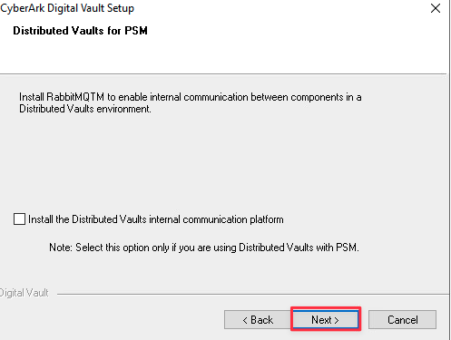

這邊的Do not harden the machine建議不要勾選以將不需要的服務關閉以避免額外漏洞

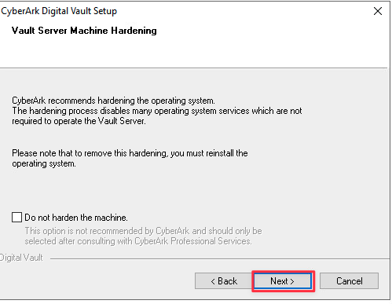

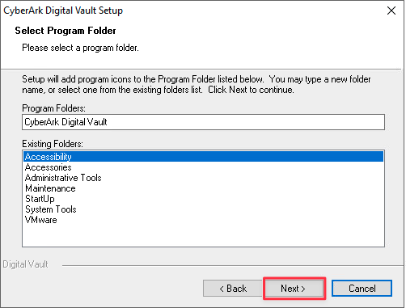

Master密碼為破窗密碼，僅緊急狀況使用，Administrator密碼為一般情況下操作Digital Vault的管理員密碼

!!! warning
    密碼必須符合下列規則不然會安裝失敗

    - 最少需6個字元最多不可以超過39個字元
    - 必須包含1個大寫字母1個小寫字母1個數字
    - 不可以包含% \ " & ^ > < |及空白及非ASCII字元

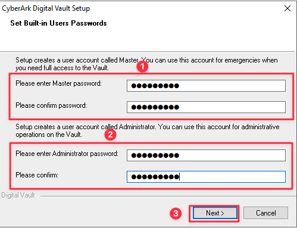

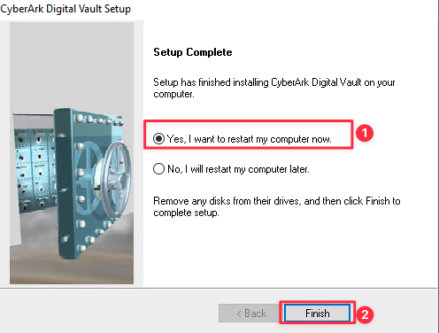

##### 5.1.1.4. 安裝Disaster Recovery應用程式

!!! warning
    須先停止以下服務

    - Cyber-Ark Event Notification Engine
    - PrivateArk Server
    - PrivateArk Database
    - PrivateArk Remote Control Agent
    - CyberArk Logic Container

    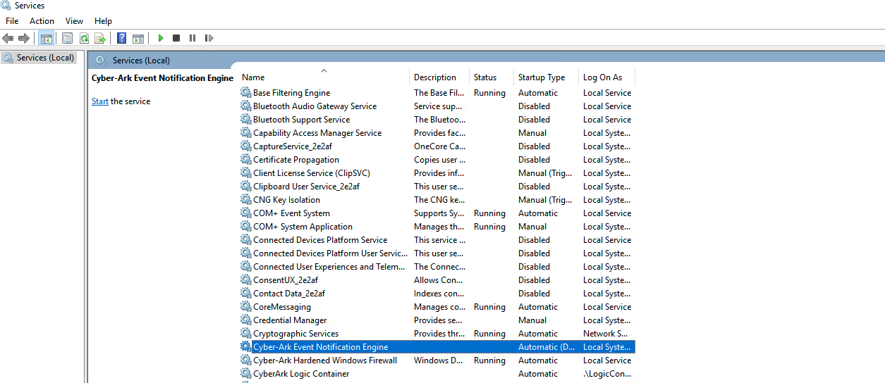

以Administrator權限執行setup.exe

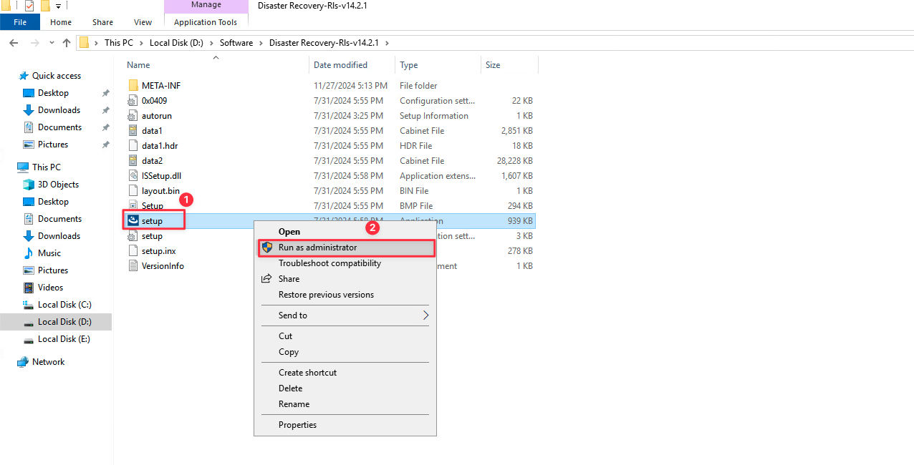

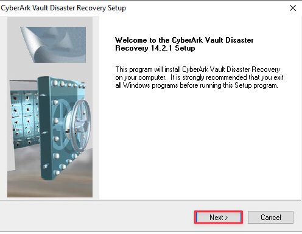

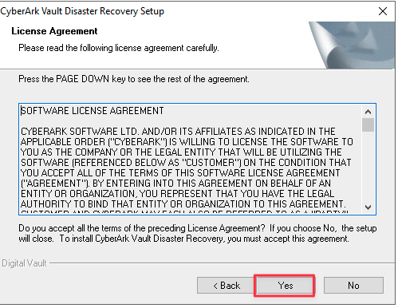

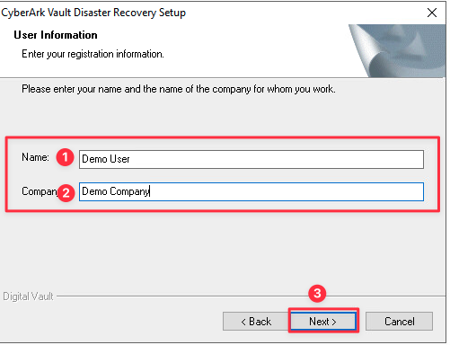

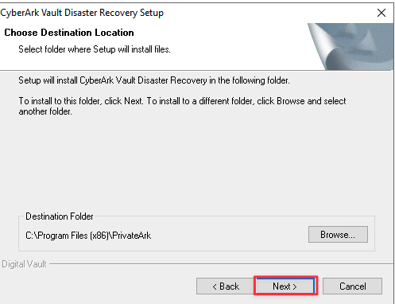

設定抄寫要使用的帳號及密碼，每台Digital Vault需設定不同帳號

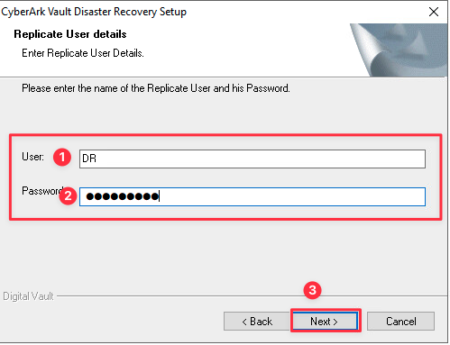

設定Primary Digital Vault的IP及使用的Port，此處因為Primary Digital Vault是本身所以IP填寫127.0.01，Port若未特別更改則為預設1858

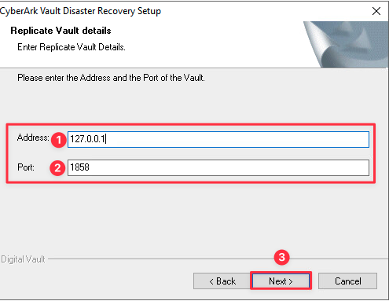

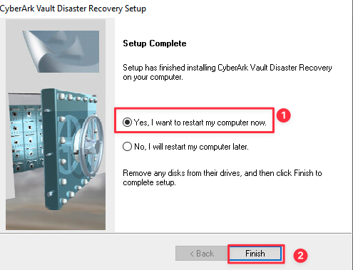

#### 5.1.2. PrivateArk Client

- 此應用程式為金庫管理程式，可安裝於管理者電腦
- 此應用程式現在於marketplace已經獨立出來成為一個項目不會在PAM Self-Hosted package內故需獨立搜尋PrivateArk Client並下載安裝

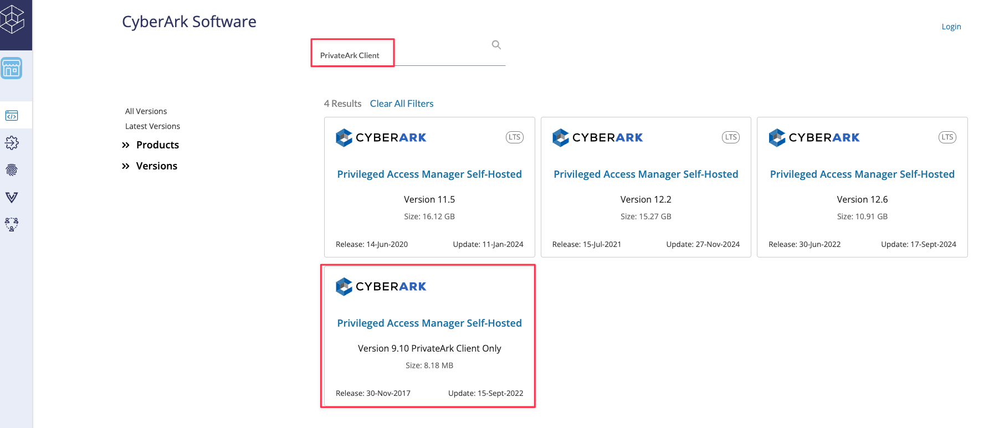

##### 5.1.2.1. 安裝

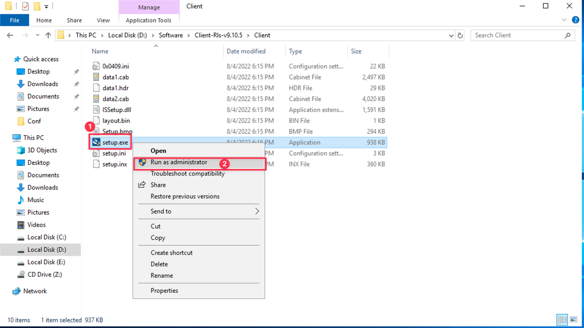

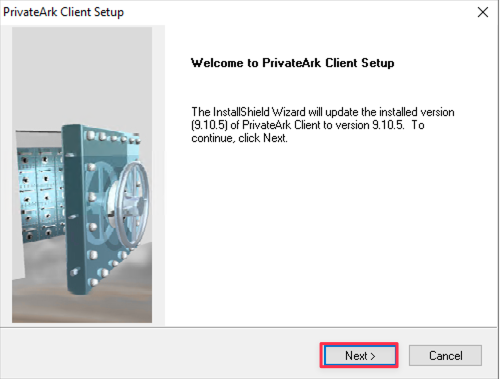

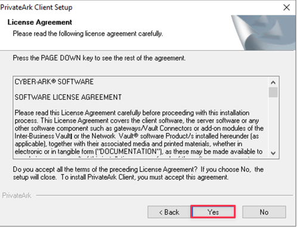

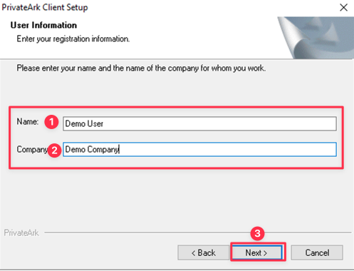

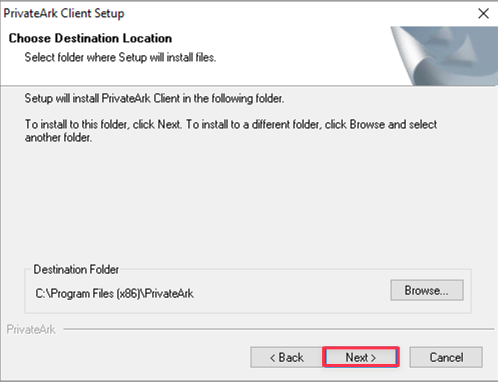

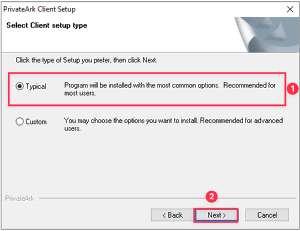

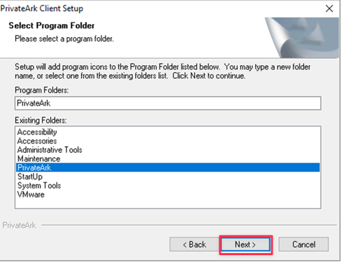

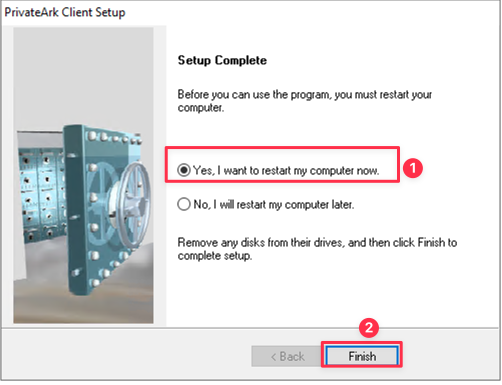

#### 5.1.3. DR Vault

安裝流程與Primary Vault相同，僅有在Disaster Recovery應用程式安裝時設定的DR user帳號需先在Primary Vault建立

##### 5.1.3.1. 建立DR User帳號

登入Primary Vault

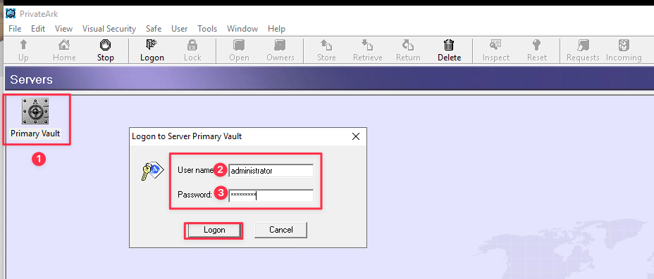

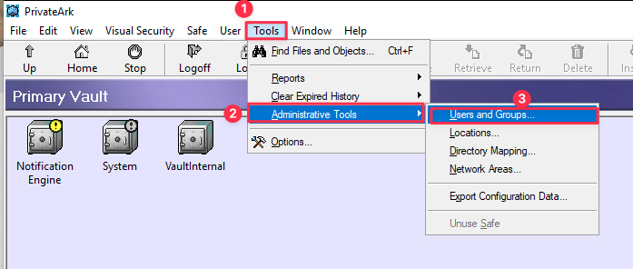

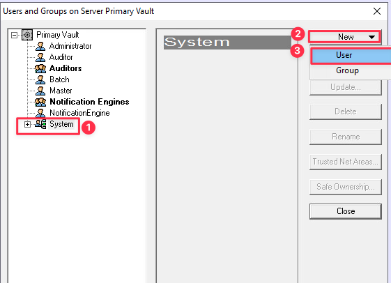

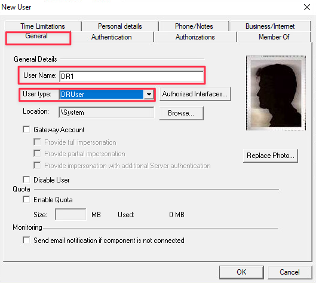

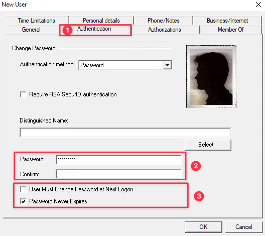

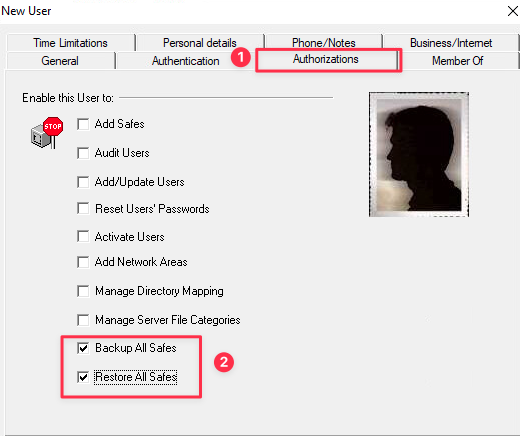

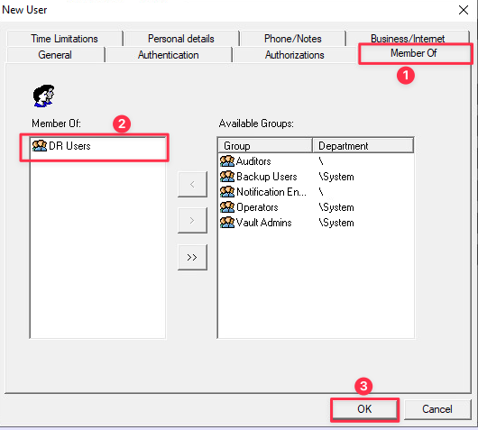

##### 5.1.3.2. 安裝.NET Framework 4.8 Runtime

下載並完成[.NET Framework 4.8 Runtime](https://dotnet.microsoft.com/zh-tw/download/dotnet-framework/net48){:target="_blank"}安裝

##### 5.1.3.3. 安裝Microsoft Visual C++ Redistributable for Visual Studio 2015-2022 32-bit and 64-bit versions

下載並完成[Microsoft Visual C++ Redistributable for Visual Studio 2015-2022 32-bit and 64-bit versions](https://learn.microsoft.com/en-us/cpp/windows/latest-supported-vc-redist?view=msvc-170#visual-studio-2015-2017-2019-and-2022){:target="_blank"}安裝

!!! warning
    以上兩項安裝完畢務必要重新開機

##### 5.1.3.4. 安裝Digital Vault應用程式

以Administrator權限執行setup.exe


應用程式安裝位置，若後續有要使用分散式架構則此處一定要使用預設值


金鑰庫存放位置建議放置於不同硬碟


需要將收到的License檔名更改為為{==License.xml==}並選擇該檔案存放位置


Operator CD內包含server key及recovery public key，在安裝Digital Vault及每次重啟Digital Vault時會需要，原廠建議除以上情形外的其他時候需移除Operator CD以確保安全


此處用於設定是否允許遠端操作Digital Vault，若不需要選擇Skip就好


此處是當有需要建立分散式的Digital Vault時才需安裝，但若此時未安裝後續想要搬移至分散式架構則只能重新在全新的作業系統重新安裝Digital Vault


這邊的Do not harden the machine建議不要勾選以將不需要的服務關閉以避免額外漏洞


Master密碼為破窗密碼，僅緊急狀況使用，Administrator密碼為一般情況下操作Digital Vault的管理員密碼

!!! warning
    密碼必須符合下列規則不然會安裝失敗

    - 最少需6個字元最多不可以超過39個字元
    - 必須包含1個大寫字母1個小寫字母1個數字
    - 不可以包含% \ " & ^ > < |及空白及非ASCII字元


##### 5.1.3.5. 安裝Disaster Recovery應用程式

!!! warning
    須先停止以下服務

    - Cyber-Ark Event Notification Engine
    - PrivateArk Server
    - PrivateArk Database
    - PrivateArk Remote Control Agent
    - CyberArk Logic Container

    

以Administrator權限執行setup.exe


設定抄寫要使用的帳號及密碼，每台Digital Vault需設定不同帳號


設定Primary  Vault的IP及使用的Port


### 5.2. PVWA

#### 5.2.1. Installation requirements

- 下載並完成[.NET Framework 4.8 Runtime](https://dotnet.microsoft.com/zh-tw/download/dotnet-framework/net48){:target="_blank"}安裝
- 下載並完成[Microsoft Visual C++ Redistributable for Visual Studio 2015-2022 32-bit and 64-bit versions](https://learn.microsoft.com/en-us/cpp/windows/latest-supported-vc-redist?view=msvc-170#visual-studio-2015-2017-2019-and-2022){:target="_blank"}安裝

!!! warning
    以上兩項安裝完畢務必要重新開機

#### 5.2.2. Pre-installation tasks

以Administrator權限執行PVWA_Prerequisters.ps1，此powershell會執行以下任務

- Verifies .NET version
- Installs Web server roles
- Disables IPv6
- Configures the self-signed certificate
- Sets IIS SSL TLS configuration

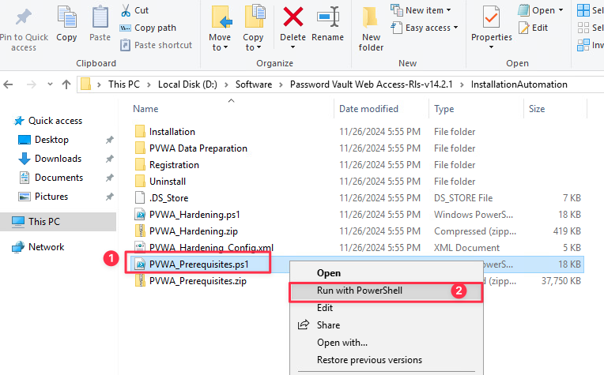

#### 5.2.3. Installation

編輯PVWA\InstallationAutomation\Installation\InstallationConfig.xml檔案並依環境修改以下設定

| 項次 |           參數           | 描述                                                                                                                    |
| :--: | :----------------------: | ----------------------------------------------------------------------------------------------------------------------- |
|  1   |      {==Username==}      | 使用者名稱                                                                                                              |
|  2   |      {==Company==}       | 公司名稱                                                                                                                |
|  3   | PVWAApplicationDirectory | PVWA在IIS中的應用程式位置。可維持預設值：C:\inetpub\wwwroot\PasswordVault\                                              |
|  4   |   PVWAInstallDirectory   | PVWA應用程式安裝位置。可維持預設值：C:\CyberArk\Password Vault Web Access\                                              |
|  5   |   PVWAApplicationName    | PVWA在IIS中的應用程式名稱。可維持預設值：PasswordVault                                                                  |
|  6   |  PVWAAuthenticationList  | PVWA登入驗證方式。可設定多種驗證方式(CyberArk, Windows, Radius, PKI, LDAP, SAML)並用分號(;)隔開，可維持預設值: CyberArk |
|  7   |      {==pvwaUrl==}       | 連線PVWA要使用的URL                                                                                                     |
|  8   |        isUpgrade         | 是否為升級。因爲新安裝故維持預設值：False                                                                               |

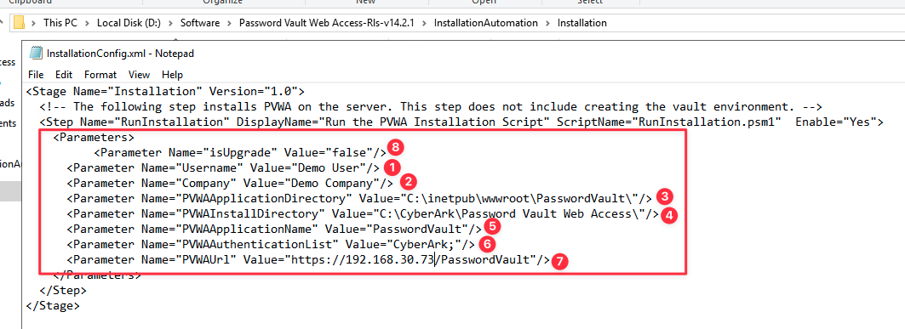

以Administrator權限執行PVWAInstallation.ps1

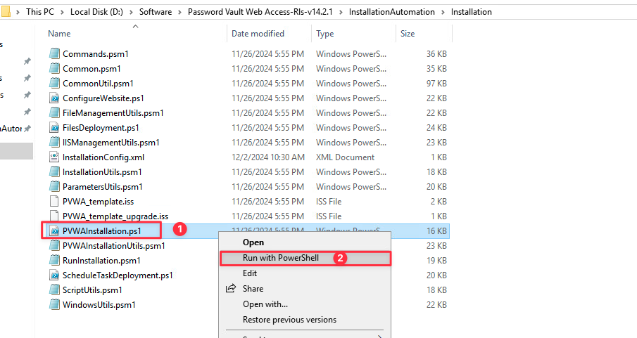

#### 5.2.4. Registration

此步驟主要是將PVWA註冊到Vault，首先需要編輯PVWA\InstallationAutomation\Registration\PVWARegisterComponentConfig.xml檔案並依環境修改以下設定

| 項次 |         參數         | 描述                                                                       |
| :--: | :------------------: | -------------------------------------------------------------------------- |
|  1   |      accepteula      | 是否接受用戶許可協議，維持預設值：Yes                                      |
|  2   |    {==vaultIP==}     | 輸入vault ip address，若有Primary與DR vault的話則兩個都輸入並以逗號(,)隔開 |
|  3   |      vaultport       | 輸入vault port，若無修改則維持預設值：1858                                 |
|  4   |      vaultuser       | 輸入vault administrator名稱，若無額外設定可維持預設值：Administrator       |
|  5   |       pocmode        | 是否以POC模式安裝，若無特別需求可維持預設值：false                         |
|  6   |  authenticationlist  | PVWA登入驗證方式，與Installation設定值相同                                 |
|  7   |  installpackagedir   | 若非POC模式則此屬性不需要修改                                              |
|  8   |   {==vaultname==}    | PVWA設定檔儲存於vault中的名稱                                              |
|  9   | virtualDirectoryPath | PVWA在IIS中的應用程式位置。與InstallationConfig.xml設定值相同              |
|  10  |   configFilesPath    | PVWA應用程式安裝位置。與InstallationConfig.xml設定值相同                   |
|  11  |    {==pvwaUrl==}     | 連線PVWA要使用的URL。與InstallationConfig.xml設定值相同                    |
|  12  |      isUpgrade       | 是否為升級。因爲新安裝故維持預設值：False                                  |
|  13  | PVWAApplicationName  | PVWA在IIS中的應用程式名稱。與InstallationConfig.xml設定值相同              |

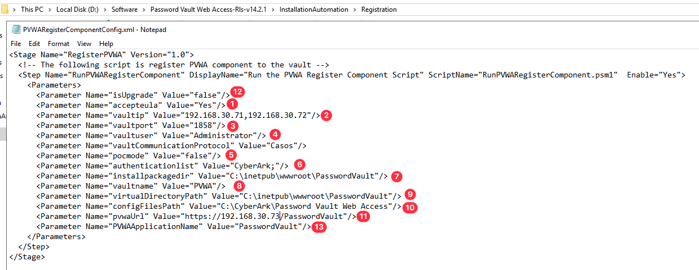

以Administrator權限執行PVWARegisterComponent.ps1

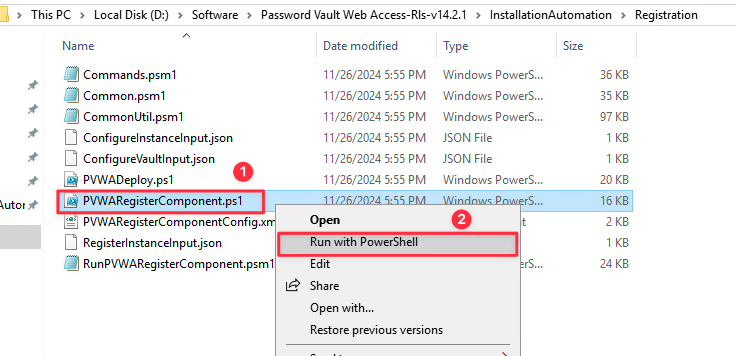

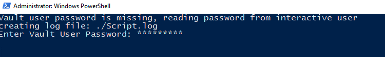

### 5.3. CPM

#### 5.3.1. Installation requirements

- 下載並完成[.NET Framework 4.8 Runtime](https://dotnet.microsoft.com/zh-tw/download/dotnet-framework/net48){:target="_blank"}安裝
- 下載並完成[Microsoft Visual C++ Redistributable for Visual Studio 2015-2022 32-bit and 64-bit versions](https://learn.microsoft.com/en-us/cpp/windows/latest-supported-vc-redist?view=msvc-170#visual-studio-2015-2017-2019-and-2022){:target="_blank"}安裝

!!! warning
    安裝完畢務必要重新開機

#### 5.3.2. Pre-installation tasks

以Administrator權限執行CPM_Prerequisters.ps1，此powershell會執行以下任務

- Verifies .NET version
- Sets IIS SSL TLS configuration

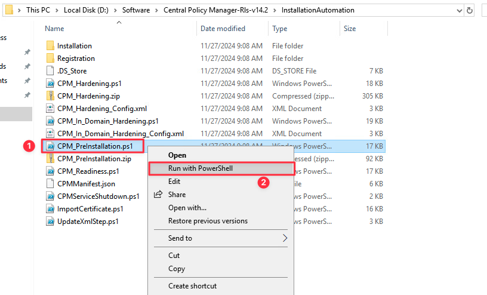

#### 5.3.3. Installation

編輯CPM\InstallationAutomation\Installation\InstallationConfig.xml檔案並依環境修改以下設定

| 項次 |        參數         | 描述                                                                |
| :--: | :-----------------: | ------------------------------------------------------------------- |
|  1   |   {==Username==}    | 使用者名稱                                                          |
|  2   |    {==Company==}    | 公司名稱                                                            |
|  3   | CPMInstallDirectory | CPM應用程式安裝位置。可維持預設值：C:\Program Files (x86)\CyberArk\ |
|  4   |      isUpgrade      | 是否為升級。因爲新安裝故維持預設值：False                           |

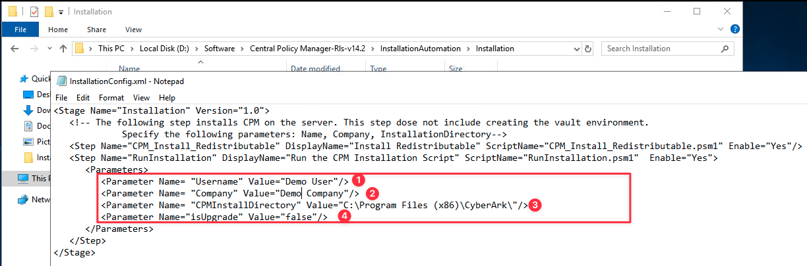

以Administrator權限執行CPMInstallation.ps1

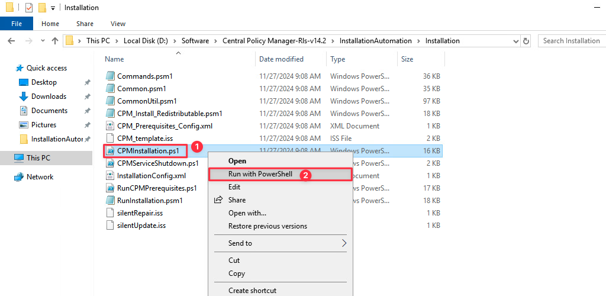

#### 5.3.4. Registration

此步驟主要是將CPM註冊到Vault，首先需要編輯CPM\InstallationAutomation\Registration\CPMRegisterComponentConfig.xml檔案並依環境修改以下設定

| 項次 |       參數       | 描述                                                                               |
| :--: | :--------------: | ---------------------------------------------------------------------------------- |
|  1   |    accepteula    | 是否接受用戶許可協議，維持預設值：Yes                                              |
|  2   |  {==vaultIP==}   | 輸入vault ip address，若有Primary與DR vault的話則兩個都輸入並以逗號(,)隔開         |
|  3   |    vaultport     | 輸入vault port，若無修改則維持預設值：1858                                         |
|  4   |    vaultuser     | 輸入vault administrator名稱，若無額外設定可維持預設值：Administrator               |
|  5   |     pocmode      | 是否以POC模式安裝，若無特別需求可維持預設值：false                                 |
|  6   | installDirectory | CPM應用程式安裝位置。與InstallationConfig.xml設定值相同                            |
|  7  |     username     | CPM使用者名稱，CPM於Vault中的儲存庫名稱也會與這個相同。可維持預設值PasswordManager |
|  8  |    isUpgrade     | 是否為升級。因爲新安裝故維持預設值：False                                          |

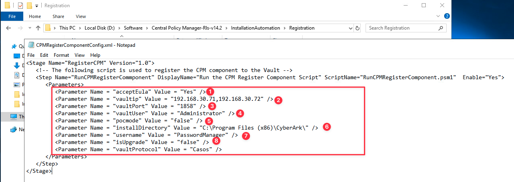

以Administrator權限執行CPMRegisterComponent.ps1

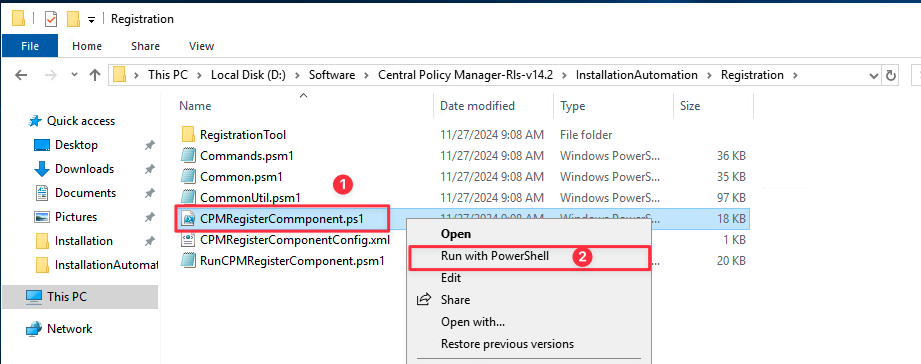

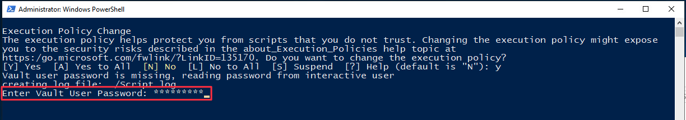

### 5.4. PSM

#### 5.4.1. Installation requirements

- 下載並完成[.NET Framework 4.8 Runtime](https://dotnet.microsoft.com/zh-tw/download/dotnet-framework/net48){:target="_blank"}安裝
- 下載並完成[Microsoft Visual C++ Redistributable for Visual Studio 2015-2022 32-bit and 64-bit versions](https://learn.microsoft.com/en-us/cpp/windows/latest-supported-vc-redist?view=msvc-170#visual-studio-2015-2017-2019-and-2022){:target="_blank"}安裝

#### 5.4.2. Installation

以Administrator權限開啟PowerShell並執行以下指令

```powershell linenums="1"
CD <PSM CD-Image Path>\PSMAutoInstallationTool
PSMAutoInstallationTool /vaultip <Vault IP address> /vaultuser <Vault username for installation> /accepteula yes
```

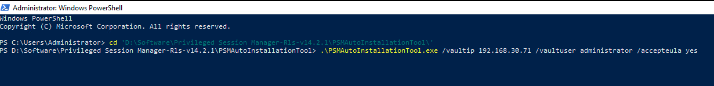
