<h2>目錄</h2>

- [1. 環境說明](#1-環境說明)
- [2. 部署虛擬機器](#2-部署虛擬機器)
    - [2.1. 下載 VX9000 檔案](#21-下載-vx9000-檔案)
    - [2.2. 建立虛擬機器](#22-建立虛擬機器)
- [3. 安裝](#3-安裝)
- [4. 初始化設定](#4-初始化設定)
    - [4.1. 登入Console](#41-登入console)
    - [4.2. 設定IP](#42-設定ip)
    - [4.3. 設定Default Gateway](#43-設定default-gateway)
    - [4.4. 啟用NOVA UI](#44-啟用nova-ui)
    - [4.5. 提交並儲存](#45-提交並儲存)
    - [4.6. 登入NOVA UI](#46-登入nova-ui)

## 1. 環境說明

- VX9000版本：7.7.1.11
- Vmware版本：8.0.3

<div class="page-break"/>

## 2. 部署虛擬機器

### 2.1. 下載 VX9000 檔案

- 至Extreme Support Portal 下載VX9000 ZIP檔案
  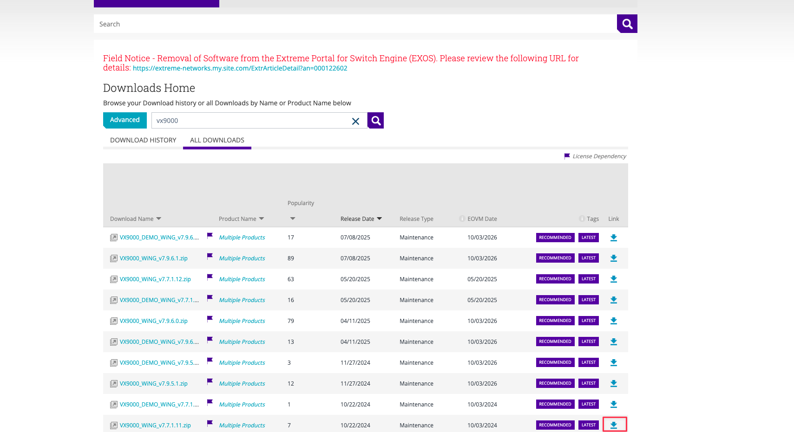
  
- 解壓縮ZIP檔案並將裡面的ISO檔案上傳至Vmware Datastore
  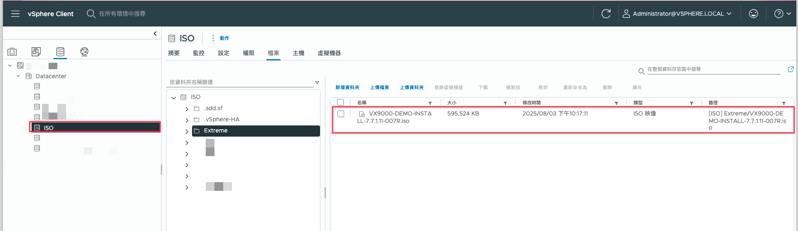

### 2.2. 建立虛擬機器

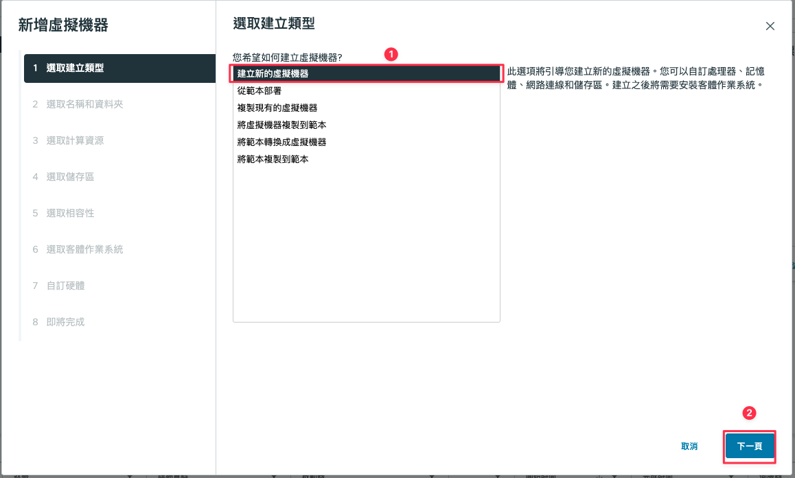

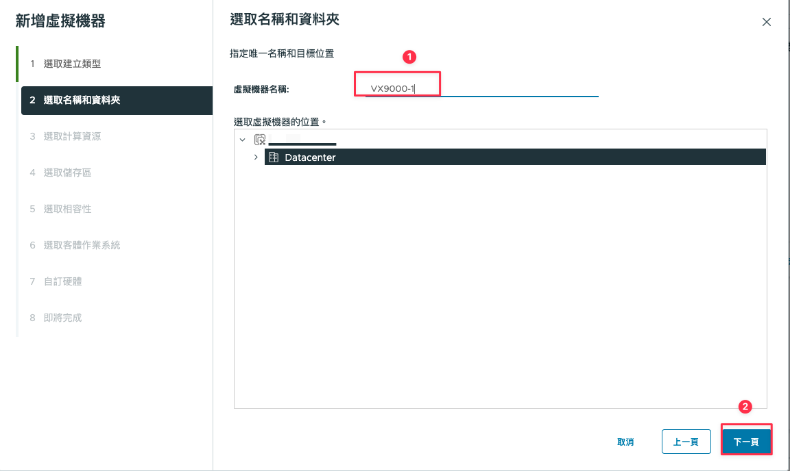

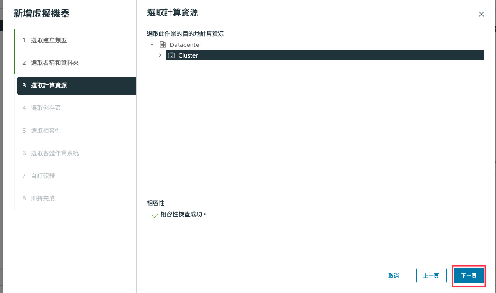

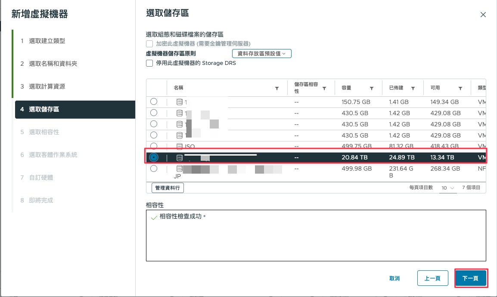

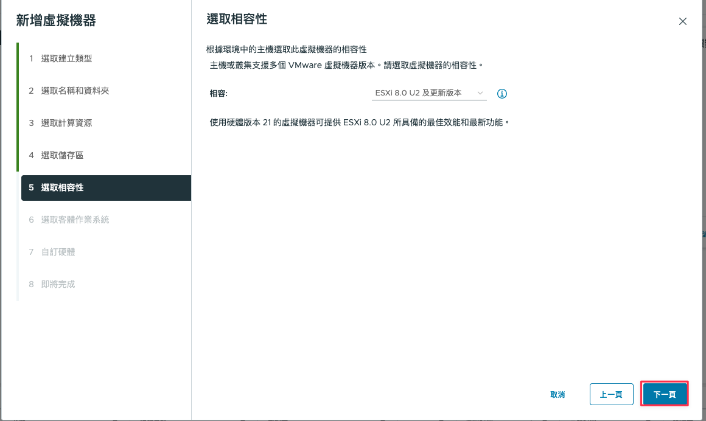

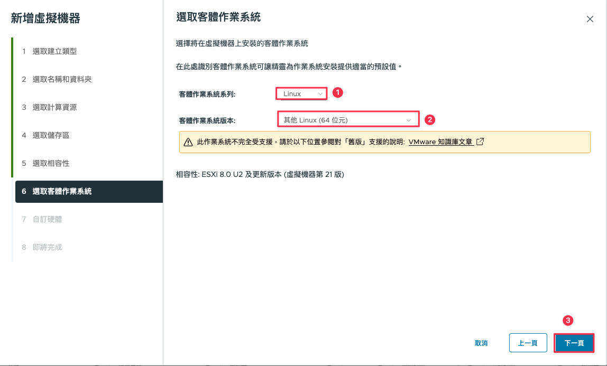

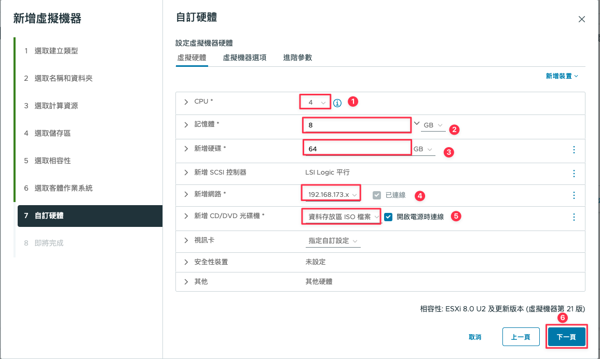

虛擬機器規格可以依據VX9000 Datasheet 設定，光碟機部分需要掛載 Vmware Datastore中的 VX9000 ISO檔案

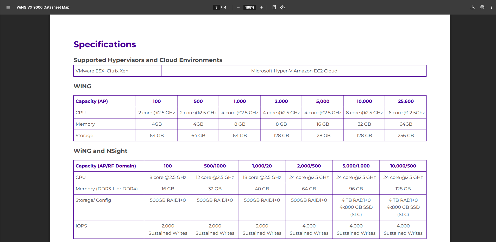

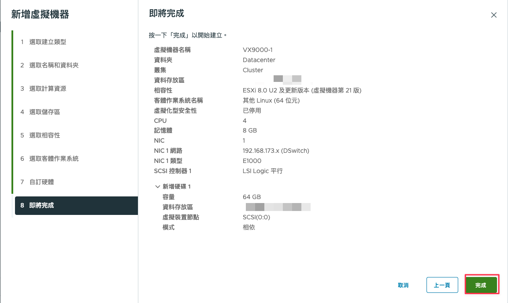

## 3. 安裝

VM 開機後打開 WEB 主控台

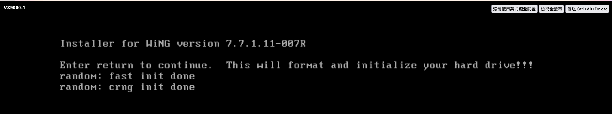

輸入enter開始安裝作業

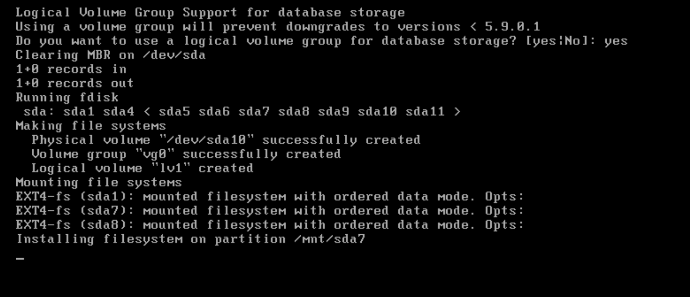

移除安裝光碟後輸入enter重新開機

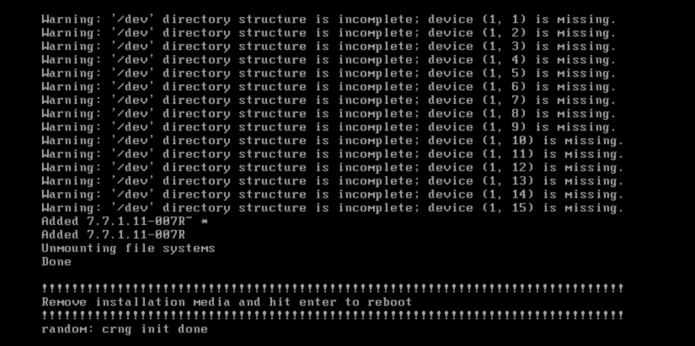

## 4. 初始化設定

### 4.1. 登入Console

預設帳號：admin，密碼：admin123

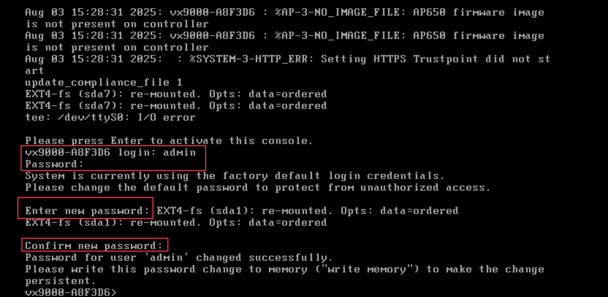

### 4.2. 設定IP

```shell
enable
self
interface vlan 1
ip address 192.168.173.51/21
```

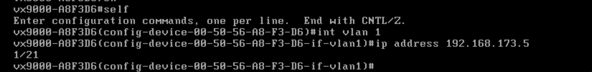

### 4.3. 設定Default Gateway

```shell
ip default-gateway 192.168.172.254
```

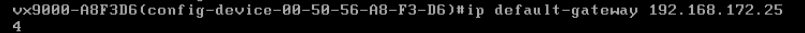

### 4.4. 啟用NOVA UI

```shell
management-policy default
nova
```

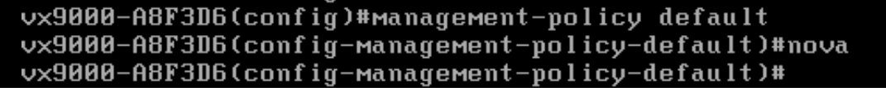

### 4.5. 提交並儲存

```shell
commit write
```

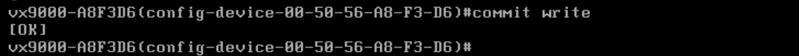

### 4.6. 登入NOVA UI

```shell
https://<VX9000 IP>:10443
```

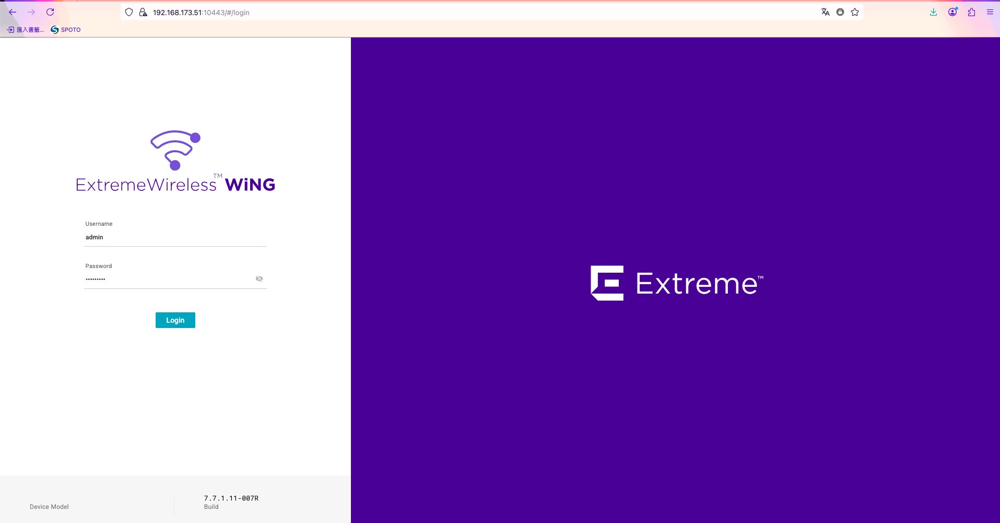

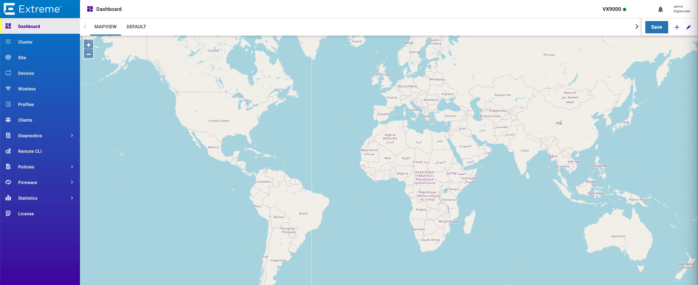