<h2>目錄</h2>

- [1. 環境說明](#1-環境說明)
- [2. SSLVPN 介紹](#2-sslvpn-介紹)
    - [2.1. 特點](#21-特點)
    - [2.2. 限制與注意事項](#22-限制與注意事項)
- [3. IPsec介紹](#3-ipsec介紹)
    - [3.1. 運作模式](#31-運作模式)
        - [3.1.1. 傳輸模式](#311-傳輸模式)
        - [3.1.2. 隧道模式](#312-隧道模式)
    - [3.2. 封包安全協定](#32-封包安全協定)
        - [3.2.1. AH](#321-ah)
        - [3.2.2. ESP](#322-esp)
    - [3.3. 金鑰管理協定](#33-金鑰管理協定)
        - [3.3.1. IKEv1](#331-ikev1)
            - [3.3.1.1. 使用Main Mode流程](#3311-使用main-mode流程)
            - [3.3.1.2. 使用Aggressive Mode流程](#3312-使用aggressive-mode流程)
            - [3.3.1.3. Main Mode vs Aggressive Mode 比較](#3313-main-mode-vs-aggressive-mode-比較)
        - [3.3.2. IKEv2](#332-ikev2)
            - [3.3.2.1. 使用 IKEv2 流程](#3321-使用-ikev2-流程)
    - [3.4. 封包處理流程](#34-封包處理流程)
        - [3.4.1. Outbound Path（封包送出）](#341-outbound-path封包送出)
        - [3.4.2. Inbound Path（封包接收）](#342-inbound-path封包接收)
- [4. SSL VPN vs IPsec VPN 比較](#4-ssl-vpn-vs-ipsec-vpn-比較)
- [5. 遷移前的設計規劃要點](#5-遷移前的設計規劃要點)
    - [5.1. 身份驗證方式](#51-身份驗證方式)
    - [5.2. 連線方式](#52-連線方式)
    - [5.3. IP 位址分配](#53-ip-位址分配)
    - [5.4. DNS 與搜尋網域](#54-dns-與搜尋網域)
    - [5.5. 多使用者群組與 Peer ID 連線設計](#55-多使用者群組與-peer-id-連線設計)
        - [5.5.1. 方式一：單一撥入隧道 + 多群組](#551-方式一單一撥入隧道--多群組)
        - [5.5.2. 方式二：多條獨立撥入隧道 + 各自群組](#552-方式二多條獨立撥入隧道--各自群組)
        - [5.5.3. IKEv1 模式對 Peer ID 辨識的影響](#553-ikev1-模式對-peer-id-辨識的影響)
- [6. 建立IPSEC VPN Tunnel](#6-建立ipsec-vpn-tunnel)
    - [6.1. 使用內建範本建立](#61-使用內建範本建立)
        - [6.1.1. 開啟 VPN Wizard](#611-開啟-vpn-wizard)
        - [6.1.2. 設定身份驗證與撥入參數](#612-設定身份驗證與撥入參數)
        - [6.1.3. 配置撥入用戶的網路設定](#613-配置撥入用戶的網路設定)
        - [6.1.4. 客戶端選項](#614-客戶端選項)
        - [6.1.5. 建立完成並驗證](#615-建立完成並驗證)
    - [6.2. 不使用內建範本建立](#62-不使用內建範本建立)
        - [6.2.1. 開啟 VPN Wizard](#621-開啟-vpn-wizard)
        - [6.2.2. Network](#622-network)
        - [6.2.3. 認證與 IKE 版本設定](#623-認證與-ike-版本設定)
        - [6.2.4. Phase 1](#624-phase-1)
        - [6.2.5. Phase 2](#625-phase-2)
        - [6.2.6. 設定EAP驗證](#626-設定eap驗證)
        - [6.2.7. 建立Firewall Policy](#627-建立firewall-policy)
- [7. FortiClient 用戶端設定教學](#7-forticlient-用戶端設定教學)
    - [7.1. 開啟 FortiClient VPN 設定頁面](#71-開啟-forticlient-vpn-設定頁面)
    - [7.2. 建立 VPN Profile](#72-建立-vpn-profile)
    - [7.3. 測試 VPN 連線](#73-測試-vpn-連線)
- [8. FAQ](#8-faq)
    - [8.1. 如何限制僅有台灣IP可以連線](#81-如何限制僅有台灣ip可以連線)
    - [8.2. 為何在Forward Traffic User欄位沒有資訊](#82-為何在forward-traffic-user欄位沒有資訊)
        - [8.2.1. IKEv1](#821-ikev1)
        - [8.2.2. IKEv2](#822-ikev2)

<div class="page-break"/>

## 1. 環境說明

- 硬體： FortiGate 60F
- FortiOS版本：7.2.11

<div class="page-break"/>

## 2. SSLVPN 介紹

SSLVPN（Secure Sockets Layer Virtual Private Network）是一種基於應用層的 VPN 技術，常透過瀏覽器或VPN軟體連線。

### 2.1. 特點

- 使用 TLS（Transport Layer Security） 加密封包（前身為 SSL）
- 用戶可透過 Web 瀏覽器或VPN軟體連線
- 支援 Web Portal 模式與 Tunnel 模式
- 支援客戶端憑證、二階段驗證、多用戶群組控管
- 通常封裝於 TCP 443，可避免大多數網路阻擋

### 2.2. 限制與注意事項

1. **TCP-over-TCP 問題**  
   Tunnel 模式本身透過 TCP（TLS）進行封包傳輸，如果使用的應用（如 RDP、SSH、FTP）本身也是 TCP 協定，兩層 TCP 若同時發生重傳機制，會造成「重複擁塞控制」與效能瓶頸，這稱為 "TCP-over-TCP" 問題。

2. **不支援 QoS 標記與優先處理**  
   TLS 封裝會將原始封包包在加密資料裡，導致網路設備無法辨識內層封包的類型與標記，因此無法針對不同流量進行 QoS（服務品質）管理。

3. **無法使用硬體加速（如 NPU）**  
   SSL VPN 使用 TLS 加密，其運算在應用層，與 IPsec 不同，無法使用 FortiGate 上的 NPU（Network Processing Unit）等硬體加速器，因此會大量依賴 CPU，造成加密效能受限。

<div class="page-break"/>

## 3. IPsec介紹

IPsec（Internet Protocol Security）是一種用於在 IP 層實現安全通訊的協定套件。它透過雙方事先協商好的設定（稱為 Security Association，SA），來對 IP 封包進行加密與驗證，確保資料在網路上的私密性、完整性與可驗證性。

```markmap
---
markmap:
  colorFreezeLevel: 2
  lineWidth: 2
  pan: true
  spacingVertical: 15
  duration: 0
---
# IPsec 架構
## 運作模式 (Operational Modes)
### 傳輸模式 (Transport Mode)
### 隧道模式 (Tunnel Mode)
## 封包安全協定 (Traffic Security Protocols)
### ESP — Encapsulating Security Payload
### AH — Authentication Header
## 安全關聯 (Security Association, SA)
### Phase-1 SA
#### IKEv1 Main / Aggressive ｜ IKEv2 IKE_SA（建立控制通道，用於後續 Phase-2 IKE 流量加解密）
### Phase-2 SA
#### IKEv1 Quick Mode ｜ IKEv2 CHILD_SA（建立資料通道，供 ESP / AH 加解密實際流量）
## 資料庫 (Databases)
### SPD — Security Policy Database
#### 依 Selectors 決定 Protect / Bypass / Discard
### SAD — Security Association Database
#### 以 SPI 為索引，保存 IKE 已談妥的 SA 參數
### PAD — Peer Authorization Database
#### 為每個 Peer ID 指定可接受的基礎驗證法（共享金鑰／憑證），並標示是否強制次級驗證 (xAuth/EAP)
## 金鑰管理協定 (Key Management Protocol)
### IKEv1
#### Main Mode
#### Aggressive Mode
### IKEv2
```

<div class="page-break"/>

### 3.1. 運作模式

#### 3.1.1. 傳輸模式

```text
┌─────────────────────────────┬─────────────────────┬────────────────────────────┐
│         IP Header           │   ESP/AH Header     │   TCP/UDP Header + Data    │
└─────────────────────────────┴─────────────────────┴────────────────────────────┘
|<----- 保留原IP Header ----->|                      |<-- 加密╱驗證的範圍 (僅負載) -->|

```

- 原 IP Header保留，只加一層 ESP／AH Header
- 僅 `TCP/UDP + Data`部分會受到保護
- 因 IP 位址不變故開銷小，但無法隱匿真實 IP。
- 適用於主機 ↔ 主機或路由協定簽章。

<div class="page-break"/>

#### 3.1.2. 隧道模式

```text
┌─────────────────────────────┬─────────────────────┬─────────────────────────────────────────┐
│        New IP Header        │   ESP/AH Header     │  Old IP Header + TCP/UDP Header + Data  │
└─────────────────────────────┴─────────────────────┴─────────────────────────────────────────┘
|<-- 外部路由使用的IP Header -->|                     |<--- 加密╱驗證的範圍（原IP Header和資料） --->|                                     
```

- 外層更換新 IP Header，把 *整個原封包* 包裝進去  
- 完全隱蔽內部源/目的 IP，適合在Internet上傳輸  
- 因額外新增一個IP Header故MTU 開銷較大  
- 適用 Site-to-Site VPN、遠端撥號。

<div class="page-break"/>

### 3.2. 封包安全協定

#### 3.2.1. AH

```text
┌────────────┬───────────────────────────────────┐
│ AH Header  │              IP Data              │
└────────────┴───────────────────────────────────┘
             |<-- 驗證範圍 (MD5/SHA1 雜湊演算法) -->|
```

- 工作在 IP Protocol 51
- 僅提供 完整性╱來源驗證，不提供加密
- 由於無機密性，現代部署已很少使用，常被 ESP 取代

<div class="page-break"/>

#### 3.2.2. ESP

```text
┌────────────┬───────────────────┬──────────────┬────────────────────┐
│ ESP Header │      IP Data      │  ESP Trailer │ ESP Authentication │
└────────────┴───────────────────┴──────────────┴────────────────────┘
             |<-- 加密範圍 (DES/3DES/AES 加密) -->|
|<-------- 驗證範圍 (MD5/SHA1 雜湊演算法) -------->|

```

- 工作在 IP Protocol 50
- 可同時提供 機密性 (加密) 與 完整性╱來源驗證
- 支援 NAT-T → 封裝於 UDP 4500
- 主流 VPN 部署（Site-to-Site、Remote Access）皆採 ESP

<div class="page-break"/>

### 3.3. 金鑰管理協定

#### 3.3.1. IKEv1

- IKEv1 使用兩階段（Phase-1 / Phase-2）建立安全關聯 (SA)。
- Phase-1 主要負責雙向認證與保護後續 IKE 流量。
- Phase-2（Quick Mode）則建立真正的 ESP/AH SA。
- 支援以下兩種協商模式

<div class="page-break"/>

##### 3.3.1.1. 使用Main Mode流程

```text
| Initiator                                                                                                 Responder |
|                                                                                                                     |
|─────────────────────────────────────────── Phase-1（Main Mode：建立 IKE SA）──────────────────────────────────────────|
|                                                                                                                     |
| ------ 傳送 Propose algorithms（加密演算法（如 AES）、驗證演算法（如 SHA1）、DH 群組（如 Group 14）、認證方法（如 PSK））  ------> |
|                                                                                                                     |
| <------------------------------------- Select algorithms（從提案中選擇匹配組合） -------------------------------------- |
|                                                                                                                     |
| ------------------------------------------- Exchange DH public values  -------------------------------------------->|
|                                                                                                                     |
| <------------------------------------------ Exchange DH public values  ---------------------------------------------|
|                                                                                                                     |
| ---------------------- 利用 Diffie-Hellman 產生的共享金鑰加密傳送Authenticate（Local ID + Auth）  ---------------------->|
|                                                                                                                     |
| <---------------------- 利用 Diffie-Hellman 產生的共享金鑰加密傳送Authenticate（Local ID + Auth）  ----------------------|
|                                                                                                                     |
|───────────────────────────────────────── Phase-2（Quick Mode：建立 IPsec SA）─────────────────────────────────────────|
|                                                                                                                     |
| ---------------------- 傳送Propose IPsec SA參數（ESP/AH演算法、加密演算法、認證演算法、生命週期等）  ----------------------->|
|                                                                                                                     |
| <------------------------------------- Select algorithms（從提案中選擇匹配組合） -------------------------------------- |
|                                                                                                                     |
| --- Initiator/Responder → 產生資料加密金鑰：---------------------------------------------------------------------------|
|     - 啟用 PFS → 進行新的 Diffie-Hellman 交換，產生獨立金鑰                                                              |
|     - 未啟用 PFS → 由 Phase-1 的共享金鑰派生新的資料加密金鑰                                                              |
```

- Phase-1 共需 6 個封包往返。
- ID 資訊（身份）在加密後傳送 ➔ 較安全。
- 適合Site-to-Site VPN。

<div class="page-break"/>

##### 3.3.1.2. 使用Aggressive Mode流程

```text
| Initiator                                                                                                               Responder |
|                                                                                                                                   |
|───────────────────────────────────────────── Phase-1（Aggressive Mode：建立 IKE SA）────────────────────────────────────────────────|
|                                                                                                                                   |
| --- 傳送 Proposal（加密演算法（如 AES）、驗證演算法（如 SHA1）、DH 群組（如 Group 14）、認證方法（如 PSK）） + DH public values + Local ID  ---> |
|                                                                                                                                   |
| <-------------------------- 傳送回應（接受的 Proposal 內容） + DH public values + Local ID + 認證資料（Auth） --------------------------|
|                                                                                                                                   |
| ------------------------------------------------------- 傳送認證資料（Auth） ------------------------------------------------------->|
|                                                                                                                                   |
|───────────────────────────────────────────── Phase-2（Quick Mode：建立 IPsec SA）───────────────────────────────────────────────────|
|                                                                                                                                   |
| ---------------------------- 傳送 Propose IPsec SA參數（ESP/AH演算法、加密演算法、認證演算法、生命週期等）  ------------------------------>|
|                                                                                                                                   |
| <-------------------------------------------- Select algorithms（從提案中選擇匹配組合） --------------------------------------------- |
|                                                                                                                                   |
| --- Initiator/Responder → 產生資料加密金鑰：-----------------------------------------------------------------------------------------|
|     - 啟用 PFS → 進行新的 Diffie-Hellman 交換，產生獨立金鑰                                                                            |
|     - 未啟用 PFS → 由 Phase-1 的共享金鑰派生新的資料加密金鑰                                                                            |
```

- Phase-1 僅需 3 個封包往返。
- ID 資訊直接以明文傳送 ➔ 速度快，但身份外洩風險高。
- 適合Remote Access VPN。

<div class="page-break"/>

##### 3.3.1.3. Main Mode vs Aggressive Mode 比較

| 項目            | Main Mode        | Aggressive Mode |
| :-------------- | :--------------- | :-------------- |
| Phase-1封包數量 | 6個              | 3個             |
| ID傳送方式      | 加密傳送         | 明文傳送        |
| 建立速度        | 較慢             | 較快            |
| 適用場景        | Site-to-Site VPN | Dial-up VPN     |
| 安全性          | 較高             | 較低            |

<div class="page-break"/>

#### 3.3.2. IKEv2

- IKEv2 重新設計了 IKE 協定，簡化了流程與訊息數量。
- 將原本 IKEv1 的 Phase-1（Main/Aggressive Mode）與 Phase-2（Quick Mode）整合成單一流程。
- 主要分為兩個階段：
    - **IKE_SA_INIT**：建立基礎加密通道（協商加密、驗證參數並交換 DH 公開值）
    - **IKE_AUTH**：雙向認證，並同時建立第一個 CHILD_SA（資料加密通道）
- 支援 NAT Traversal（UDP 4500）、EAP（靈活認證機制）、MOBIKE（行動IP遷移）。

<div class="page-break"/>

##### 3.3.2.1. 使用 IKEv2 流程

```text

|Initiator                                                                                                                   Responder|                                                 
|                                                                                                                                     |
|─────────────────────────────────────────────────── IKE_SA_INIT 階段（建立加密通道）────────────────────────────────────────────────────|
|                                                                                                                                     |
| --- 傳送 Proposal（加密演算法（如 AES）、驗證演算法（如 SHA1）、DH 群組（如 Group 14）、認證方法（如 PSK））、DH public values、Nonce（隨機數）  ---> |
|                                                                                                                                    |
| <----------------------------------------- 回應選定演算法、DH public values、Nonce（隨機數）  ----------------------------------------- |
|                                                                                                                                    |
|                              【雙方根據彼此的 DH public values + Nonce ➔ 計算出 Shared Key】                                           |
|                                                                                                                                    |
|────────────────────────────────────────────────── IKE_AUTH 階段（認證與建立資料通道）──────────────────────────────────────────────────|
|                              【此階段封包內容以 IKE_SA_INIT 階段產生的 Shared Key 加密】                                                 |
|                                                                                                                                    |
| -------------------------------------------------------- Encrypted(IDi + 認證資料 + CHILD_SA參數提案) ------------------------------->|
|                                                                                                                                    |
| <------------------------------------------- Encrypted(IDr + 認證資料 + CHILD_SA建立回應) --------------------------------------------|
```

- 只需 4 個封包往返，即可完成身份驗證與資料通道建立。
- 支援 EAP 認證 ➔ 適合靈活使用者認證（如帳號密碼、雙因子認證）。
- 建立第一個 CHILD_SA 後，可持續新增／刪除 CHILD_SA，不需重建 IKE_SA。
- 適合各種 VPN 型態（Site-to-Site VPN、Remote Access VPN）。

<div class="page-break"/>

### 3.4. 封包處理流程

#### 3.4.1. Outbound Path（封包送出）

```text
[應用層資料]（產生要傳送的資料）
      ↓
[加上 IP Header]（封裝成 IP 封包）
      ↓
[SPD 查詢]（根據 Selectors：來源IP／目的IP／Port／協定）
      ↓
[SPD 查詢結果]
      ├── Bypass → [直接送出]（無需加密）
      ├── Discard → [丟棄封包]
      ↓ Protect
[SAD 查找 SA]（根據 SPD指定 or SPI 查找 SA）
      ↓
[找到 SA？]
      ├── 否 → [觸發 IKE 協商]（建立新的 SA 並存入 SAD）
      │           ↓
      └────────── 回到 [使用 ESP╱AH 加密]
      ↓ 是
[使用 ESP╱AH 加密]（加密封包 or 驗證完整性）
      ↓
[送出到網路]

```

**以上流程圖可以想像成：**

1. 當你（主機）要寄出一封信（資料封包），你先把信寫好（應用層資料），然後裝進信封（IP Header）。
2. 接著你到郵局（SPD）詢問：
    - 這封信要加密寄出嗎？（Protect）
    - 還是可以直接寄出？（Bypass）
    - 還是這封信根本不准寄？（Discard）
3. 如果郵局說要加密寄出，那你會去問櫃台（SAD）：「我有鑰匙可以加密嗎？」
    - 如果有，就直接加密（使用ESP/AH）後送出去。
    - 如果沒有鑰匙，就要打電話給對方（IKE 協商），雙方交換好密鑰，才能加密後寄出。

<div class="page-break"/>

#### 3.4.2. Inbound Path（封包接收）

```text
[從網路接收封包]
      ↓
[封包是否有 ESP╱AH Header？]
      ├── 有 → [解析 SPI]（從 ESP╱AH Header 擷取 SPI）
      │           ↓
      │    [SAD 查找對應的 SA]（找加解密╱驗證所需參數）
      │           ↓
      │    [ESP╱AH 驗證╱解密]（先完成驗證與解密）
      ↓
[SPD 查詢]（根據解密後封包的 Selectors 進行比對）
      ↓
[SPD 查詢結果]
      ├── Protect → [交付上層應用]（符合規則，交TCP/UDP繼續處理）
      ├── Bypass → [直接交付上層應用]（明文允許流量）
      └── Discard → [丟棄封包]（不符合規則丟棄）
```

**以上流程圖可以想像成：**

1. 當你（主機）收到一封信（網路封包），你先看看信封上是不是貼了「加密封條」（ESP/AH Header）。
2. 如果有，就用你事先存好的鑰匙（SAD裡的SA）把信打開，並驗證是不是正確寄來的。
3. 打開之後，你再拿這封信去郵局（SPD）問：
    - 這種信可以收嗎？（Protect）
    - 還是這封信本來就是可以直接收的明信片？（Bypass）
    - 還是這封信是垃圾詐騙？（Discard）
4. 郵局會根據信件的寄件人、地址等資訊做決定。只有通過檢查的信，才會交到你的桌上（上層應用）。

<div class="page-break"/>

## 4. SSL VPN vs IPsec VPN 比較

以下表格彙整 SSL VPN 與 IPsec VPN 在各項核心技術指標的差異：

| 項目           | SSL VPN              | IPsec VPN                                     |
| :------------- | :------------------- | :-------------------------------------------- |
| 封裝方式       | TLS over TCP         | ESP（Encapsulating Security Payload）         |
| 加密效能       | 較低                 | 較高（支援硬體加速）                          |
| NAT 穿透能力   | 高（走 TCP 443）     | 中（需 UDP 4500，或 TCP 封裝方式）            |
| 穿透防火牆能力 | 高（幾乎不受限制）   | 中（視防火牆設定而定）                        |
| QoS 支援       | 差（無法標記 DSCP）  | 佳（ESP 可支援 QoS 標記與分類）               |
| 用戶端需求     | 瀏覽器 / FortiClient | FortiClient（或其他 IPsec-compatible client） |
| 適用場景       | 小型、臨時連線需求   | 長期、穩定、大規模部署                        |

<div class="page-break"/>

**小結說明：**

- **SSL VPN** 透過標準的 HTTPS (TCP 443) 封裝，加密傳輸，  
    - 優點是**容易穿越 NAT、防火牆**。
    - 缺點是**加密效率較低**，且容易遇到 **TCP over TCP 重傳效能下降**問題。
    - 適合小型、臨時需求，如 Remote Access 或緊急異地辦公。

- **IPsec VPN** 使用 ESP 協定於 IP 層加密，  
    - 優點是**支援硬體加速（NPU等）**，加密效率高、可標記 QoS。  
    - 缺點是**NAT穿透需配合 UDP 4500**，且防火牆須正確設置。
    - 適合需要高效能、長期且穩定連線的場景，如 Site-to-Site VPN 或大型企業連線。

<div class="page-break"/>

## 5. 遷移前的設計規劃要點

在開始配置 IPsec VPN 之前，建議先盤點現有 SSL VPN 架構與使用者行為，並依據下列幾個面向設計對應策略。

### 5.1. 身份驗證方式

SSL VPN 支援多種驗證方式，包括：

- 本機帳號（Local User）
- LDAP
- RADIUS
- SAML
- PKI 憑證

IPsec VPN 同樣支援上述大多數機制，但實作方式會依 IKE 協定版本略有差異：

| 驗證方式 | IKEv1 支援       | IKEv2 支援     | 備註                              |
| -------- | ---------------- | -------------- | --------------------------------- |
| 本機帳號 | ✅               | ✅             |                                   |
| LDAP     | ✅（搭配 XAuth） | ✅（搭配 EAP） | IKEv2 效能與整合度較佳            |
| RADIUS   | ✅               | ✅             |                                   |
| SAML     | ❌               | ✅             | 僅支援 IKEv2，需 FortiClient 支援 |
| 憑證     | ✅               | ✅             | 可與 PKI + LDAP 搭配使用          |

> 若目前 SSL VPN 為多樣化驗證結構（如混合 LDAP+SAML），則建議選用 IKEv2 並搭配 FortiClient。

<div class="page-break"/>

### 5.2. 連線方式

- SSL VPN 提供 Web Portal 或 FortiClient Tunnel 模式登入。
- IPsec VPN 則必須使用 FortiClient（或支援 IPsec 的第三方客戶端）建立隧道。

### 5.3. IP 位址分配

SSL VPN 使用自訂 IP Pool 發放虛擬位址。

IPsec VPN 可使用：

1. **Mode Config 地址池**：類似 SSL VPN 的方式。
2. **DHCP over IPsec**：由內部 DHCP Server 分配。
3. **靜態 IP（使用者設定）**：僅限部分進階場景使用。

> 建議使用 mode-config 並設定適當的 Split Tunnel 網段，以避免流量全數導入 VPN 造成瓶頸。

<div class="page-break"/>

### 5.4. DNS 與搜尋網域

SSL VPN 可支援自定義 DNS 與搜尋字尾設定；IPsec VPN 同樣支援，但其行為依 IKE 版本與用戶端功能而異。

| 項目            | SSL VPN | IPsec（IKEv1） | IPsec（IKEv2） |
| --------------- | ------- | -------------- | -------------- |
| 設定 DNS Server | ✅      | ✅             | ✅             |
| 設定搜尋字尾    | ✅      | 有限支援       | ✅             |
| Split DNS       | ✅      | ❌             | ✅             |

<div class="page-break"/>

### 5.5. 多使用者群組與 Peer ID 連線設計

在 SSL VPN 中，所有使用者共用同一個虛擬介面 `ssl.root`，並依使用者所屬群組，透過防火牆政策指派不同 Portal 或存取權限。

相比之下，IPsec VPN 提供更多彈性來實作多群組架構，常見有兩種設計方式：

#### 5.5.1. 方式一：單一撥入隧道 + 多群組

- 在單一 VPN 隧道中，允許多個使用者群組（如 `Group_A`、`Group_B`）連線
- 利用防火牆政策根據群組分配不同存取權限
- 適合設定共用、資源共用（如同一IP Pool、加密套件）

#### 5.5.2. 方式二：多條獨立撥入隧道 + 各自群組

- 為每個群組建立一條專屬的 VPN 隧道
- 每條隧道設定專屬的 **Peer ID**（用來識別不同來源）
- 可為不同群組設定不同加密演算法、不同 IP Pool、不同存取策略
- 需依據連線初期的 Peer ID 來套用正確的設定檔

<div class="page-break"/>

#### 5.5.3. IKEv1 模式對 Peer ID 辨識的影響

| IKEv1 模式類型  | Peer ID 傳遞支援 | 說明                                          |
| :-------------- | :--------------- | :-------------------------------------------- |
| Main Mode       | ❌ 不支援        | 初期封包不傳遞身份，無法根據 Peer ID 區分連線 |
| Aggressive Mode | ✅ 支援          | 初期封包即攜帶 Peer ID，可用來區分設定        |

> **重點提醒**：  
> 若採用 IKEv1 並希望依 Peer ID 自動分配設定，建議使用 **Aggressive Mode**。  
> 使用 IKEv2 則無此限制，原生支援 Peer ID 傳遞。

<div class="page-break"/>

## 6. 建立IPSEC VPN Tunnel

### 6.1. 使用內建範本建立

FortiGate 提供內建的 IPsec Wizard，可快速建立與 FortiClient 相容的遠端 VPN，設定流程簡單明確，本節將逐步說明 GUI 設定流程。

<div class="page-break"/>

#### 6.1.1. 開啟 VPN Wizard

1. 登入 FortiGate 管理介面
2. 前往 `VPN > IPsec Wizard`
3. Template Type 請選擇：**Remote Access**
4. Remote device type 選擇：**FortiClient**

輸入 Tunnel 名稱（例如：`Remote-VPN`）

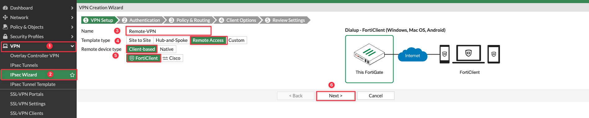

<div class="page-break"/>

#### 6.1.2. 設定身份驗證與撥入參數

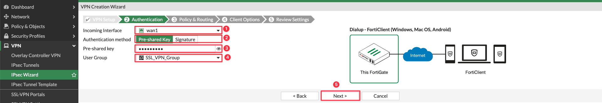

| 欄位名稱              | 建議設定                                       |
| --------------------- | ---------------------------------------------- |
| Incoming Interface    | 對外連線使用的 WAN 介面（如 `wan1`）           |
| Authentication Method | 選擇 `Pre-shared Key` 或 `Digital Certificate` |
| Pre-shared Key        | 自訂金鑰，需與用戶端設定一致                   |
| User Group            | 選擇已建立的驗證群組（如 `SSL_VPN_Group`）     |

✅ 若使用 LDAP 或 RADIUS，請確保已建立對應的使用者群組並套用至此處。

<div class="page-break"/>

#### 6.1.3. 配置撥入用戶的網路設定

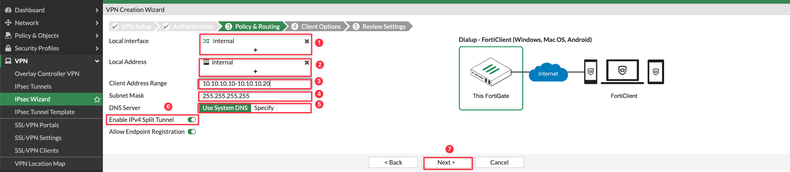

| 項目                 | 說明                                                                     |
| -------------------- | ------------------------------------------------------------------------ |
| Local Interface      | 內部網段的出入口（如 `internal`）                                        |
| Local Address        | 用戶成功撥入後能存取的內部資源 IP 或網段                                 |
| Client Address Range | 指定撥入用戶將取得的虛擬 IP 範圍（如 `10.10.10.10-10.10.10.20`）         |
| Subnet Mask          | 建議設定`255.255.255.255`，這樣每個VPN用戶均視為獨立網段彼此不能互相溝通 |
| DNS Server           | 指定內部 DNS（如 `192.168.1.1`），或保留預設                             |
| Enable Split Tunnel  | 啟用後就只有設定的目的地網段才會導入 VPN                                 |

<div class="page-break"/>

#### 6.1.4. 客戶端選項

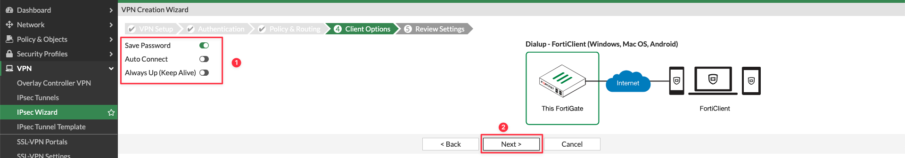

| 選項項目      | 建議                                 |
| ------------- | ------------------------------------ |
| Save Password | 若啟用則使用者將可以儲存密碼         |
| Auto Connect  | 可選，適用於長時間連線需求           |
| Always Up     | 若啟用，VPN 將會自動嘗試維持連線狀態 |

<div class="page-break"/>

#### 6.1.5. 建立完成並驗證

完成設定後，系統會自動建立：

- Phase 1 與 Phase 2 的設定檔
- 一條撥入的 IPsec Tunnel 介面
- 對應的防火牆政策（允許撥入 VPN 使用者進入內部網段）

可至 `VPN > IPsec Tunnels` 查看連線狀態並進行調整。

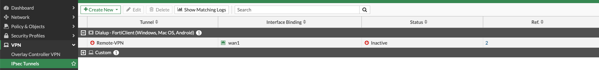

<div class="page-break"/>

### 6.2. 不使用內建範本建立

使用範本建立部分目前都是使用IKEv1，若有要使用IKEv2或希望不要自動建立相關物件及Policy則可以使用 Custom 方式建立，以下是使用IKEv2作為範例，若是要設定IKEv1則不需要設定EAP部分但是要設定XAuth部分

#### 6.2.1. 開啟 VPN Wizard

1. 登入 FortiGate 管理介面
2. 前往 `VPN > IPsec Wizard`
3. Template Type 請選擇：**Custom**

輸入 Tunnel 名稱（例如：`IKEv2-VPN`）

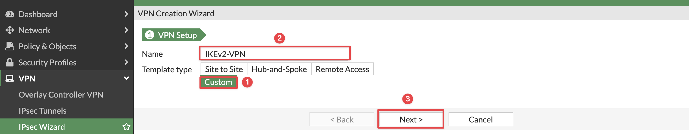

<div class="page-break"/>

#### 6.2.2. Network

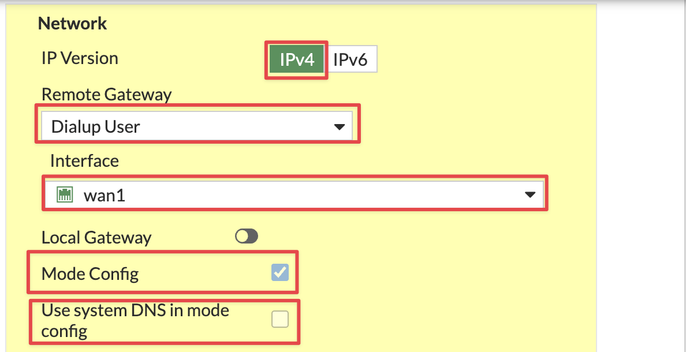

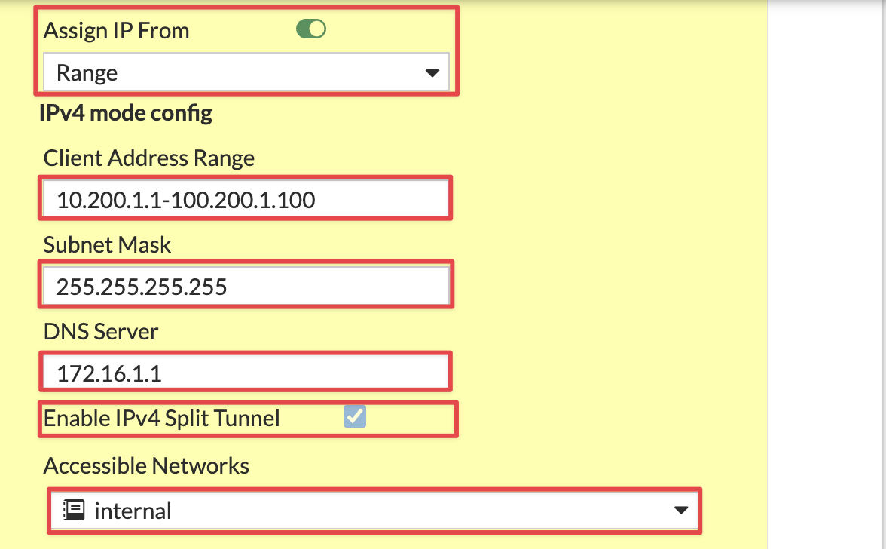

<div class="page-break"/>

| 項目                          | 說明                                                                   |
| ----------------------------- | ---------------------------------------------------------------------- |
| IP Version                    | 使用 `IPv4`                                                            |
| Remote Gateway                | 選擇 `Dialup User`，代表允許不定來源的用戶端進行撥入                   |
| Interface                     | 設定 VPN 撥入要綁定的介面（如 `wan1`）                                 |
| Local Gateway                 | 僅有當要使用的IP並非介面IP時才需勾選                                   |
| Mode Config                   | 建議`啟用`，因為在未啟用此設定情況下是不會賦予用戶端任何網路資訊       |
| Use system DNS in mode config | 若有`勾選`則用戶端會使用FortiGate上設定的DNS資訊                       |
| Assign IP From                | 設定賦予Client端IP方式，一般選擇`Range`                                |
| Client Address Range          | 設定Client IP範圍，如 `10.10.10.10-10.10.10.20`                        |
| Subnet Mask                   | 建議設定255.255.255.255，這樣每個VPN用戶均視為獨立網段彼此不能互相溝通 |
| DNS Server                    | 設定Client DNS Server                                                  |
| Enable IPv4 Split Tunnel      | 啟用後就只有設定的目的地網段才會導入 VPN                               |
| Accessible Networks           | 選擇要導入VPN的目的地網段                                              |
| NAT Traversal                 | 建議設為設定 `Enable`，可支援 VPN 客戶端位於 NAT 後方                  |
| Dead Peer Detection           | 建議設為 `On Demand`，可自動偵測對端是否離線，避免無效連線             |

<div class="page-break"/>

#### 6.2.3. 認證與 IKE 版本設定

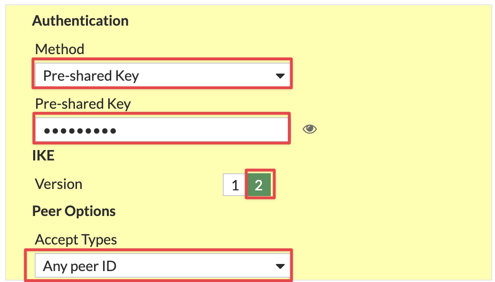

| 項目               | 說明                                                            |
| ------------------ | --------------------------------------------------------------- |
| **Method**         | 依需求選擇，通常選擇 `Pre-shared Key`                           |
| **Pre-shared Key** | 設定`Pre-shared Key`                                            |
| **IKE Version**    | 依需求選擇，建議選擇 `2`較安全                                  |
| **Accept Types**   | 依 VPN 架構選擇，通常選擇`Any peer ID`：                        |
|                    | - `Any peer ID`：適用於**單一VPN撥入通道**的環境                |
|                    | - `Specific Peer ID`：適用於**相同介面有多個VPN撥入通道**的環境 |

<div class="page-break"/>

#### 6.2.4. Phase 1

Proposal（加密演算法、驗證演算法、Diffie-Hellman 群組）可以設定多組，IKE 協商時對方只要符合其中一組，即可成功連線。這樣可兼容不同設備或客戶端的加密需求，提升互通性。

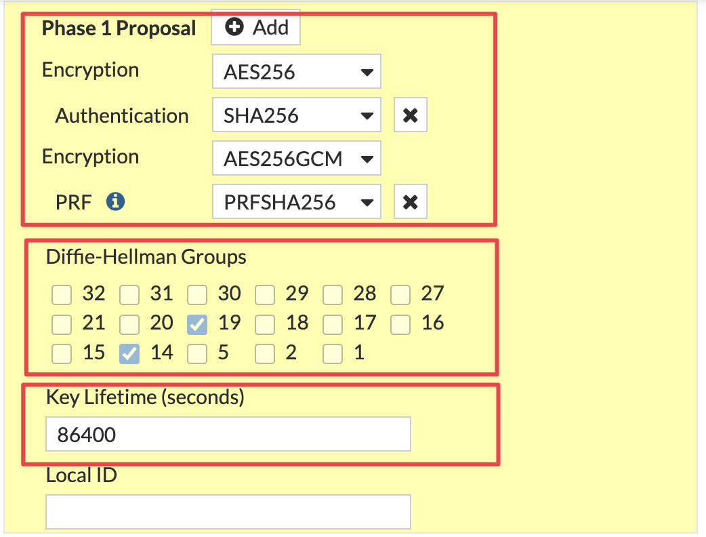

| 項目                     | 說明                                                |
| ------------------------ | --------------------------------------------------- |
| **Encryption**           | 建議不要選擇`DES 與 3DES`，已經不安全               |
| **Authentication**       | 建議不要選`MD5與SHA1`易受碰撞攻擊                   |
| **Diffie-Hellman Group** | 建議不要選`1、2、5`，金鑰長度太短，容易遭受暴力破解 |
| **Key Lifetime**         | 維持預設`86400`秒即可                               |

<div class="page-break"/>

#### 6.2.5. Phase 2

- Selectors 部分建議將 Local/Remote Address 設定為 0.0.0.0/0，Local Port、 Remote Port、 Protocol都設定為All，因為此部分是控制是否加密而非流量是否要走此通道。
- Proposal（加密演算法、驗證演算法、Diffie-Hellman 群組）可以設定多組，IKE 協商時對方只要符合其中一組，即可成功連線。這樣可兼容不同設備或客戶端的加密需求，提升互通性。

<div class="page-break"/>

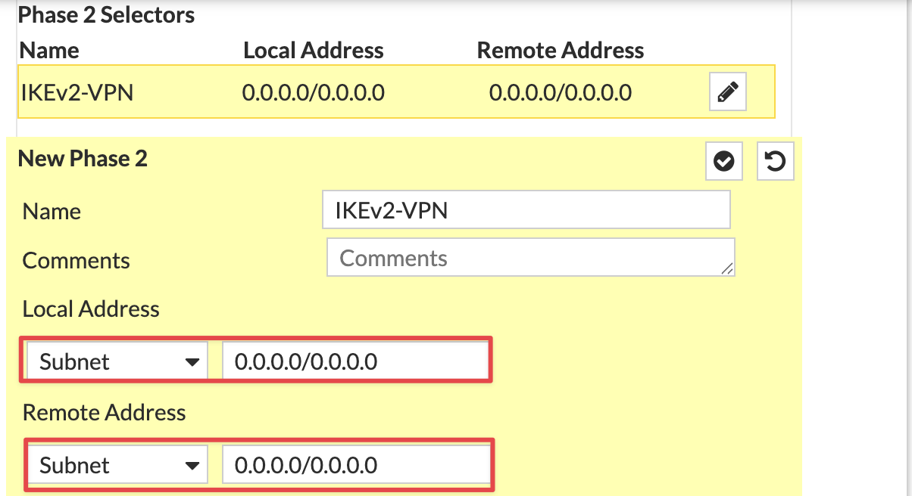

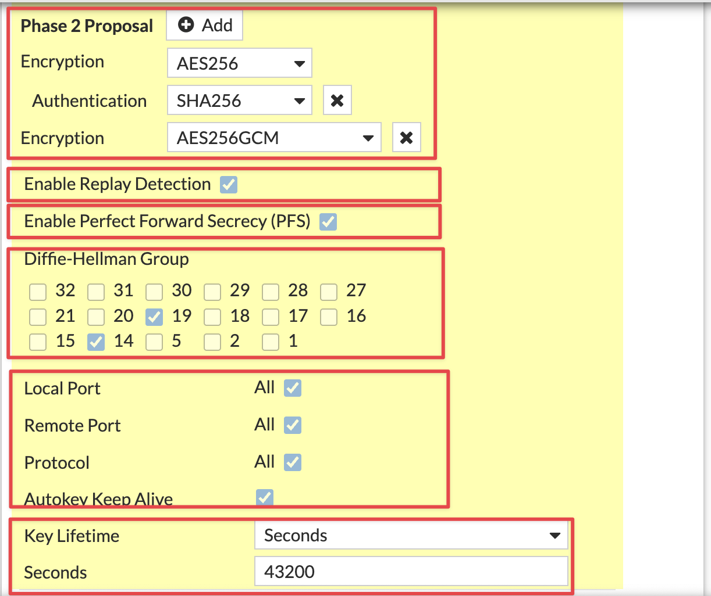

<div class="page-break"/>

| 項目                                     | 說明                                                                                               |
| ---------------------------------------- | -------------------------------------------------------------------------------------------------- |
| **Local Address**                        | 與 Remote Address 組成 Selector，建議設定 `0.0.0.0/0` 即可。                                       |
| **Remote Address**                       | 與 Local Address 組成 Selector，建議設定 `0.0.0.0/0` 即可。                                        |
| **Encryption**                           | 建議不要選擇 `DES` 與 `3DES`，演算法過時，安全性不足。                                             |
| **Authentication**                       | 建議避免選 `MD5` 與 `SHA1`，容易受到碰撞攻擊。                                                     |
| **Diffie-Hellman Group**                 | 僅在 PFS開啟時使用。建議避免 `Group 1、2、5`，因金鑰長度過短易被破解。                             |
| **Enable Replay Detection**              | 建議`勾選`，可防止封包重播攻擊（Replay Attack）。                                                  |
| **Enable Perfect Forward Secrecy (PFS)** | 建議`啟用` PFS，讓每次建立 IPsec SA 時都進行新的 Diffie-Hellman 金鑰交換，即使 IKE SA 洩漏也安全。 |
| **Key Lifetime**                         | 建議保持預設 `43200` 秒，不宜設太長，避免金鑰長期暴露風險。                                        |
| **Local Port**                           | 指定被保護流量的來源 Port，通常勾選 `All`。                                                        |
| **Remote Port**                          | 指定被保護流量的目的 Port，通常勾選 `All`。                                                        |
| **Protocol**                             | 指定被保護的傳輸層協定（如 TCP、UDP、ICMP），通常勾選 `All`。                                      |
| **Autokey Keep Alive**                   | 建議`開啟`，防止因為長時間無流量導致 NAT Session 超時被清除，確保隧道連線持續活躍。                |

<div class="page-break"/>

#### 6.2.6. 設定EAP驗證

此部分在此版本僅能使用CLI設定，且僅只有設定IKEv2才需設定，若是設定IKEv1則僅許在GUI配置XAuth即可

```shell
config vpn ipsec phase1-interface 

edit IKEv2-VPN 
# 編輯要設定的VPN設定檔名稱

set eap enable 
# 啟用EAP驗證

set eap-identity send-request 
# 設定要發送EAP驗證請求

set authusrgrp SSL_VPN_Group 
# 設定要允許的User Group

end
```

<div class="page-break"/>

#### 6.2.7. 建立Firewall Policy

依據需求建立允許IPSec Tunnel流量的相關Policy

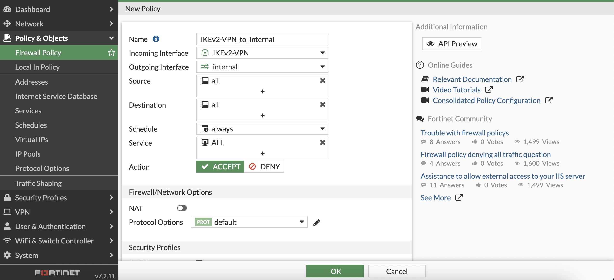

<div class="page-break"/>

## 7. FortiClient 用戶端設定教學

使用者可手動在 FortiClient 上設定撥入 IPsec VPN，以下為必要步驟與參數說明。

<div class="page-break"/>

### 7.1. 開啟 FortiClient VPN 設定頁面

至[官網](https://community.fortinet.com/t5/FortiGate/Technical-Tip-How-to-use-multiple-groups-with-EAP-for-IKEv2-SAML/ta-p/334453){:target="_blank"}下載FortiClient VPN Only版本後完成安裝   

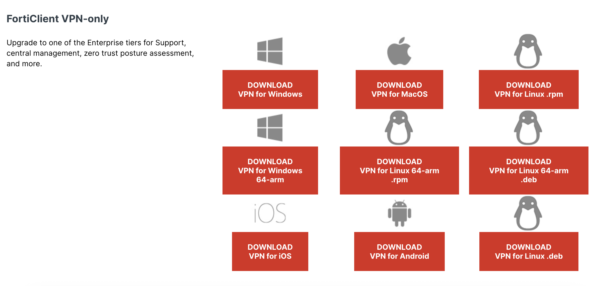

點選 `建立新連接`。

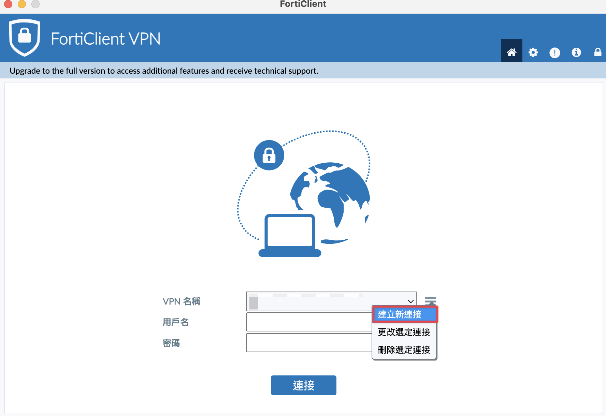

<div class="page-break"/>

### 7.2. 建立 VPN Profile

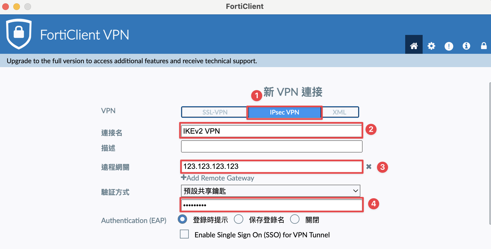

| 項目     | 說明                                                                                       |
| -------- | ------------------------------------------------------------------------------------------ |
| VPN      | 選擇 `IPsec VPN`                                                                           |
| 連接名   | 自定義，例如：`IKEv2 VPN`                                                                  |
| 遠程網關 | 輸入在FortiGate上VPN設定的介面IP 或 FQDN                                                   |
| 驗証方式 | 依FortiGate上設定選擇 `預設共享金鑰` 或 `Certificate` ，若選`預設共享金鑰`則需輸入共享金鑰 |

<div class="page-break"/>

!!!important
    下方相關參數設定要與在FortiGate上設定的相同除了Proposal不一定要完全相同可以設定多組外，但Proposal設定的其中一個一定要與FortiGate上設定的吻合

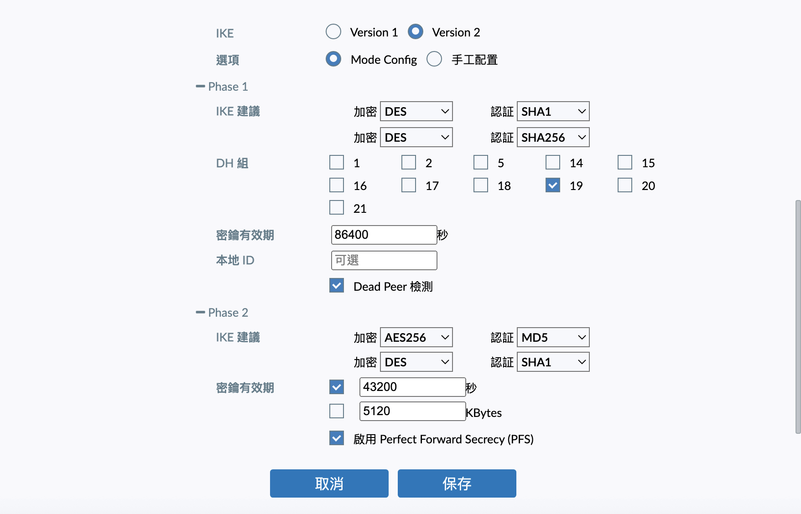

<div class="page-break"/>

### 7.3. 測試 VPN 連線

儲存設定後輸入帳號密碼點選 `連接`。

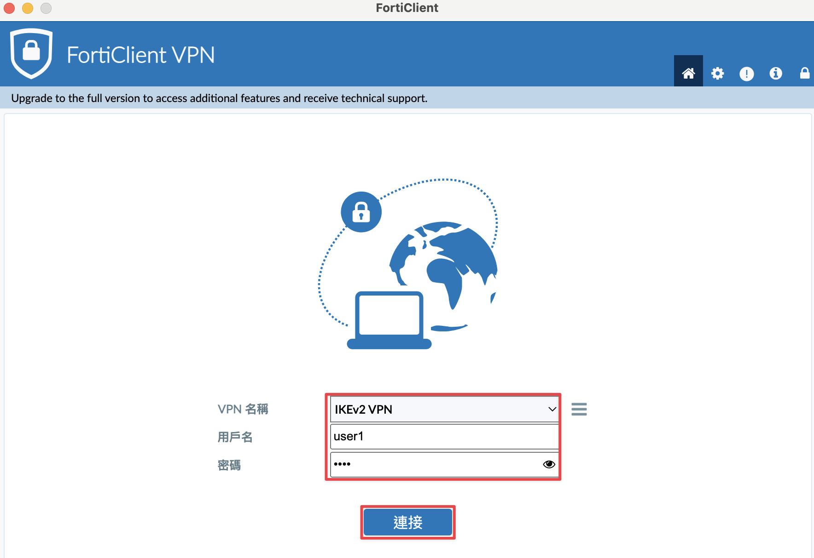

<div class="page-break"/>

連線成功後，應取得虛擬 IP 並可存取內部網段。

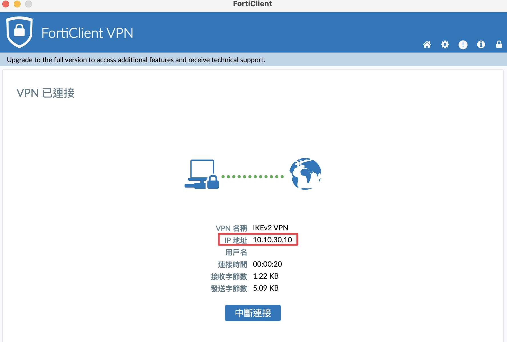

<div class="page-break"/>

## 8. FAQ

### 8.1. 如何限制僅有台灣IP可以連線

**建立Addresses Object**

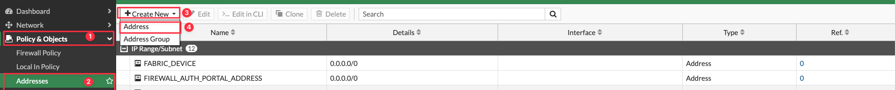

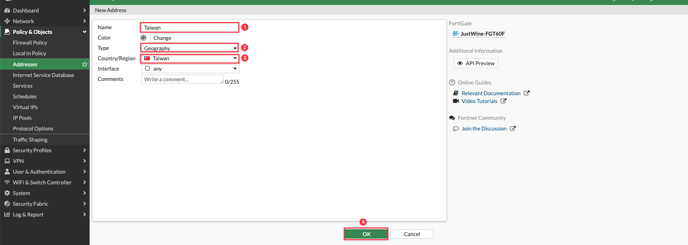

| 項目           | 說明                                 |
| -------------- | ------------------------------------ |
| Name           | 物件名稱，可自定義                   |
| Type           | 選擇`Geography`                      |
| Country/Region | 選擇`要設定的國家地區`，例如`Taiwan` |

<div class="page-break"/>

**建立Services**

IPSec VPN會使用UDP500及4500這兩個Port，故需要建立這兩個Service

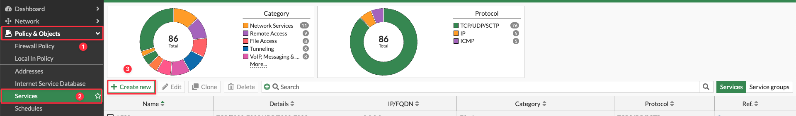

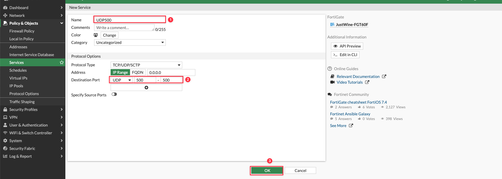

| 項目             | 說明               |
| ---------------- | ------------------ |
| Name             | 物件名稱，可自定義 |
| Destination Port | 選擇`UDP`， `Low及High`都設定為`500`   |

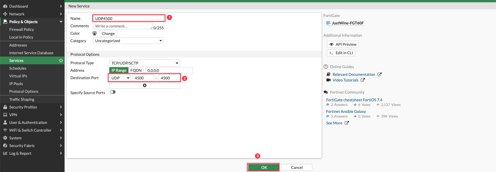

<div class="page-break"/>

**建立Local In Policy**

Local In Policy 是用於管制連線FortiGate本身服務的Policy，目前僅能使用CLI新增，由於IPSEC VPN會使用到UDP 500及4500，故需要新增一條規則管制連線此兩個Port的IP

```shell
config firewall local-in-policy

edit 1
# 規則編號

set intf wan1
# IPSec VPN使用的介面

set srcaddr Taiwan
# 設定允許的來源國家IP

set srcaddr-negate enable
# 設定除了上面設定的IP外其他來源都不可以連線

set dstaddr all
# 設定目的地IP，可以設定IPSec VPN使用的WAN IP物件，或直接設定All

set service UDP500 UDP4500
# 設定目的地Port

set schedule always
# 設定啟用排程，直接設定always代表永遠開啟

end
```

!!! warning
    Local-in-Policy 的比對順序一樣為由上而下，若有多條規則，務必注意順序，以免錯誤阻擋合法流量。

<div class="page-break"/>

### 8.2. 為何在Forward Traffic User欄位沒有資訊

因為當在 IPSec VPN Phase1 設定了群組，身份驗證就會發生在 VPN 隧道層，防火牆就無法辨識使用者，導致 Forward Traffic 的 User 欄位無資料。需改由使用防火牆政策設定群組才能讓使用者資訊顯示在流量記錄中。但不可兩邊都設定會造成連線直接被拒絕。

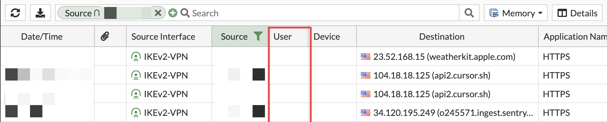

<div class="page-break"/>

#### 8.2.1. IKEv1

**取消Phase1對Group的驗證**

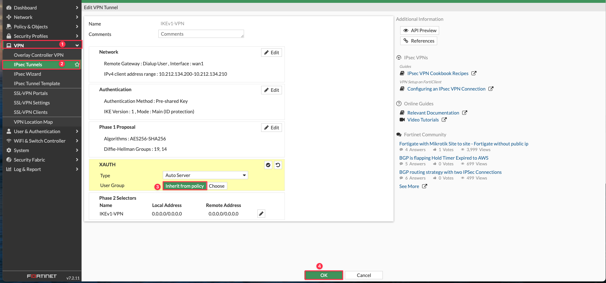

<div class="page-break"/>

**針對所有此VPN的相關Policy加入Group**

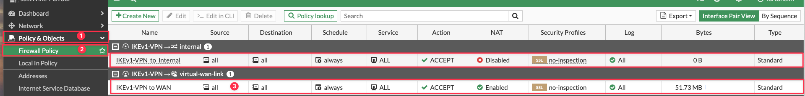

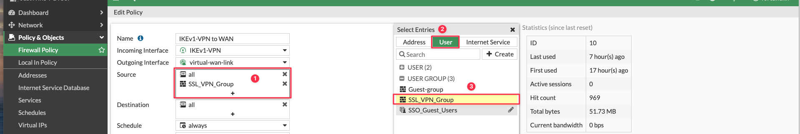

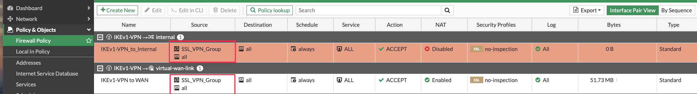

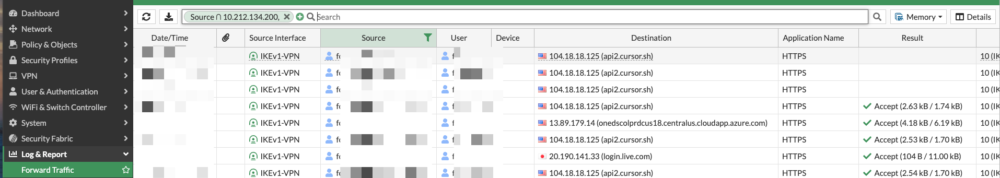

<div class="page-break"/>

#### 8.2.2. IKEv2

**取消Phase1對Group的驗證**

```shell
config vpn ipsec phase1-interface

edit "IKEv2-VPN"
# 編輯要設定的VPN設定檔名稱

unset authusrgrp
# 取消允許User Group的設定

end
```

<div class="page-break"/>

**針對所有此VPN的相關Policy加入Group**

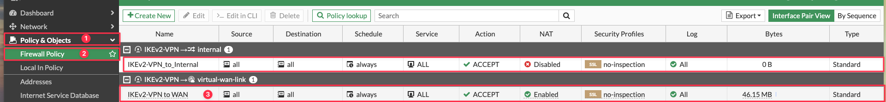

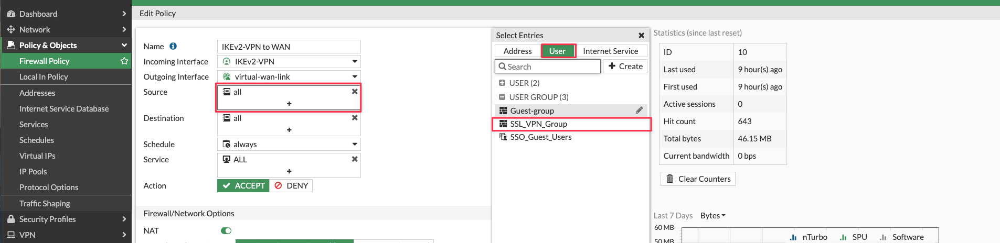

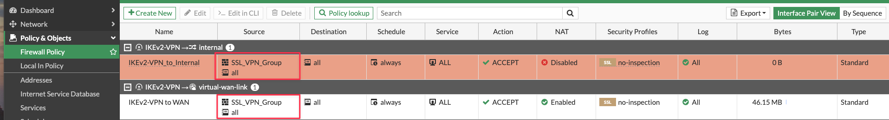

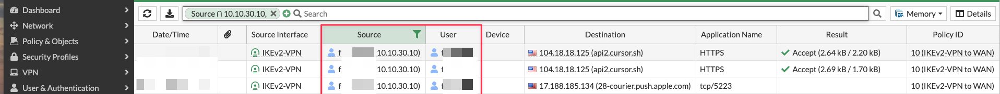

<div class="page-break"/>

<h2 class="no-print">參考資料</h2>

- [SSL VPN to IPsec VPN Migration](https://docs.fortinet.com/document/fortigate/7.4.4/ssl-vpn-to-ipsec-vpn-migration/140089){:target="_blank"}
- [Technical Tip: How to use multiple groups with EAP for IKEv2 (SAML/RADIUS/local)](https://community.fortinet.com/t5/FortiGate/Technical-Tip-How-to-use-multiple-groups-with-EAP-for-IKEv2-SAML/ta-p/334453){:target="_blank"}
- [Technical Tip: Using group based firewall policy for Dial-Up VPN to restrict network access](https://community.fortinet.com/t5/FortiGate/Technical-Tip-Using-group-based-firewall-policy-for-Dial-Up-VPN/ta-p/198208){:target="_blank"}
- [Troubleshooting Tip: Dialup IPsec VPN user-info not displaying in 'Assets & Identities'](https://community.fortinet.com/t5/FortiGate/Troubleshooting-Tip-Dialup-IPsec-VPN-user-info-not-displaying-in/ta-p/385150){:target="_blank"}