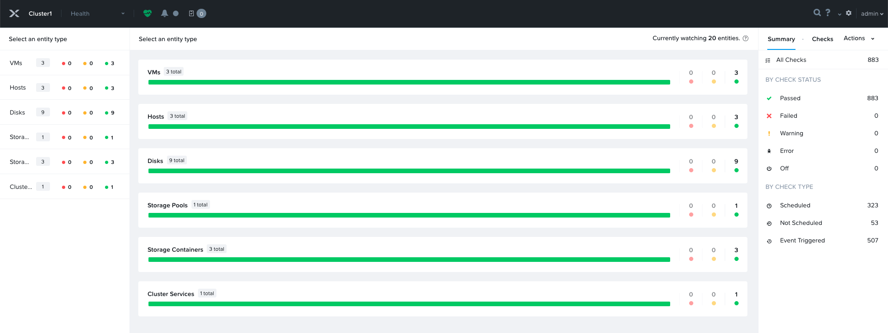
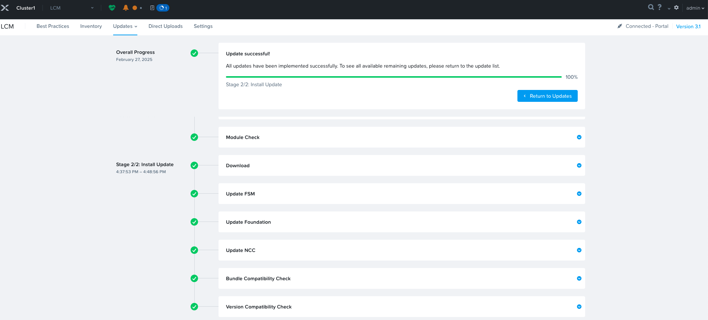

<h2>目錄</h2>

- [1. 環境說明](#1-環境說明)
- [2. 先期準備事項](#2-先期準備事項)
    - [2.1. 確認安裝所需網路資訊](#21-確認安裝所需網路資訊)
    - [2.2. 完成實體設備網路線路連接](#22-完成實體設備網路線路連接)
    - [2.3. 下載必要軟體](#23-下載必要軟體)
- [3. Foundation安裝](#3-foundation安裝)
    - [3.1. 介紹](#31-介紹)
    - [3.2. 安裝方式](#32-安裝方式)
    - [3.3. 部署Foudation VM](#33-部署foudation-vm)
    - [3.4. 新增Foudation VM網卡（可選項）](#34-新增foudation-vm網卡可選項)
    - [3.5. 設定Foundation VM IP](#35-設定foundation-vm-ip)
    - [3.6. 上傳Image](#36-上傳image)
- [4. 使用Foundation GUI部署](#4-使用foundation-gui部署)
- [5. Cluster初始化設定](#5-cluster初始化設定)
- [6. Cluster基本設定](#6-cluster基本設定)
    - [6.1. ISCSI Data Service IP](#61-iscsi-data-service-ip)
    - [6.2. HTTP Proxy](#62-http-proxy)
    - [6.3. Name Servers](#63-name-servers)
    - [6.4. NTP Servers](#64-ntp-servers)
    - [6.5. Manage VM High Availability](#65-manage-vm-high-availability)
    - [6.6. Rebuild Capacity Reservation](#66-rebuild-capacity-reservation)
- [7. 修改預設密碼](#7-修改預設密碼)
    - [7.1. CVM](#71-cvm)
    - [7.2. AHV](#72-ahv)
    - [7.3. 更改Nutanix NX主機IPMI ADMIN帳號的密碼](#73-更改nutanix-nx主機ipmi-admin帳號的密碼)
    - [7.4. 更改Prism Central nutanix帳號的密碼](#74-更改prism-central-nutanix帳號的密碼)
- [8. NCC](#8-ncc)
- [9. Network](#9-network)
    - [9.1. Nutanix與Vmware術語比較](#91-nutanix與vmware術語比較)
    - [9.2. Virtual Switch](#92-virtual-switch)
    - [9.3. Subnet](#93-subnet)
- [10. Storage](#10-storage)
    - [10.1. Default Storage Container](#101-default-storage-container)
    - [10.2. 新增Storage Container](#102-新增storage-container)
- [11. LCM](#11-lcm)
    - [11.1. Inventory](#111-inventory)
    - [11.2. Updates](#112-updates)
- [12. Prism Central](#12-prism-central)
    - [12.1. 安裝Prism Central](#121-安裝prism-central)
    - [12.2. 註冊Prism Central](#122-註冊prism-central)
- [13. 其他設定](#13-其他設定)
    - [13.1. 設定CVM VLAN Tag](#131-設定cvm-vlan-tag)
    - [13.2. 設定AHV VLAN Tag](#132-設定ahv-vlan-tag)

<div class="page-break"/>

## 1. 環境說明

- 硬體： Nutanix NX-1065-G9
- Foundation版本：5.7.1
- AOS版本：6.10.1
- AHV版本：20230302.103003

<div class="page-break"/>

## 2. 先期準備事項

### 2.1. 確認安裝所需網路資訊

完成Table 1 - 3 網路資訊填寫，相關服務資訊及注意事項如下：

- Nutanix每個Node均需要3個 IP Address
    - IPMI。
    - Hypervisor Host。
    - Nutanix Controller VM（CVM）。
- Nutanix每個Cluster需要2個IP Address
    - Cluster Virtual IP：提供單一IP Address來與 CVM提供的各項服務進行溝通，主要用於 Nutanix Prism Element、API、{==Nutanix Guest Tools==}、Nutanix Objects等。
    - iSCSI Data Services IP：提供單一IP Address來提供ISCSI儲存功能，如Nutanix Volumes、Objects、Files、{==Prism Central==}等均會使用此IP。
- 若有使用以下服務，每個服務也都需要一個IP Address
    - Prism Centeral：多叢集管理及其他Nutanix應用等。
    - Move：跨虛擬化平台的遷移工具。
- Nutanix Cluster必需的IP數量為 Node數量 X 3（IPMI、Hypervisor Host、CVM）+ Cluster Virtual IP + iSCSI Data Services IP 。

!!! warning
    - {==CVM IP、Hypervisor IP、Virtual IP、iSCSI Data Services IP需位於同一個網段中==}。建議除了這些服務以外的任何系統均不得位於該網路中。
    - {==CVM和Hypervisor網段不可以是192.168.5.X==}，因為此網段為CVM和Hypervisor內部溝通使用
    - Move不可以使用172.17.0.1網段
    - Prism Central避免使用10.100.0.0/16、10.200.32.0/24網段，因為此為Prism Central微服務預設網段，若需使用可以開CASE請Support協助。

<div class="page-break"/>

Table: IP Addresses Per Node

|  Node  |  Service   |        IP Address        | Username | Default Password |        New Password        |
| :----: | :--------: | :----------------------: | :------: | :--------------: | :------------------------: |
| Node 1 |    IPMI    | (Provide the IP address) |  ADMIN   |    主機板序號    | (Provide the new password) |
|        | Hypervisor | (Provide the IP address) |   root   |    nutanix/4u    | (Provide the new password) |
|        |    CVM     | (Provide the IP address) | nutanix  |    nutanix/4u    | (Provide the new password) |
| Node 2 |    IPMI    | (Provide the IP address) |  ADMIN   |    主機板序號    | (Provide the new password) |
|        | Hypervisor | (Provide the IP address) |   root   |    nutanix/4u    | (Provide the new password) |
|        |    CVM     | (Provide the IP address) | nutanix  |    nutanix/4u    | (Provide the new password) |
| Node 3 |    IPMI    | (Provide the IP address) |  ADMIN   |    主機板序號    | (Provide the new password) |
|        | Hypervisor | (Provide the IP address) |   root   |    nutanix/4u    | (Provide the new password) |
|        |    CVM     | (Provide the IP address) | nutanix  |    nutanix/4u    | (Provide the new password) |

<div class="page-break"/>

Table: Cluster Information

|      Service       |        IP Address        | Username | Default Password |        New Password        |
| :----------------: | :----------------------: | :------: | :--------------: | :------------------------: |
|     Cluster IP     | (Provide the IP address) |  admin   |    nutanix/4u    | (Provide the new password) |
| Prism Central(Web) | (Provide the IP address) |  admin   |    Nutanix/4u    | (Provide the new password) |
| Prism Central(SSH) |            -             | nutanix  |    nutanix/4u    | (Provide the new password) |
| iSCSI Data Service | (Provide the IP address) |    -     |        -         |             -              |
|        Move        | (Provide the IP address) | nutanix  |    nutanix/4u    | (Provide the new password) |

<div class="page-break"/>

Table: Network Information

|             Parameter              |          Value           |
| :--------------------------------: | :----------------------: |
|             NTP Server             | (Provide the IP address) |
|             DNS Server             | (Provide the IP address) |
|        IPMI Default Gateway        | (Provide the IP address) |
|          IPMI Subnet Mask          |  (Provide the Netmask)   |
|      IPMI VLAN Tag (Optional)      |  (Provide the VLAN Tag)  |
|   CVM/Hypervisor Default Gateway   | (Provide the IP address) |
|     CVM/Hypervisor Subnet Mask     |  (Provide the Netmask)   |
| CVM/Hypervisor VLAN Tag (Optional) |  (Provide the VLAN Tag)  |

<div class="page-break"/>

### 2.2. 完成實體設備網路線路連接

- 建議可以使用非網管型交換器實施部署以避免交換器設定問題。
- 實體設備在初始化部署時建議每個Node最少需接兩條線，第一條是IPMI，第二條是Data Port。
- Nutanix NX系列硬體Port 1通常是Shared IPMI Port，也就是可以同時跑IPMI及Data，但是盡量避免使用此Port作為IPMI，若要使用此Port當作IPMI Port則Switch要支援自動協商100 Mbps速率，因為在關機狀態下此Port僅會以100 Mbps速率運行。
- 建議部署時CVM/Hypervisor及IPMI的VLAN為untagged VLAN以降低錯誤配置衍生的問題或查找問題的困難度。
- 建議部署時先暫時不設定LACP以降低錯誤配置衍生的問題或查找問題的困難度。


<div class="page-break"/>

### 2.3. 下載必要軟體

- AOS(Acropolis Operating System)：此為Nutanix Controller VM所使用的作業系統。
- Hypervisor：除AHV的其餘Hypervisor ISO需至各官網自行下載，AOS6.8之前有內建AHV ISO不需要額外下載。
- Foudation：Nutanix 的官方部署軟體。
- VirtIO：AHV環境中的虛擬驅動程式（Virtual Input/Output Driver），主要用於提升AHV上虛擬機的效能與相容性。
- AOS、AHV、Foudation、VirtIO均可以至[Nutanix下載頁面](https://portal.nutanix.com/page/downloads/list){:target="_blank"}下載

<div class="page-break"/>


<div class="page-break"/>


<div class="page-break"/>


<div class="page-break"/>


<div class="page-break"/>

## 3. Foundation安裝

### 3.1. 介紹

- Foundation 是 Nutanix 的官方部署軟體。Foundation 允許您配置pre-imaged node，或部署Hypervisor及AOS。
- Hypervisor及AOS支援列表可查看[Compatibility and Interoperability Matrix](https://portal.nutanix.com/page/documents/compatibility-interoperability-matrix){:target="_blank"}

<div class="page-break"/>

### 3.2. 安裝方式

- Node有區分兩種狀態：
    - 裸機：無預先安裝好Hypervisor及AOS或DiscoveryOS的Node
    - Pre-imaged Node：已有預先安裝好Hypervisor及AOS或DiscoveryOS的Node
- Foundation軟體可以區分三種安裝方式，詳述如Table 4，{==建議以Standalone Foundation VM方式安裝，因為此方式較無限制==}，本篇安裝說明皆以此方式為主

Table: Foundation Installation Method

| 項目              | CVM Foundation                                               | Foundation for Windows/macOS                                                               | Standalone Foundation VM                                              |
| ----------------- | ------------------------------------------------------------ | ------------------------------------------------------------------------------------------ | --------------------------------------------------------------------- |
| **摘要**          | 最受限制的 Foundation 形式。僅用於其他兩種選項都無法使用時。 | 最簡單的 Foundation 形式。                                                                 | 最完整的 Foundation 形式。                                            |
| **限制**          | 無法進行裸機映像。                                           | 裸機映像僅限於特定硬體平台。                                                               | 無限制。                                                              |
| **硬體**          | 任何硬體皆可，但無法進行裸機映像。                           | - 非裸機映像：任何硬體皆可（但不包含 Cisco UCS）。<br>- 裸機映像僅支援：Nutanix、Dell、HPE | 任何硬體皆可。                                                        |
| **IPv6 被禁用時** | 無法映像Node。                                               | Node需具備 IPMI IPv4。                                                                     | Node需具備 IPMI IPv4。                                                |
| **使用方式**      | 透過網址 http://CVM_IP:8000/ 存取。                          | 執行適用於 Windows 10+ 或 macOS 10.13.1+ 的執行檔。                                        | 作為虛擬機部署於 VirtualBox、Fusion、Workstation、AHV、ESX 等環境中。 |

<div class="page-break"/>

### 3.3. 部署Foudation VM

依照使用的虛擬化軟體進行OVF部署，以下範例為Vmware ESXI方式


<div class="page-break"/>

### 3.4. 新增Foudation VM網卡（可選項）

僅有當IPMI使用的VLAN與Hypervisor及AOS使用的VLAN不同時才需新增


<div class="page-break"/>

### 3.5. 設定Foundation VM IP

Foundation VM預設帳號為nutanix，密碼為nutanix/4u，登入後可使用GUI或CLI設定IP Address，以下為GUI方式


{==需重啟網路卡設定才會生效==}


<div class="page-break"/>

### 3.6. 上傳Image

使用SCP軟體將以下Image上傳至Foudation VM，若未先上傳，也可以於後續部署步驟透過導引程序上傳

- AOS Image：/home/nutanix/foundation/nos 目錄
- Hypervisor Image（依所要安裝的Hypervisor上傳）：
    - AHV Image：/home/nutanix/foundation/isos/hypervisor/kvm 目錄
    - ESXi Image：/home/nutanix/foundation/isos/hypervisor/esx 目錄


<div class="page-break"/>

## 4. 使用Foundation GUI部署

可以於VM內點擊Nutanix Foudation圖示或直接連線http://[Foundation_IP]:8000


<div class="page-break"/>


Table: Start

| 編號 | 欄位描述                                                                                                                                                                                                                                      |
| :--: | --------------------------------------------------------------------------------------------------------------------------------------------------------------------------------------------------------------------------------------------- |
|  1   | 選擇部署的硬體平台。選擇{==Autodetect==}即可。                                                                                                                                                                                                |
|  2   | 是否啟用RDMA passthrough CVM功能。大多數情況下選擇{==No==}即可。Nutanix Node 之間的 Storage Replication 網路流量是走標準的 TCP/IP。若需要 High-Performance 和 Low-Latency 時，Nutanix 支援採用 RDMA 技術繞過 TCP/IP Stack，但需要指定的網卡。 |
|  3   | Node和交換機之間是否使用LACP。大多數情況下選擇{==None==}即可。若有需求可於完成部署後再設定。                                                                                                                                                  |
|  4   | 設定CVM/Host的VLAN Tag。若連接的交換器為access port（untagged port）則{==不需填寫==}。                                                                                                                                                        |

<div class="page-break"/>


Table: Start

| 編號 | 欄位描述                                                                                                                            |
| :--: | ----------------------------------------------------------------------------------------------------------------------------------- |
|  1   | Host/CVM網路子網遮罩和閘道。                                                                                                        |
|  2   | IPMI 網路子網遮罩和閘道。                                                                                                           |
|  3   | 若Host/CVM網路及IPMI 網路為不同網段且Foudation VM沒有在這兩個網段都有IP Address，也就是需透過路由才可以到達不同網段時，需要選擇Skip |
|  4   | 目前Foudation VM IP資訊，若沒有正確抓取到則可以使用Add a new IP Address新增。                                                       |
|  5   | 新增Foudation VM IP資訊                                                                                                             |

<div class="page-break"/>

Discover Nodes需交換器未禁用IPv6且為pre-image node才可以自動偵測到，因限制較多故建議使用{==Add IPMI Nodes Manually==}即可


<div class="page-break"/>

一般使用IPMI MAC Address方式，若使用IPMI MAC Address方式有問題時，可以嘗試將Node連接螢幕鍵盤滑鼠然後登入IPMI設定IP Address後，改用IPMI IP Address方式設定


Table: Nodes

| 編號 | 欄位描述                                 |
| :--: | ---------------------------------------- |
|  1   | Node數量。                               |
|  2   | 若IPMI已經有設定IP Address則選擇此選項。 |
|  3   | 若IPMI沒有設定IP Address則選擇此選項。   |

<div class="page-break"/>


Table: Nodes

| 編號 | 欄位描述                                                                                            |
| :--: | --------------------------------------------------------------------------------------------------- |
|  1   | Node編號 。                                                                                         |
|  2   | IPMI Mac Address，在Nutanix NX系列會有貼紙註明於設備後方。                                          |
|  3   | IPMI要設定的IP Address。                                                                            |
|  4   | Host（Hypervisor）要設定的IP Address。                                                              |
|  5   | CVM要設定的IP Address。                                                                             |
|  6   | Host（Hypervisor）要設定的Hostname。                                                                |
|  7   | Node類型。大多數情況都是選擇Hyper-converged，除非Node是特殊類型才選擇是Storage-only或Compute-only。 |

<div class="page-break"/>

選擇要安裝的AOS版本，若未先使用SCP上傳則可點擊Upload New AOS Binary上傳


設定CVM記憶體大小，依據磁碟配置及啟用的功能所需的記憶體不同，可以參考[Controller VM (CVM) Specifications](https://portal.nutanix.com/page/documents/details?targetId=Advanced-Admin-AOS:app-nutanix-cloud-infra-cvm-field-specifications-c.html){:target="_blank"}，若空白則會自動計算所需的大小。


<div class="page-break"/>

選擇要安裝的Hypersior類型及版本，若未先使用SCP上傳則可點擊Upload New AHV Binary上傳


<div class="page-break"/>


Table: Cluster

| 編號 | 欄位描述                                                                                                                                                       |
| :--: | -------------------------------------------------------------------------------------------------------------------------------------------------------------- |
|  1   | 不建立Cluster。通常不需勾選，僅在只有要初始化新增的Node並加入既有的Cluster時使用。                                                                             |
|  2   | 是否要將CVM的管理流量及儲存流量分開於不同網段。 選擇後CVM會自動增加一個虛擬網卡，並需額外給予另外一個網段專門給CVM之間資料抄寫使用，此部分可於部署完後再設定。 |
|  3   | 設定Cluster名稱。                                                                                                                                              |
|  4   | 設定Cluster時區。                                                                                                                                              |

<div class="page-break"/>


Table: Cluster

| 編號 | 欄位描述                               |
| :--: | -------------------------------------- |
|  1   | 資料份數。RF2代表資料會有兩份。        |
|  2   | 設定Cluster Virtual IP。               |
|  3   | 設定NTP Server。可於初始化完後再設定。 |
|  4   | 設定DNS Server。可於初始化完後再設定。 |

<div class="page-break"/>

設定Cluster密碼。目前版本密碼僅會修改CVM的nutanix帳號


Cluster Lockdown啟用的話就會關閉CVM及AHV的SSH連線。若未啟用Cluster Lockdown則要選擇是使用Public Key或密碼方式進行SSH連線


<div class="page-break"/>

輸入每個Node的IPMI帳號及密碼，2020年6月之後的Nutanix NX機種，IPMI的帳號為ADMIN（都是大寫），密碼會貼在node後面(主機板序號)，之前的機種則為ADMIN/ADMIN（都是大寫）。


是否禁止安裝過程中Foudation VM進入睡眠模式


<div class="page-break"/>


<div class="page-break"/>

## 5. Cluster初始化設定

連線PRISM Element

https://[任一個CVM IP或CVM Cluster IP]：9440


輸入Username：admin，Password：nutanix/4u


<div class="page-break"/>

變更admin密碼


選擇同意EULA協議


<div class="page-break"/>

啟用Pulse服務將會監控收集Cluster必要資訊並於問題發生時主動通知，建議要開啟除非是測試或環境無法對外上網時。


<div class="page-break"/>

## 6. Cluster基本設定

**點擊左上方選單 -> Settings**


### 6.1. ISCSI Data Service IP

需與CVM/Hypervisor同網段


<div class="page-break"/>

### 6.2. HTTP Proxy

若安裝環境對外上網需透過Proxy則可在此設定


### 6.3. Name Servers

建議最少設定2個


<div class="page-break"/>

### 6.4. NTP Servers

- 建議設定5個，最少設定3個
- 不要使用Windows Server當時間同步來源，可參考[KB-3851](https://portal.nutanix.com/page/documents/kbs/details?targetId=kA032000000TVVyCAO){:target="_blank"}說明


<div class="page-break"/>

### 6.5. Manage VM High Availability

- 未啟用時，在發生故障的情況下，如果資源可用，將盡最大可能性恢復虛擬機開機狀態。
- 啟用時，會以叢集的當前狀態下，保留多達 1/n(n=總Node數)的記憶體以避免在單個Host發生故障時資源不足。
  


<div class="page-break"/>

### 6.6. Rebuild Capacity Reservation

- 若未啟用且使用的空間量超過Resilient Capacity閥值時會告警且這時候發生硬碟故障或Node故障時將無法Rebuild。
- 啟用時，叢集將根據容錯、故障域和叢集中的總儲存容量等引數計算所需的重建容量。
- 啟用後Storage Summary將僅顯示Resilient Capacity空間（即扣除掉Rebuild需要的空間量）。


<div class="page-break"/>

## 7. 修改預設密碼

詳細說明可參考[KB-6153](https://portal.nutanix.com/page/documents/kbs/details?targetId=kA00e000000LKXcCAO){:target="_blank"}，下表為各元件預設密碼。

Table: 預設密碼

|     **元件**      | **登入方式** |   **帳號**    | **預設密碼** |
| :---------------: | :----------: | :-----------: | :----------: |
|      **CVM**      |     SSH      |    nutanix    |  nutanix/4u  |
|      **AHV**      |     SSH      |     root      |  nutanix/4u  |
|      **AHV**      |     SSH      |    nutanix    |     none     |
|      **AHV**      |     SSH      |     admin     |     none     |
|     **ESXi**      |   Web/SSH    |     root      |  nutanix/4u  |
|    **Hyper-V**    |   Console    | administrator |  nutanix/4u  |
|     **IPMI**      |     Web      |     ADMIN     |  主機板序號  |
| **Prism Element** |     Web      |     admin     |  nutanix/4u  |
| **Prism Central** |     Web      |     admin     |  Nutanix/4u  |
| **Prism Central** |     SSH      |    nutanix    |  nutanix/4u  |

<div class="page-break"/>

### 7.1. CVM

- 若於安裝Node時已經有設定Cluster Password則可略過此步驟
- SSH登入任一台CVM以指令更改，更改後的密碼會同步至其他CVM

```shell
sudo passwd nutanix
```


<div class="page-break"/>

### 7.2. AHV

- SSH登入任一台{==CVM==}以指令更改，以下Script會修改Cluster中{==所有Node==}的AHV密碼

**更改AHV root帳號的密碼**

```shell
echo -e "CHANGING ALL AHV HOST ROOT PASSWORDS.\nPlease input new password: "; read -rs password1; echo "Confirm new password: "; read -rs password2; if [ "$password1" == "$password2" ]; then for host in $(hostips); do echo Host $host; echo $password1 | ssh root@$host "passwd --stdin root"; done; else echo "The passwords do not match"; fi
```


<div class="page-break"/>

**更改AHV admin帳號的密碼**

```shell
echo -e "CHANGING ALL AHV HOST ADMIN PASSWORDS.\nPlease input new password: "; read -rs password1; echo "Confirm new password: "; read -rs password2; if [ "$password1" == "$password2" ]; then for host in $(hostips); do echo Host $host; echo $password1 | ssh root@$host "passwd --stdin admin"; done; else echo "The passwords do not match"; fi
```


<div class="page-break"/>

**更改AHV nutanix帳號的密碼**

```shell
echo -e "CHANGING ALL AHV HOST NUTANIX PASSWORDS.\nPlease input new password: "; read -rs password1; echo "Confirm new password: "; read -rs password2; if [ "$password1" == "$password2" ]; then for host in $(hostips); do echo Host $host; echo $password1 | ssh root@$host "passwd --stdin nutanix"; done; else echo "The passwords do not match"; fi
```


<div class="page-break"/>

### 7.3. 更改Nutanix NX主機IPMI ADMIN帳號的密碼

使用{==root帳號==}SSH逐一登入每一台{==AHV==}以指令更改或登入IPMI GUI頁面修改，以下為指令方式

**查看帳號ID**

```shell
ipmitool user list 
```


**修改密碼**

```shell
ipmitool user set password user_id new_password  
```


**BMC版本高於7.0且密碼長度大於16字元時需使用以下指令**

```shell
ipmitool user set password user_id new_password 20
```

<div class="page-break"/>

### 7.4. 更改Prism Central nutanix帳號的密碼

需以SSH登入Prism Central以指令修改。

```shell
sudo passwd nutanix
```

<div class="page-break"/>

## 8. NCC

- Nutanix Cluster Check簡稱NCC，是一款診斷與健康檢查工具，用來分析 Nutanix 叢集的狀態，確保系統的穩定性、效能與高可用性。
- 建議於安裝後、更新前後手動執行確保系統狀態正常。

**點擊左上方選單 -> Health**


**點擊Actions -> Run NCC Checks**


<div class="page-break"/>

**點擊All Checks -> Run**


**點擊左上方Recent Tasks圖示確認檢查完畢**


<div class="page-break"/>

**針對Failed、Warning、Error逐一點擊查看被檢查到的項目**


**點擊每個項目查看原因及修正方式**


<div class="page-break"/>

**全部修正完後再重新執行All Checks確保無重大錯誤**



<div class="page-break"/>

## 9. Network

### 9.1. Nutanix與Vmware術語比較

Table: Networking Terminology Matrix

|          **AHV Term**          |                                **VMware Term**                                |
| :----------------------------: | :---------------------------------------------------------------------------: |
|     Bridge, Virtual Switch     |                      vSwitch, Distributed Virtual Switch                      |
|           {==Bond==}           |                                   NIC team                                    |
|          Port or tap           |                                     Port                                      |
|          {==Subnet==}          |                                  Port group                                   |
|             Uplink             |                                 pNIC or vmnic                                 |
|             VM NIC             |                                     vNIC                                      |
|      {==Internal port==}       |                                 VMkernel port                                 |
|         Active-backup          |                                Active-standby                                 |
| Active-Active with MAC pinning | Route based on source MAC hash combined with route based on physical NIC load |
|         Active-Active          |                        LACP and route based on IP hash                        |

<div class="page-break"/>

### 9.2. Virtual Switch

預設會將所有相同速率實體網路卡綁定至預設的Virtual Switch，故需依造實際需求修改或新增Virtual Switch，以下為修改方式。


<div class="page-break"/>


Table: General Settings

| 編號 | 欄位描述                                                                                                                  |
| :--: | ------------------------------------------------------------------------------------------------------------------------- |
|  1   | vSwitch名稱                                                                                                               |
|  2   | vSwitch描述                                                                                                               |
|  3   | vSwitch MTU大小                                                                                                           |
|  4   | vSwitch變更方式<br> - Standard(建議)：Node會進入維護模式並滾動更新。<br>- Quick：Node不會進入維護模式，故有可能影響流量。 |

<div class="page-break"/>


Table: Uplink Configuration

| 編號 | 欄位描述                                                                                                                                                                                                                                                                                                                                                                                             |
| :--: | ---------------------------------------------------------------------------------------------------------------------------------------------------------------------------------------------------------------------------------------------------------------------------------------------------------------------------------------------------------------------------------------------------- |
|  1   | Bond模式，可區分4種。<br>- Active-Backup：推薦使用，為預設設定。所有流量都透過單一啟用的網路介面卡進行傳輸，當主介面失效時，會自動切換到備援介面。<br>- Active-Active with MAC pinning：該模式將每個 VM NIC 綁定到單一網卡，並根據負載動態分配流量，但不適合多播流量。<br>- Active-Active：即為LACP模式，設定此模式時建議交換器要設定LACP failback。<br>- No Uplink Bond：可配置為0或1張網路介面卡。 |
|  2   | 選擇要修改的主機                                                                                                                                                                                                                                                                                                                                                                                     |
|  3   | 選擇要顯示的網路介面卡。如只顯示Connected Ports或10G速率的Port。                                                                                                                                                                                                                                                                                                                                     |
|  4   | 設定此vSwitch在主機要綁定的網路介面卡。                                                                                                                                                                                                                                                                                                                                                              |

<div class="page-break"/>

### 9.3. Subnet

預設不會有任何Subnet故需於此處新增VM所需使用的網路


Table: Create Subnet

| 編號 | 欄位描述                                 |
| :--: | ---------------------------------------- |
|  1   | Subnet名稱                               |
|  2   | 選擇此Subnet要於哪一個Virtual Switch建立 |
|  3   | VLAN ID，若無則輸入0。                   |
|  4   | 此Subnet是否由AHV派送DHCP。              |

<div class="page-break"/>

## 10. Storage

- Storage Pool
    - 定義：Nutanix分散式儲存架構的基礎單位，它將所有節點的物理存儲設備（HDD/SSD/NVMe）組合在一起，形成一個統一的儲存資源池。
    - 特點：
        - 由 多個節點的本地磁碟組成，可以包含 HDD、SSD 或 NVMe。
        - 所有 Storage Containers 與 Volume Groups 都建立在 Storage Pool 之上。
        - 支援 RAID-less，透過 Nutanix 的 RF2（Replication Factor 2）或 RF3 來確保數據冗餘與安全性。
        - 可擴展，當叢集新增節點時，Storage Pool 也會自動擴展。
- Storage Container：
    - 定義：儲存架構中的邏輯分區，它位於 Storage Pool 之上，用於管理不同類型的數據與存儲策略。
    - 特點：
        - 基於 Storage Pool 建立的邏輯存儲區，概念上類似Windows資料夾而非磁碟分區。
        - 可設定不同的儲存策略如資料份數、可使用空間上限、壓縮、重複資料刪除等。
- Volume Group
    - 定義：Nutanix 提供的 iSCSI 目標儲存設備，適用於無法直接使用 Storage Container 的應用。
    - 特點：
        - 基於 Storage Pool 建立，與 Storage Container 並列。
        - 提供 iSCSI LUN 來存取儲存。
        - 支援多重存取模式，也就是可以多個VM共同使用此iSCSI LUN

<div class="page-break"/>

Table: Storage

| 名稱              | 功能                      | 用途                                 | 存取方式        |
| ----------------- | ------------------------- | ------------------------------------ | --------------- |
| Storage Pool      | 統一管理所有磁碟資源      | Nutanix 叢集內的基礎存儲池           | 內部自動管理    |
| Storage Container | 存放VM Disk，管理儲存策略 | Nutanix AHV、VMware ESXi VM 使用     | CIFS、NFS、vDisk |
| Volume Group      | 提供 iSCSI LUN 給特殊應用 | Windows Failover Cluster、Oracle RAC | iSCSI           |

<div class="page-break"/>

### 10.1. Default Storage Container

- Cluster建立完成後會有三個預設的Storage Container，其中NutanixManagementShare及SelfServiceContainer為{==系統使用不可刪除==}。
- default-container-xxxx無法改名，因名稱難以識別故可刪除建立新的，若要使用則建議可開啟inline compression功能。


<div class="page-break"/>

### 10.2. 新增Storage Container

**點擊左上方選單 -> Storage**


Table:  Create Storage Container

| 編號 | 欄位描述                          |
| :--: | --------------------------------- |
|  1   | **Name**為此Storage Container名稱 |

<div class="page-break"/>


Table:  Advanced Settings

| 編號 | 欄位描述                                                                                                                                      |
| :--: | --------------------------------------------------------------------------------------------------------------------------------------------- |
|  1   | **Replication Factor**是指資料要儲存的份數。RF2係指同份資料會被儲存成兩份。                                                                   |
|  2   | **Reserved Capacity**是指此Storage Container需預留的儲存空間。這樣可以確保此Storage Container內的應用或虛擬機擁有固定的可用儲存容量           |
|  3   | **Advertised Capacity**是指此Storage Containe最大可用儲存空間，當儲存使用量達到設定的容量上限時，將無法再新增數據，以避免超出預期的存儲空間。 |

<div class="page-break"/>


Table:  Advanced Settings

| 編號 | 欄位描述                                                                                                                                                                                                                                                                                                                                                                                                  |
| :--: | --------------------------------------------------------------------------------------------------------------------------------------------------------------------------------------------------------------------------------------------------------------------------------------------------------------------------------------------------------------------------------------------------------- |
|  1   | **Compression**預設啟用，當**Delay設定為0**時即數據在寫入時立即壓縮也就是所謂的**Inline Compression**，。若**Delay設定為非0值**即所謂的**Post-Process Compression**，建議設定最少**60 分鐘**。                                                                                                                                                                                                            |
|  2   | **Deduplication**為Post-Process Deduplication。Nutanix 建議將此選項應用於full clone, persistent desktops, and physical to virtual等場景，以節省存儲容量。建議 **要啟用此功能建議CVM具備至少 32GB RAM 和 300GB SSD 作為metadata disk**。                                                                                                                                                                   |
|  3   | **Erasure Coding**是一種提升儲存效率的技術，透過分散式校驗碼機制儲存資料，比 RF2節省 30-50% 空間，同時確保數據可用性，即使節點或磁碟故障仍能恢復。{==啟用最低需求為4個Node==}，詳請可參考[Prism Element Web Console Guide](https://portal.nutanix.com/page/documents/details?targetId=Web-Console-Guide-Prism-v6_10:wc-erasure-coding-overview-wc-c.html#nconcept_upx_k3b_cs){:target="_blank"}內的說明。 |
|  4   | **Filesystem Allowlists**為定義允許使用NFS存取此Storage Container的主機或網段。部分備份軟體或第三方軟體需使用NFS存取時就需要設定，此設定會覆蓋全域白名單設定。                                                                                                                                                                                                                                            |


<div class="page-break"/>

## 11. LCM

- LCM（Life Cycle Manager）是 Nutanix提供的自動化生命週期管理工具，用於升級與管理Nutanix叢集的軟體與韌體，確保系統始終處於最佳狀態，建議完成安裝後要執行韌體更新。

<div class="page-break"/>

### 11.1. Inventory

執行Inventory時將會掃描Cluster中的硬體與軟體及識別當前版本與可用更新，可設定定期自動檢查或手動檢查。


<div class="page-break"/>

### 11.2. Updates

當執行完Inventory後將可以在Updates查看是否有Software或Firmware可用更新，建議在更新前後均手動執行NCC Check確定Cluster健全狀態。


選擇要更新的項目及版本


執行更新




<div class="page-break"/>

## 12. Prism Central

Prism Central可集中管理多個Cluster，且部分功能也僅有在Prism Central才可以執行，例如VM變更Storage Container、同時對多台VM執行開關機等，主要差異如下表。

Table:  Key Differences

|   **Feature**    | **Prism Element**                                                                                                                 | **Prism Central**                                                                                                                                                                                                                                                                                                                                                                                                                                                                     |
| :--------------: | --------------------------------------------------------------------------------------------------------------------------------- | ------------------------------------------------------------------------------------------------------------------------------------------------------------------------------------------------------------------------------------------------------------------------------------------------------------------------------------------------------------------------------------------------------------------------------------------------------------------------------------- |
|     **範圍**     | Single Cluster                                                                                                                    | Multiple Clusters                                                                                                                                                                                                                                                                                                                                                                                                                                                                     |
|   **管理方式**   | Localized per cluster                                                                                                             | Centralized across all clusters                                                                                                                                                                                                                                                                                                                                                                                                                                                       |
| **自動化與分析** | Basic                                                                                                                             | Advanced, AI-driven                                                                                                                                                                                                                                                                                                                                                                                                                                                                   |
|  **安全與政策**  | Security Per Cluster                                                                                                              | Global policies across clusters                                                                                                                                                                                                                                                                                                                                                                                                                                                       |
|   **硬體管理**   | Expand cluster, put host into maintenance mode                                                                                    | Cluster, host, disk, networking dashboards                                                                                                                                                                                                                                                                                                                                                                                                                                            |
|   **儲存管理**   | Manage containers, volume groups per cluster                                                                                      | Centralized storage management and policies                                                                                                                                                                                                                                                                                                                                                                                                                                           |
|   **網路管理**   | Network visualization and subnet management per cluster                                                                           | Centralized networking across all clusters                                                                                                                                                                                                                                                                                                                                                                                                                                            |
|   **虛擬機器**   | - Create, update, clone, delete VM<br>- launch console<br>- migrate<br>- take snapshot<br>- power on/off<br>- manage guest tools. | - Create, update, clone, delete<br>- launch console<br>- migrate<br>- power off/on<br>- hard power off<br>- soft shutdown<br>- VM templates<br>- enable/disable efficiency measurement<br>- enable/disable anomaly detection<br>- protect/unprotect<br>- create recovery point<br>- install, manage , upgrade NGT<br>- configure host affinity<br>- add to catalog<br>- export as OVA<br>- run playbook<br>- manage categories<br>- manage affinity policies<br>- manage NGT policies |

<div class="page-break"/>

### 12.1. 安裝Prism Central

於Prism Element點選**Register or create new**


選擇Deploy


<div class="page-break"/>

在CVM可對外連線情況下會自動抓取版本號，後續會依據所選擇的版本自動下載軟體，但也可以自行至官網下載後使用**Upload Installation Binary**上傳


X-Small大小僅有基本的Prism Central功能且無法Scale-Out，其餘大小都可依需求Scale-Out成三台達到高可用性


<div class="page-break"/>

選擇要使用的Subnet及Storage Container，並填入相關網路資訊及主機名稱


無特殊需求保持預設值即可


<div class="page-break"/>

完成安裝後連線https://[Prism_Central_IP]:9440，帳號：admin，密碼：Nutanix/4u


變更admin密碼


<div class="page-break"/>

選擇同意EULA協議


啟用Pulse服務將會監控收集Cluster必要資訊並於問題發生時主動通知，建議要開啟除非是測試或環境無法對外上網時。


<div class="page-break"/>


<div class="page-break"/>

### 12.2. 註冊Prism Central

於Prism Element點選**Register or create new**


選擇Connect


<div class="page-break"/>

輸入Prism Central IP、帳號、密碼，Port部分若Prism Central是使用預設的9440就可以不需輸入


<div class="page-break"/>

完成後會顯示Conntected


<div class="page-break"/>

## 13. 其他設定

### 13.1. 設定CVM VLAN Tag

需個別SSH登入每一台CVM設定

**新增/修改 CVM VLAN Tag**

```shell
change_cvm_vlan <vlan tag>
```

**移除CVM VLAN Tag**

```shell
change_cvm_vlan --remove
```

**檢查CVM VLAN Tag**

若沒有VLAN Tag則不會輸出任何資訊

```shell
virsh dumpxml 1 | grep tag
```

### 13.2. 設定AHV VLAN Tag

需個別SSH登入每一台AHV設定

**新增/修改 AHV VLAN Tag**

```shell
ovs-vsctl set port br0 tag=<vlan tag>
```

**移除AHV VLAN Tag**

```shell
ovs-vsctl set port br0 tag=0
```

**檢查AHV VLAN Tag**

```shell
ovs-vsctl list port br0 | grep tag
```

<div class="page-break"/>

<h2 class="no-print">參考資料</h2>

- [Foudation Field Installation Guide](https://portal.nutanix.com/page/documents/details?targetId=Field-Installation-Guide-v5_7:Field-Installation-Guide-v5_7){:target="_blank"}
- [Prism Element Web Console Guide](https://portal.nutanix.com/page/documents/details?targetId=Web-Console-Guide-Prism-v6_10:Web-Console-Guide-Prism-v6_10){:target="_blank"}
- [Nutanix AHV Networking Best Practices](https://portal.nutanix.com/page/documents/solutions/details?targetId=BP-2071-AHV-Networking:BP-2071-AHV-Networking){:target="_blank"}