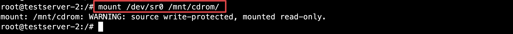

<h2>目錄</h2>

## 1. 環境說明

- 硬體： Nutanix NX-1065-G9
- Foundation：5.7.1
- AOS：6.10.1
- AHV：20230302.103003

## 2. Storage Management

### 2.1. 元件

- Storage Pool
    - 定義：Nutanix分散式儲存架構的基礎單位，它將所有節點的物理存儲設備（HDD/SSD/NVMe）組合在一起，形成一個統一的儲存資源池。
    - 特點：
        - 由 多個節點的本地磁碟組成，可以包含 HDD、SSD 或 NVMe。
        - 所有 Storage Containers 與 Volume Groups 都建立在 Storage Pool 之上。
        - 支援 RAID-less，透過 Nutanix 的 RF2（Replication Factor 2）或 RF3 來確保數據冗餘與安全性。
        - 可擴展，當叢集新增節點時，Storage Pool 也會自動擴展。
- Storage Container：
    - 定義：儲存架構中的邏輯分區，它位於 Storage Pool 之上，用於管理不同類型的數據與存儲策略。
    - 特點：
        - 基於 Storage Pool 建立的邏輯存儲區，概念上類似Windows資料夾而非磁碟分區。
        - 可設定不同的儲存策略如資料份數、可使用空間上限、壓縮、重複資料刪除等。
- Volume Group
    - 定義：Nutanix 提供的 iSCSI 目標儲存設備，適用於無法直接使用 Storage Container 的應用。
    - 特點：
        - 基於 Storage Pool 建立，與 Storage Container 並列。
        - 提供 iSCSI LUN 來存取儲存。
        - 支援多重存取模式，也就是可以多個VM共同使用此iSCSI LUN

<div class="page-break"/>

Table: Storage

| 名稱              | 功能                      | 用途                                 | 存取方式        |
| ----------------- | ------------------------- | ------------------------------------ | --------------- |
| Storage Pool      | 統一管理所有磁碟資源      | Nutanix 叢集內的基礎存儲池           | 內部自動管理    |
| Storage Container | 存放VM Disk，管理儲存策略 | Nutanix AHV、VMware ESXi VM 使用     | CIFS、NFS、vDisk |
| Volume Group      | 提供 iSCSI LUN 給特殊應用 | Windows Failover Cluster、Oracle RAC | iSCSI           |

### 2.2. Storage Container

#### 2.2.1. 新增

**點擊左上方選單 -> Storage**


Table:  Create Storage Container

| 編號 | 欄位描述                          |
| :--: | --------------------------------- |
|  1   | **Name**為此Storage Container名稱 |

<div class="page-break"/>


Table:  Advanced Settings

| 編號 | 欄位描述                                                                                                                                      |
| :--: | --------------------------------------------------------------------------------------------------------------------------------------------- |
|  1   | **Replication Factor**是指資料要儲存的份數。RF2係指同份資料會被儲存成兩份。                                                                   |
|  2   | **Reserved Capacity**是指此Storage Container需預留的儲存空間。這樣可以確保此Storage Container內的應用或虛擬機擁有固定的可用儲存容量           |
|  3   | **Advertised Capacity**是指此Storage Containe最大可用儲存空間，當儲存使用量達到設定的容量上限時，將無法再新增數據，以避免超出預期的存儲空間。 |

<div class="page-break"/>


Table:  Advanced Settings

| 編號 | 欄位描述                                                                                                                                                                                                                                                                                                                                                                                                  |
| :--: | --------------------------------------------------------------------------------------------------------------------------------------------------------------------------------------------------------------------------------------------------------------------------------------------------------------------------------------------------------------------------------------------------------- |
|  1   | **Compression**預設啟用，當**Delay設定為0**時即數據在寫入時立即壓縮也就是所謂的**Inline Compression**，。若**Delay設定為非0值**即所謂的**Post-Process Compression**，建議設定最少**60 分鐘**。                                                                                                                                                                                                            |
|  2   | **Deduplication**為Post-Process Deduplication。Nutanix 建議將此選項應用於full clone, persistent desktops, and physical to virtual等場景，以節省存儲容量。建議 **要啟用此功能建議CVM具備至少 32GB RAM 和 300GB SSD 作為metadata disk**。                                                                                                                                                                   |
|  3   | **Erasure Coding**是一種提升儲存效率的技術，透過分散式校驗碼機制儲存資料，比 RF2節省 30-50% 空間，同時確保數據可用性，即使節點或磁碟故障仍能恢復。{==啟用最低需求為4個Node==}，詳請可參考[Prism Element Web Console Guide](https://portal.nutanix.com/page/documents/details?targetId=Web-Console-Guide-Prism-v6_10:wc-erasure-coding-overview-wc-c.html#nconcept_upx_k3b_cs){:target="_blank"}內的說明。 |
|  4   | **Filesystem Allowlists**為定義允許使用NFS存取此Storage Container的主機或網段。部分備份軟體或第三方軟體需使用NFS存取時就需要設定，此設定會覆蓋全域白名單設定。                                                                                                                                                                                                                                            |


<div class="page-break"/>

#### 2.2.2. 修改


#### 2.2.3. 刪除


## 3. Network Management

### 3.1. Nutanix與Vmware術語比較

Table: Networking Terminology Matrix

|          **AHV Term**          |                                **VMware Term**                                |
| :----------------------------: | :---------------------------------------------------------------------------: |
|     Bridge, Virtual Switch     |                      vSwitch, Distributed Virtual Switch                      |
|           {==Bond==}           |                                   NIC team                                    |
|          Port or tap           |                                     Port                                      |
|          {==Subnet==}          |                                  Port group                                   |
|             Uplink             |                                 pNIC or vmnic                                 |
|             VM NIC             |                                     vNIC                                      |
|      {==Internal port==}       |                                 VMkernel port                                 |
|         Active-backup          |                                Active-standby                                 |
| Active-Active with MAC pinning | Route based on source MAC hash combined with route based on physical NIC load |
|         Active-Active          |                        LACP and route based on IP hash                        |

<div class="page-break"/>

### 3.2. Virtual Switch

#### 3.2.1. 新增


Table: General Settings

| 編號 | 欄位描述                                                                                                                  |
| :--: | ------------------------------------------------------------------------------------------------------------------------- |
|  1   | vSwitch名稱                                                                                                               |
|  2   | vSwitch描述                                                                                                               |
|  3   | vSwitch MTU大小                                                                                                           |
|  4   | vSwitch變更方式<br> - Standard(建議)：Node會進入維護模式並滾動更新。<br>- Quick：Node不會進入維護模式，故有可能影響流量。（此選項僅在修改Virtual Switch時會出現） |

<div class="page-break"/>


Table: Uplink Configuration

| 編號 | 欄位描述                                                                                                                                                                                                                                                                                                                                                                                             |
| :--: | ---------------------------------------------------------------------------------------------------------------------------------------------------------------------------------------------------------------------------------------------------------------------------------------------------------------------------------------------------------------------------------------------------- |
|  1   | Bond模式，可區分4種。<br>- Active-Backup：推薦使用，為預設設定。所有流量都透過單一啟用的網路介面卡進行傳輸，當主介面失效時，會自動切換到備援介面。<br>- Active-Active with MAC pinning：該模式將每個 VM NIC 綁定到單一網卡，並根據負載動態分配流量，但不適合多播流量。<br>- Active-Active：即為LACP模式，設定此模式時建議交換器要設定LACP failback。<br>- No Uplink Bond：可配置為0或1張網路介面卡。 |
|  2   | 選擇要修改的主機                                                                                                                                                                                                                                                                                                                                                                                     |
|  3   | 選擇要顯示的網路介面卡。如只顯示Connected Ports或10G速率的Port。                                                                                                                                                                                                                                                                                                                                     |
|  4   | 設定此vSwitch在主機要綁定的網路介面卡。                                                                                                                                                                                                                                                                                                                                                              |

<div class="page-break"/>

#### 3.2.2. 修改

設定項目可參考『新增』Virtual Switch


#### 3.2.3. 刪除


### 3.3. Subnet

#### 3.3.1. 新增

預設不會有任何Subnet故需於此處新增VM所需使用的網路


Table: Create Subnet

| 編號 | 欄位描述                                 |
| :--: | ---------------------------------------- |
|  1   | Subnet名稱                               |
|  2   | 選擇此Subnet要於哪一個Virtual Switch建立 |
|  3   | VLAN ID，若無則輸入0。                   |
|  4   | 此Subnet是否由AHV派送DHCP。              |

<div class="page-break"/>

#### 3.3.2. 修改


#### 3.3.3. 刪除


## 4. Virtual Machine Management

### 4.1. 支援的作業系統

可至[Nutanix Compatibility and Interoperability Matrix](https://portal.nutanix.com/page/documents/compatibility-interoperability-matrix/guestos){:target="_blank"}查詢支援的作業系統版本及功能


### 4.2. VM規格配置上限

可至[Nutanix Configuration Maximums](https://portal.nutanix.com/page/documents/configuration-maximum/list){:target="_blank"}查詢


### 4.3. VirtIO

AHV環境中的虛擬驅動程式（Virtual Input/Output Driver），主要用於提升AHV上虛擬機的效能與相容性，可至[Nutanix Downloads](https://portal.nutanix.com/page/downloads?product=ahv){:target="_blank"}下載


### 4.4. Image Configuration

安裝虛擬機器所需的ISO檔案或DISK檔案需先上傳後才可以於建立VM時使用

#### 4.4.1. Upload Image


Table: Upload Image

| 編號 | 欄位描述                                                       |
| :--: | -------------------------------------------------------------- |
|  1   | 輸入Image名稱。此名稱為後續要選擇時顯示的名稱。                |
|  2   | 選擇上傳的Image類型。可選擇ISO（ISO檔案）或DISK（qcow2檔案）。 |
|  3   | 選擇上傳的Image要放置於哪一個Storage Container。               |
|  4   | 選擇上傳檔案方式。可由指定網址下載或由本機電腦上傳檔案。       |

需確定為ACTIVE狀態才代表上傳完成


#### 4.4.2. Delete Image


### 4.5. Create VM

#### 4.5.1. Windows


Table: General Configuration

| 編號 | 欄位描述                                                                                                                                                |
| :--: | ------------------------------------------------------------------------------------------------------------------------------------------------------- |
|  1   | 輸入虛擬機器名稱。                                                                                                                                      |
|  2   | 輸入虛擬機器描述（可選項）。                                                                                                                            |
|  3   | 選擇虛擬機器時區。                                                                                                                                      |
|  4   | 是否為agent VM，若無特殊需求不需勾選。當設定為agent VM時此VM將會是後關機、最先開機，且不會被遷移只會固定在特定主機上，通常用於NFV功能或不允許被遷移的VM |


| 編號 | 欄位描述                 |
| :--: | ------------------------ |
|  1   | 輸入vCPU數。             |
|  2   | 輸入每個vCPU有幾個CORE。 |
|  3   | 輸入記憶體大小。         |

選擇BIOS Type為Legacy BIOS或UEFI，若選擇UEFI則Disk介面{==不可以設定為IDE==}


新增硬碟


| 編號 | 說明                                                                                                                                                                                                                                                                                                                                                              |
| :--: | ----------------------------------------------------------------------------------------------------------------------------------------------------------------------------------------------------------------------------------------------------------------------------------------------------------------------------------------------------------------- |
|  1   | 選擇要新增的Disk類型為**DISK**或**CD-ROM**。                                                                                                                                                                                                                                                                                                                      |
|  2   | 選擇新增的Disk內容來源為：<br>- **Clone from ADSF file**：從Storage Container複製檔案作為磁碟映像。<br>- **Empty CD-ROM**：僅建立空白光碟機設備 **(僅適用於TYPE選擇CD-ROM類型)** 。<br>- **Allocate on Storage Container**：僅分配存儲空間。 **（僅適用於TYPE選擇DISK類型）** <br>- **Clone from Image Service**：使用 **Image Service** 匯入的映像檔來建立磁碟。 |
|  3   | 選擇磁碟或光碟機的匯流排類型，選項如下：<br>- **磁碟 (DISK)**：{==SCSI（建議）==}、SATA、PCI、IDE。<br>- **光碟機 (CD-ROM)**：IDE 或 SATA。                                                                                                                                                                                                                       |
|  4   | 依據選擇的Operation方式會有不同的項目<br>- **Clone from ADSF file**：輸入Storage Container的存放路徑，例如：`/storagecontainer/veeam`。<br>- **Clone from Image Service**：選擇已於Image Configuration上傳的映像檔來複製。<br>- **Allocate on Storage Container**：選擇要分配的儲存空間。                                                                         |
|  5   | 輸入磁碟大小。                                                                                                                                                                                                                                                                                                                                                    |

!!! warning
    Guest OS沒有 VirtIO 驅動程式來支援 SCSI 設備時，請使用 SATA、PCI 或 IDE 來確保相容性。但這可能會影響系統效能。

掛載Windows ISO檔案


當硬碟介面是選擇SCSI時，於Windows安裝導引中將會看不到此硬碟，須先掛載VirtIO ISO安裝驅動程式後才可以看到，故建議在此可以多新增一個光碟機掛載VirtIO ISO，可以避免需要更換ISO檔案的步驟


新增網路介面卡


| 編號 | 說明                                              |
| :--: | ------------------------------------------------- |
|  1   | 選擇此網路介面卡使用的Subnet。                    |
|  2   | 選擇此網路介面卡狀態為Conntected或Disconntected。 |

設定此VM是否固定在特定Node上，若沒特別需求可以不設定，若要設定建議最少選擇兩個Node以避免單點失敗。


VM開機


開啟VM Console


硬碟使用介面為SCSI時則在此處將看不到任何硬碟，此時若已將VirtIO ISO掛載於第二台光碟機則可以直接選擇載入驅動程式，沒有的話需於右上方Mount ISO更換光碟機ISO檔案為VirtIO ISO並於載入驅動程式完成後更換回Windows ISO


依據所要安裝的作業系統版本選擇對應資料夾


選擇所有Driver


#### 4.5.2. Linux

與Windows安裝方式大致相同，但不需要掛載VirtIO ISO，因為可以直接查看到SCSI介面硬碟


  


### 4.6. Nutanix Guest Tool

#### 4.6.1. 功能

Nutanix Guest Tool（NGT安裝於Guest VM後可以提供以下進階VM管理功能

- File Level Restore CLI：允許用戶從VM快照進行自助文件層級恢復，無需還原整個VM。
- VM Mobility
    - 提供 ESXi與AHV之間的VM遷移。
    - In-Place Hypervisor Conversion。
    - Cross-Hypervisor Disaster Recovery。
- Application-Consistent Snapshots
    - Windows
        - Nutanix native in-guest Volume Snapshot Service (VSS) agent，可針對支援 VSS 的所有 VM 進行Application-Consistent Snapshots。
        - 支援第三方備份解決方案 (CommVault、Rubrik 等)進行Application-Consistent Snapshots。
    - Linux
        - 透過執行Script，實現Application-Consistent Snapshots。
- Static IP Preservation：允許Guest VM在Failover（DR）至 IPAM 網路時，保留其靜態 IP 地址
- In-Guest Scripts Execution：可在 VM Recovery後 自動執行各種任務。

#### 4.6.2. 元件

- NGT Installer：NGT安裝程式。
- Nutanix Guest Agent Service（NGA Service）：在CVM和Guest VM 之間維持通訊。
- Nutanix VirtIO Package：包含運行於AHV Hypervisor的VM所需的驅動程式。
- Python：NGA Service使用 Python 開發，故會安裝專屬的 Python，以避免影響系統中的其他元件。
- Nutanix VSS 套件：Nutanix native in-guest Volume Snapshot Service (VSS) agent，可針對支援 VSS 的所有 VM 進行Application-Consistent Snapshots。
- Windows系統額外包含以下元件
    - Custom module：執行系統檢查並滿足所有前置需求。
    - Microsoft Visual C++ 2015 x64 redistributable component。
    - 與 Windows Performance Monitor 整合元件。

#### 4.6.3. 管理

- 此處用於管理是否啟用Nutanix Guest Tools及其相關功能，以及掛載Nutanix Guest Tools ISO以供Guest VM安裝。
- 安裝時所有的元件都會安裝，故Enable Nutanix Guest Tools或Enable Applications部分{==僅是設定是否在此VM啟用此功能而非是否安裝==}。


|                               欄位                               | 說明                                                                           |
| :--------------------------------------------------------------: | ------------------------------------------------------------------------------ |
|                    Enable Nutanix Guest Tools                    | 設定是否啟用Nutanix Guest Tools。                                              |
|                    Mount Nutanix Guest Tools                     | 是否掛載Nutanix Guest Tools ISO。                                              |
|                    Self Service Restore (SSR)                    | 是否啟用Self Service Restore功能。                                             |
| Volume Snapshot Service / Application Consistent Snapshots (VSS) | 是否啟用Volume Snapshot Service / Application Consistent Snapshots (VSS)功能。 |

#### 4.6.4. 安裝

- 需先完成Nutanix Guest Tools啟用及掛載Nutanix Guest Tools ISO
- 需檢查環境是否有符合[Nutanix Guest Tools Requirements](https://portal.nutanix.com/page/documents/details?targetId=Prism-Central-Guide:mul-ngt-pc-requirements-r.html){:target="_blank"}要求

##### 4.6.4.1. Windows


##### 4.6.4.2. Linux

使用以下兩個指令其中一個確認光碟機路徑

```bash
 blkid -L NUTANIX_TOOLS
```


```bash
lsblk -o PATH,LABEL
```


建立掛載點所需資料夾

```bash
mkdir -p /mnt/cdrom
```


將光碟機裝置掛載到目錄

```bash
sudo mount [CDROM_PATH] [MOUNT_POINT_PATH]
```



執行安裝程式

```bash
 sudo python [mount_point]/installer/linux/install_ngt.py --operation install
 
 # 指令為python或python3取決於系統安裝的python版本及設定
```


#### 4.6.5. 升級

僅有在AOS升級才有升級NGT需求，升級步驟如下，可參考安裝步驟，兩者相同

- 掛載NGT ISO
- 執行安裝程式

#### 4.6.6. 解除安裝

解除安裝前務必確定CVM與NGT溝通是正常的，若不正常的話即使解除安裝程式後在CVM仍然會顯示NGT已安裝

##### 4.6.6.1. Windows


##### 4.6.6.2. Linux

```bash
 sudo sh /usr/local/nutanix/ngt/python/bin/uninstall_ngt.sh
```


##### 4.6.6.3. 確認移除狀態

SSH登入CVM執行以下指令

```bash
 ncli ngt list
```


若NGT已經移除但仍出現在list上可以使用以下指令刪除

```bash
 ncli ngt delete vm-id=[virtual_machine_id]
```

## 5. NCC

- Nutanix Cluster Check簡稱NCC，是一款診斷與健康檢查工具，用來分析 Nutanix 叢集的狀態，確保系統的穩定性、效能與高可用性。
- 建議於安裝後、更新前後手動執行確保系統狀態正常。

**點擊左上方選單 -> Health**


**點擊Actions -> Run NCC Checks**


<div class="page-break"/>

**點擊All Checks -> Run**


**點擊左上方Recent Tasks圖示確認檢查完畢**


<div class="page-break"/>

**針對Failed、Warning、Error逐一點擊查看被檢查到的項目**


**點擊每個項目查看原因及修正方式**


<div class="page-break"/>

**全部修正完後再重新執行All Checks確保無重大錯誤**


<div class="page-break"/>

## 6. LCM

- LCM（Life Cycle Manager）是 Nutanix提供的自動化生命週期管理工具，用於升級與管理Nutanix叢集的軟體與韌體，確保系統始終處於最佳狀態，建議完成安裝後要執行韌體更新。

<div class="page-break"/>

### 6.1. Inventory

執行Inventory時將會掃描Cluster中的硬體與軟體及識別當前版本與可用更新，可設定定期自動檢查或手動檢查。


<div class="page-break"/>

### 6.2. Updates

當執行完Inventory後將可以在Updates查看是否有Software或Firmware可用更新，建議在更新前後均手動執行NCC Check確定Cluster健全狀態。


選擇要更新的項目及版本


執行更新


<div class="page-break"/>

## 7. 開關機流程

### 7.1. 關機

#### 7.1.1. 關閉所有虛擬機器

關閉除了CVM之外的所有虛擬機器


#### 7.1.2. 關閉Cluster服務

SSH登入{==任一台CVM==}輸入以下指令關閉Cluster服務

```shell
cluster stop
```


如果成功會顯示Success


如果還有虛擬機器未關機會顯示類似下面的結果


#### 7.1.3. 關閉CVM

SSH登入{==每一台CVM==}輸入以下指令

```shell
sudo shutdown -P now
```

或SSH登入{==任一台CVM==}輸入以下指令

```shell
allssh sudo shutdown -P now
```


#### 7.1.4. 關閉Node

SSH登入{==每一台AHV==}輸入以下指令

**確認CVM已完成關機**

```shell
virsh list --all | grep CVM
```


**執行關機指令**

```shell
shutdown -h now
```


### 7.2. 開機

#### 7.2.1. 開啟Node

從節點上的電源鈕按下或透過IPMI遠端開機，燈號亮起後即為電源啟動


#### 7.2.2. 啟動Cluster服務

開機後等待約5-10分鐘後，透過SSH連線到{==任何一台==}CVM執行以下指令

```shell
cluster start
```


確認Cluster服務狀態，若有服務非up狀態可再輸入cluster start，此時僅會針對沒有up的服務做啟用動作並不會影響已經up的服務

```shell
cluster status
```


#### 7.2.3. 開啟虛擬機器

登入Prism Element將虛擬機器開機


或輸入以下指令將所有關機VM都開機

```shell
for i in `acli vm.list power_state=off | awk '{print $1}' | grep -v NTNX` ; do acli vm.on $i; done
```


<h2 class="no-print">參考資料</h2>

- [Prism Element Web Console Guide](https://portal.nutanix.com/page/documents/details?targetId=Web-Console-Guide-Prism-v6_10:Web-Console-Guide-Prism-v6_10){:target="_blank"}
- [Prism Central Infrastructure Guide](https://portal.nutanix.com/page/documents/details?targetId=Prism-Central-Guide-vpc_2024_3:Prism-Central-Guide-vpc_2024_3){:target="_blank"}
- [Nutanix AHV Networking Best Practices](https://portal.nutanix.com/page/documents/solutions/details?targetId=BP-2071-AHV-Networking:BP-2071-AHV-Networking){:target="_blank"}