<h2>目錄</h2>

- [1. 環境說明](#1-環境說明)
- [2. 設定](#2-設定)
    - [2.1. 新增Admin Roles](#21-新增admin-roles)
    - [2.2. 建立管理者帳號](#22-建立管理者帳號)
    - [2.3. 取得帳號API Key](#23-取得帳號api-key)
    - [2.4. 新增 Batch Script](#24-新增-batch-script)
    - [2.5. 建立工作排程](#25-建立工作排程)
    - [2.6. 測試執行情形](#26-測試執行情形)
  
<div class="page-break"/>

## 1. 環境說明

- 防火牆型號：PA-820
- 防火牆版本： 10.1.14
- 執行備份任務腳本電腦作業系統版本： Windows Server 2019

<div class="page-break"/>

## 2. 設定

!!!warning
    防火牆變更後記得要commit，設定才會生效

### 2.1. 新增Admin Roles

建立一個新的Admin Roles僅具有使用XML API Export功能，其餘均禁止以達到權限最小化原則

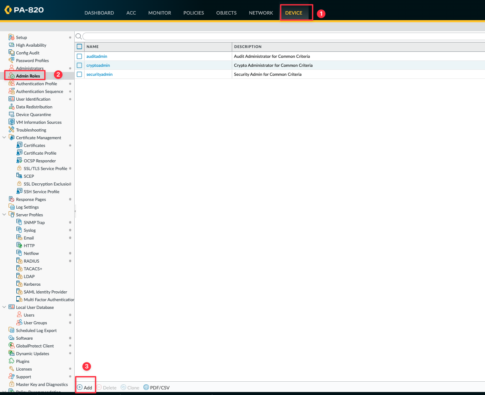

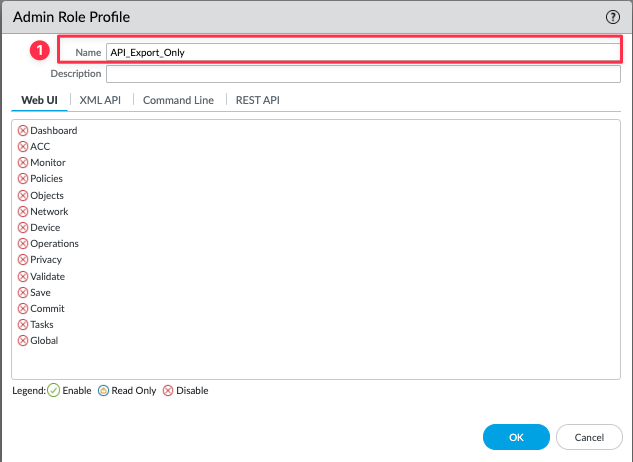

| 編號 | 欄位名稱 | 欄位描述       |
| :--: | :------: | -------------- |
|  1   | **Name** | 名稱，可自定義 |

<div class="page-break"/>

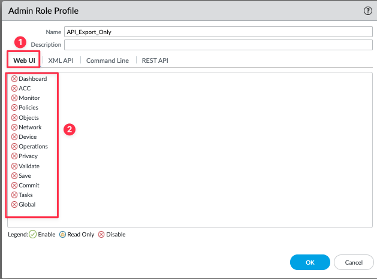

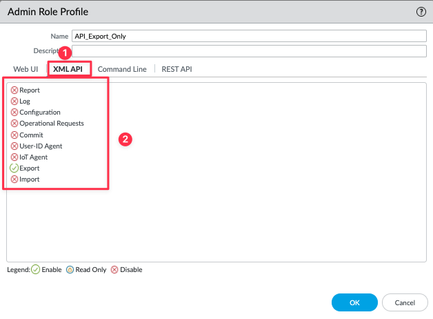

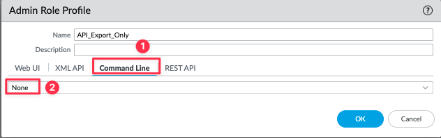

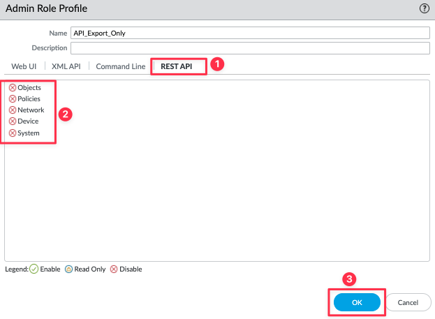

<div class="page-break"/>

### 2.2. 建立管理者帳號

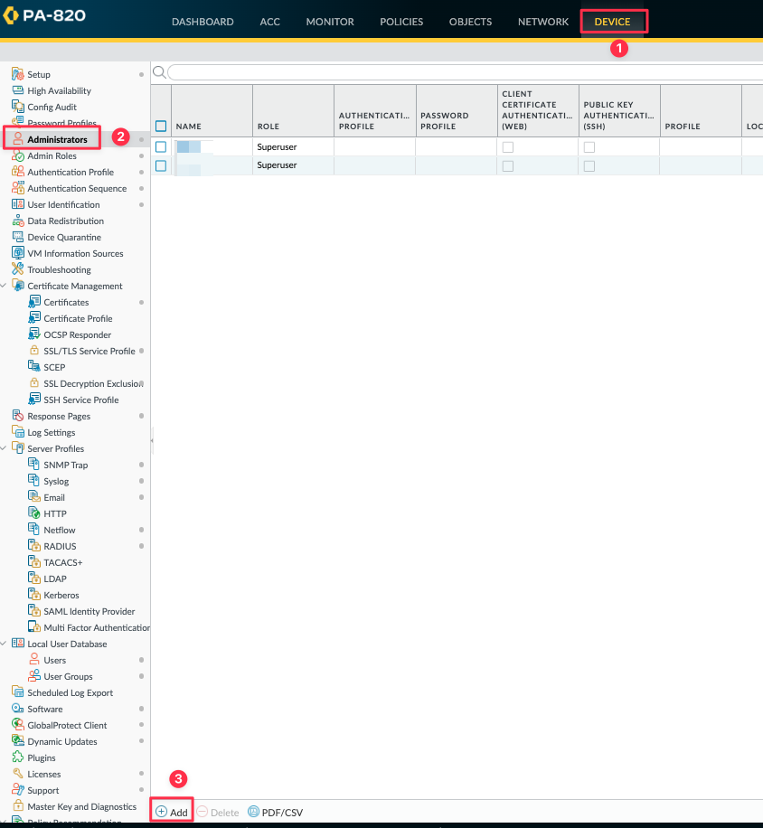

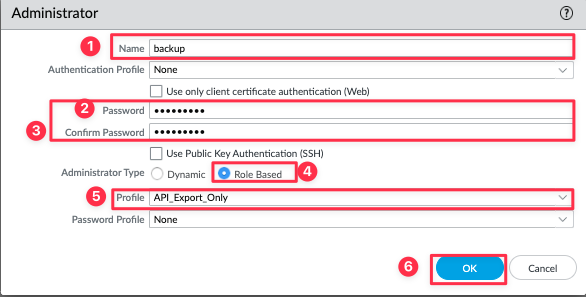

| 編號 |        欄位名稱        | 欄位描述                                                                                      |
| :--: | :--------------------: | --------------------------------------------------------------------------------------------- |
|  1   |        **Name**        | 名稱，可自定義                                                                                |
|  2   |      **Password**      | 密碼，可自定義                                                                                |
|  3   |  **Confirm Password**  | 密碼確認                                                                                      |
|  4   | **Administrator Type** | 管理員權限賦予方式<br>**- Dynamic：**使用內建的管理員角色<br/>{==**- Role Based：**==}使用自定義的管理員角色 |
|  5   |      **Profile**       | 選擇此帳號的權限設定檔                                                                        |

<div class="page-break"/>

### 2.3. 取得帳號API Key

使用瀏覽器開啟以下網址，其中<firewall-ip\>為防火牆IP，<username\>為剛建立的管理者帳號，<password\>為剛建立的管理員密碼

```bash
https://<firewall-ip>/api/?type=keygen&user=<username>&password=<password>
```

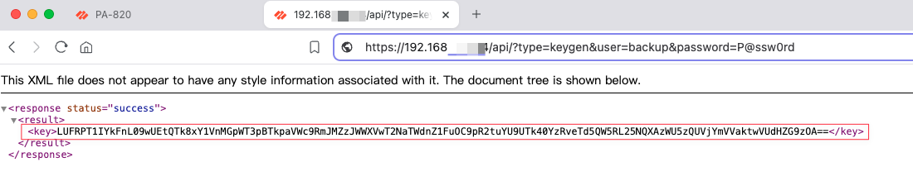

!!!info
    API Key預設不會逾期故管理員密碼變更也不需要重新取得API Key，若要使API Key失效或者要設定有效期間需至Device -> Setup -> Management -> Authentication Settings變更

<div class="page-break"/>

### 2.4. 新增 Batch Script

主要執行備份的語法為

```batch
 curl -kG "https://<firewall-ip>/api/?type=export&category=configuration&key=<api_key>" > running-config.xml`
```

為達到可自動依日期儲存及紀錄錯誤可拓展為以下Batch Script，此部分可以需求自行修改存檔命名方式及檢查邏輯並將此Batch Script放置於要執行備份的電腦內

``` batch linenums="1" title="backup.bat"
@echo off
:: 設定備份目的地，依實際狀況修改
set "backup_dir=C:\backup"
:: 設定防火牆IP，依實際狀況修改
set "api_ip=192.168.1.254"
:: 設定API Key，依實際狀況修改
set "api_key=LUFRa1F0SQ=="

:: 獲取日期時間，並將 Year, Month, Day, Hour, Minute, Second 設置為環境變數
for /f %%i in ('WMIC Path Win32_LocalTime Get /Format:value') do @for /f %%j in ("%%i") do @set %%j

:: 補零處理（若為個位數則補零）
set Month=0%Month%
set Month=%Month:~-2%
set Day=0%Day%
set Day=%Day:~-2%
set Hour=0%Hour%
set Hour=%Hour:~-2%
set Minute=0%Minute%
set Minute=%Minute:~-2%

:: 格式化日期和時間為 YYYY-MM-DD_HH-MM
set "date_str=%Year%-%Month%-%Day%"
set "time_str=%Hour%-%Minute%"

:: 設定備份檔案名稱
set "backup_file=fw1-config_%date_str%_%time_str%.xml"
set "log_file=%backup_dir%\backup_log.txt"

:: 檢查 backup 資料夾是否存在，若不存在則建立
if not exist "%backup_dir%" (
    mkdir "%backup_dir%"
)

:: 執行 curl，並將標準輸出寫入到備份檔案中，錯誤訊息寫入日誌檔案
curl -s -kG "https://%api_ip%/api/?type=export&category=configuration&key=%api_key%" > "%backup_dir%\%backup_file%" 2>> "%log_file%"

:: 檢查 curl 是否成功執行，若失敗則刪除可能已經創建的文件，並記錄錯誤
if %errorlevel% neq 0 (
    del "%backup_dir%\%backup_file%" >nul 2>&1
    echo [%date_str% %time_str%] [ERROR] 備份失敗，curl錯誤：%errorlevel% >> "%log_file%"
    exit /b 1
)
```

<div class="page-break"/>

### 2.5. 建立工作排程

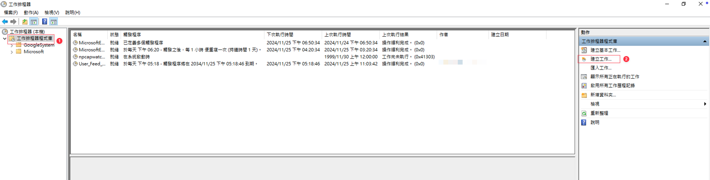

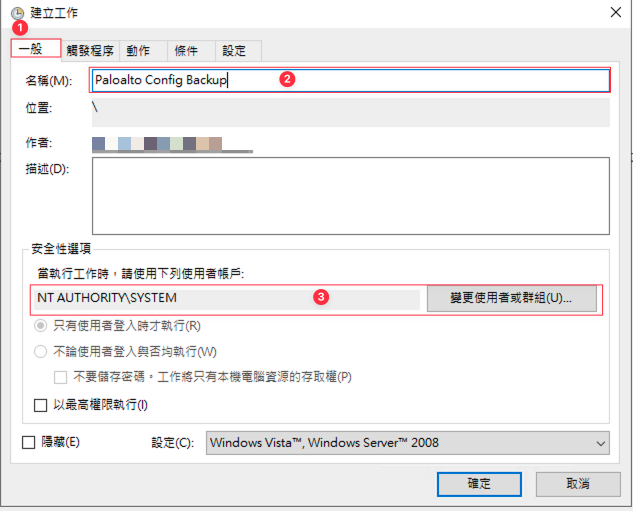

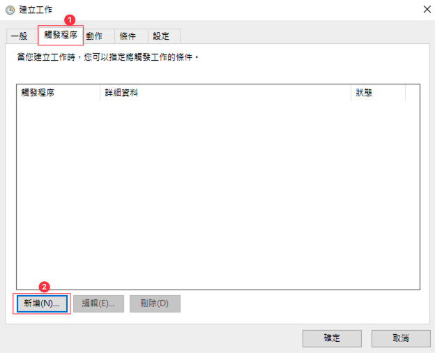

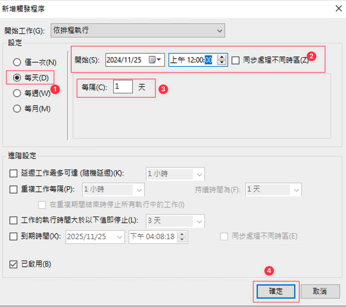

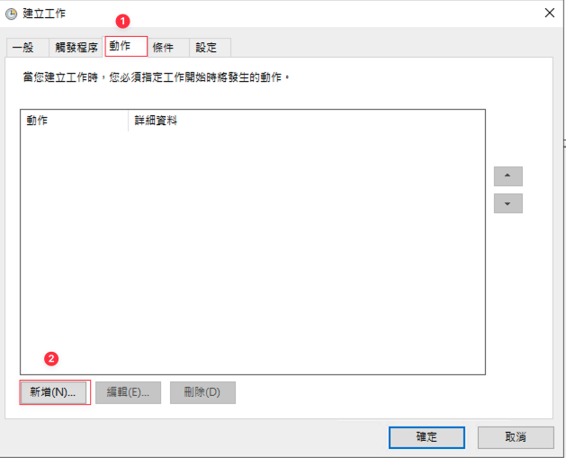

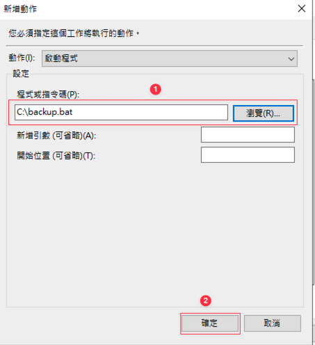

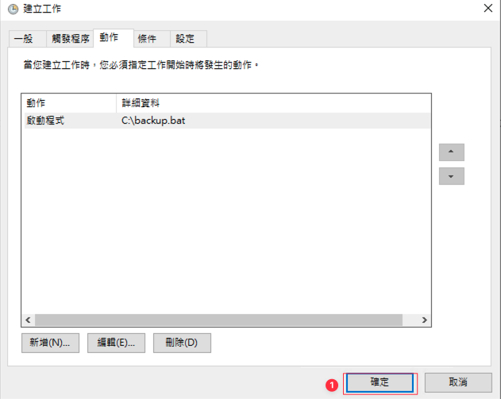

<div class="page-break"/>

### 2.6. 測試執行情形

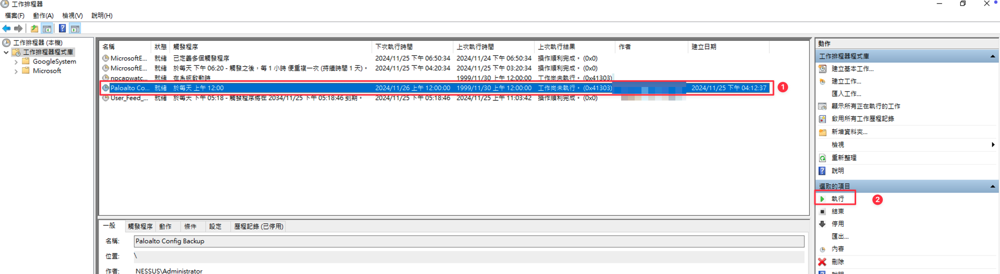

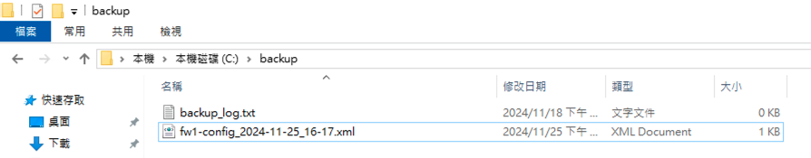

<div class="page-break"/>

<h2 class="no-print">參考資料</h2>

- [How To Backup of Config Files Periodically without Panorama](https://knowledgebase.paloaltonetworks.com/KCSArticleDetail?id=kA10g000000Cm7yCAC){:target="_blank" class="no-print"}
