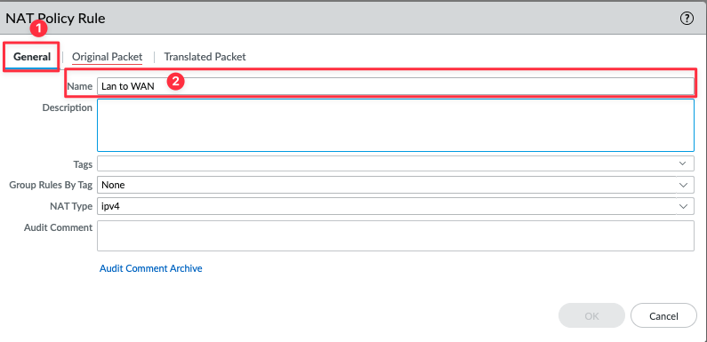

<h2>目錄</h2>

- [1. 環境說明](#1-環境說明)
- [2. 連線方式](#2-連線方式)
- [3. 初始化設定](#3-初始化設定)
    - [3.1. 變更密碼](#31-變更密碼)
    - [3.2. 關閉ZTP](#32-關閉ztp)
- [4. 提交設定](#4-提交設定)
- [5. 管理介面IP設定](#5-管理介面ip設定)
- [6. 設備名稱及時區設定](#6-設備名稱及時區設定)
- [7. DNS、NTP Server設定](#7-dnsntp-server設定)
- [8. 服務路由設定](#8-服務路由設定)
- [9. 啟用授權](#9-啟用授權)
- [10. 特徵碼更新及排程設定](#10-特徵碼更新及排程設定)
    - [10.1. 特徵碼更新](#101-特徵碼更新)
    - [10.2. 排程設定](#102-排程設定)
- [11. 網路設定](#11-網路設定)
    - [11.1. Zones](#111-zones)
    - [11.2. Interface Mgmt](#112-interface-mgmt)
    - [11.3. Interfaces](#113-interfaces)
    - [11.4. Virtual Routers](#114-virtual-routers)
- [12. NAT](#12-nat)
- [13. Security Policy](#13-security-policy)
- [14. 設定備份與還原](#14-設定備份與還原)
    - [14.1. 設定備份](#141-設定備份)
    - [14.2. 設定還原](#142-設定還原)
- [15. 重新開機](#15-重新開機)
    - [15.1. 重新開機](#151-重新開機)
    - [15.2. 關機](#152-關機)
- [16. 升級](#16-升級)
    - [16.1. 升級說明](#161-升級說明)
    - [16.2. 升級步驟](#162-升級步驟)
  
<div class="page-break"/>

## 1. 環境說明

- 防火牆型號：PA-440
- 防火牆版本：10.2.7-h8
- 架構：


|    設備     |  介面  |        IP         |
| :---------: | :----: | :---------------: |
|     ISP     | Port 1 |  10.10.10.254/24  |
|   PA-440    |  MGT   | 192.168.30.101/24 |
|   PA-440    |  E1/1  |   10.10.10.1/24   |
|   PA-440    |  E1/2  |  172.16.1.254/24  |
| Core Switch | Port 1 |   172.16.1.1/24   |
| Core Switch | Port 2 | 192.168.30.254/24 |

<div class="page-break"/>

## 2. 連線方式

- Web
    - 電腦使用網路線連接MGT Port
    - 電腦設定為192.168.1.0/24任一個IP，但不要是192.168.1.1
    - 使用瀏覽器連線<http://192.168.1.1>
- Console
    - Bit rate: 9600
    - Serial data bits: 8
    - No serial parity
    - Serial stop bit: 1
    - No flow control

<div class="page-break"/>

## 3. 初始化設定

### 3.1. 變更密碼

預設帳號為admin，密碼為admin


<div class="page-break"/>

設定新密碼


<div class="page-break"/>

### 3.2. 關閉ZTP

!!! info
    此部分僅針對A-5400, PA-400, PA-410, PA-1400, PA-3400, PA-220-ZTP, PA-220R-ZTP, PA-800-ZTP, PA-850-ZTP, PA-3220-ZTP, PA-3250-ZTP, and PA-3260-ZTP才需要設定

使用變更後的密碼登入


<div class="page-break"/>

選擇標準模式


<div class="page-break"/>

!!! warning
    若防火牆沒有自動重新開機代表預載的Firmware有關閉ZTP的Bug就需要使用CLI關閉ZTP Mode

``` bash
# PA-220-ZTP, PA-220R-ZTP, PA-800-ZTP, PA-850-ZTP, PA-3220-ZTP, PA-3250-ZTP, and PA-3260-ZTP
request disable-ztp

# PA-5400, PA-400, PA-410, PA-1400, and PA-3400
set system ztp disable
```


<div class="page-break"/>

## 4. 提交設定

!!! warning
    在沒有提交設定之前所做的任何變更都{==不會生效==}


<div class="page-break"/>

## 5. 管理介面IP設定


| 編號 |      欄位名稱       | 欄位描述                   |
| :--: | :-----------------: | -------------------------- |
|  1   |     **IP Type**     | 選擇使用靜態IP或者DHCP取得 |
|  2   |   **IP Address**    | IP位址                     |
|  3   |     **Netmask**     | 子網路遮罩                 |
|  4   | **Default Gateway** | 預設閘道 |

<div class="page-break"/>

## 6. 設備名稱及時區設定


<div class="page-break"/>

## 7. DNS、NTP Server設定


此處的DNS設定是防火牆本身要做DNS查詢時使用，{==若未設定則相關特徵碼、Firmware更新、啟用授權等功能均會異常==}


NTP Server Address可以設定FQDN或者是IP


<div class="page-break"/>

## 8. 服務路由設定

Service Route部分是指防火牆本身的各項服務要使用哪個介面，預設是使用Management Interface，但若Management Interface無法上網或者沒有接線時可以改成使用其他介面


<div class="page-break"/>

可針對不同的服務設定使用不同的介面


<div class="page-break"/>

## 9. 啟用授權

!!! info
    - 啟用授權前設備需先於[Paloalto Customer Support Portal](https://support.paloaltonetworks.com/){:target="_blank"}完成註冊
    - 設備必須先完成DNS及服務路由設定


<div class="page-break"/>

## 10. 特徵碼更新及排程設定

### 10.1. 特徵碼更新

!!! info
    - 必須先啟用完授權在此才可以看得到更新項目
    - AntiVirus更新項目需先安裝Application and Threats後重新檢查更新才會出現


<div class="page-break"/>

需先下載要更新的項目


下載完成後Action會變成Install，此時點擊就會安裝


<div class="page-break"/>

### 10.2. 排程設定

每個項目都有各自的更新排程可以依需求設定自動下載及安裝時間


| 編號 |       欄位名稱        | 欄位描述                                                                     |
| :--: | :-------------------: | ---------------------------------------------------------------------------- |
|  1   |    **Recurrence**     | 排程週期。依不同項目可選擇每小時、每天或每週                                 |
|  2   | **Minutes Past Hour** | 依據選擇的排程週期可設定每小時的第幾分鐘或每天的第幾個小時或每週的第幾天     |
|  3   |      **Action**       | 可選擇僅下載或者下載並安裝                                                   |
|  4   | **Threshold (hours)** | 設定下載的更新項目其發行時間要是多少小時以前的。主要用於避免直接下載最新更新 |

<div class="page-break"/>

## 11. 網路設定

### 11.1. Zones

Zone主要用途是將多個介面群組起來故在設定NAT或Security Policy時就可以使用Zone的方式而不需要選擇每個介面，每個介面只能屬於一個Zone


| 編號 |       欄位名稱        | 欄位描述                                                                     |
| :--: | :-------------------: | ---------------------------------------------------------------------------- |
|  1   |    **Name**     | Zone名稱                                 |
|  2   | **Type** | Zone類型，可設定為Tap、Virtual Wire、Layer 2、Layer3、Tunnel。Zone類型需與Interface類型相同故不能將不同類型的Interface放入同一個Zone     |

<div class="page-break"/>

共建立LAN與WAN兩個Zone


<div class="page-break"/>

### 11.2. Interface Mgmt

Interface Mgmt設定檔主要是設定介面要允許哪些服務以及哪些IP可以使用這些服務，在對外Interface套用的設定檔建議不要勾選Administrative Management Services的項目因為這樣就可以直接從外部存取到防火牆


| 編號 |         欄位名稱          | 欄位描述                                     |
| :--: | :-----------------------: | -------------------------------------------- |
|  1   |         **Name**          | Interface Mgmt設定檔名稱                     |
|  2   |        **Service**        | 介面允許的服務，可分為管理用及一般網路服務用 |
|  3   | **PERMITED IP ADDRESSES** | 允許使用服務的IP。沒有設定代表全部都允許 |


<div class="page-break"/>

### 11.3. Interfaces

設定每個介面的IP、Zone、Virtual Router、Interface Mgmt Profile


| 編號 |         欄位名稱          | 欄位描述                                                                                                            |
| :--: | :-----------------------: | ------------------------------------------------------------------------------------------------------------------- |
|  1   |    **Interface Type**     | Interface類型。可設定為Tap、HA、Virtual Wire、Layer 2、Layer3、Aggregate Ethernet，此處選擇Layer 3                                   |
|  3   |    **Virtual Router**     | 設定屬於哪一個虛擬路由器。Paloalto允許建立多個Virtual Router，每個 Virtual Router都是獨立的路由表，此處選擇default |
|  4   | **Security Zone** | 設定屬於哪一個Zone。依照不同介面選擇Zone                                                                            |

設定介面IP


<div class="page-break"/>

設定介面的Management Profile


完成兩個Interfaces設定


<div class="page-break"/>

### 11.4. Virtual Routers

設定各種路由包含靜態及動態路由


| 編號 |    欄位名稱     | 欄位描述                           |
| :--: | :-------------: | ---------------------------------- |
|  1   |    **Name**     | 靜態路由名稱                       |
|  3   | **Destination** | 目的地。0.0.0.0/0代表default route |
|  4   |  **Interface**  | 符合上述目的地的要由哪個介面出去   |
|  4   |  **Next Hop**   | 出去後要丟給哪一個IP               |

<div class="page-break"/>

此處共要設定兩條路由，一條是default route丟往Internet，另一條是針對內部網段要丟往Core Switch


<div class="page-break"/>

## 12. NAT

可設定多條NAT規則，比對順序為由上而下，一但有比對到就不會再往下比對


<div class="page-break"/>

設定此NAT Policy名稱



封包要符合此處{==所有條件==}才會套用此規則


| 編號 |         欄位名稱          | 欄位描述                           |
| :--: | :-----------------------: | ---------------------------------- |
|  1   |      **Source Zone**      | 來源Zone                      |
|  2   |   **Destination Zone**    | 目的地Zone |
|  3   | **Destination Interface** | 目的地Interface   |
|  4   |        **Service**        | 目的地Port              |
|  5   |     **SOURCE ADDRESS**      |來源IP|
|  6   | **DESTINATION ADDRESS** |目的地IP|

可以針對來源IP或目的地IP實施轉換，來源IP轉換大多是內部要存取外部服務，目的地IP轉換大多是外部需要訪問內部服務


| 編號 |         欄位名稱          | 欄位描述                           |
| :--: | :-----------------------: | ---------------------------------- |
|  2   |      **Translation Type**      | 轉換方式，可設定以下三種：<br>- Dynamic IP Port：來源IP及Port都會被轉換<br>- Dynamic IP：僅來源IP會被轉換成設定的IP範圍<br>- Static：僅來源IP會被轉換成設定的IP                     |
|  3   |   **Address Type**    | 可以選擇使用Interface IP或者是手動輸入IP |
|  4   | **Interface** | 要使用哪一個Interface IP做轉換   |
|  5   |        **IP Address**        | 要使用Interface的哪一個IP做轉換              |

<div class="page-break"/>

## 13. Security Policy

- 此處主要設定允許或拒絕封包及相關資訊安全檢查，比對順序為由上而下，一但有比對到就不會再往下比對

- {==封包要完全符合Source、Destination、Application、Service/URL Category==}這四種條件才會套用規則的Actions


設定Policy名稱


<div class="page-break"/>

設定來源Zone及IP


設定目的地Zone 及IP


設定目的地應用程式（如Line、Facebook）等


<div class="page-break"/>

設定目的地Port或URL類別


設定符合條件的封包要允許或拒絕、允許後要實施的資安檢查項目及Log是否紀錄


<div class="page-break"/>

## 14. 設定備份與還原

### 14.1. 設定備份

防火牆在每次提交設定後都會於本身保存設定版本，預設會保存100個版本


選擇要匯出的設定檔版本


<div class="page-break"/>

### 14.2. 設定還原

匯入之前備份的檔案，檔名可以自行變更但副檔名要是xml


此時僅是將設定檔案上傳到防火牆還需載入該設定檔案


載入完成後若確認沒有問題需要commit後設定才會生效


<div class="page-break"/>

## 15. 重新開機

### 15.1. 重新開機


### 15.2. 關機

關機後若要開機需先將電源拔除後重插即可開機


<div class="page-break"/>

## 16. 升級

### 16.1. 升級說明

- PAN-OS命名方式為(主要版本號).(次要版本號).(維護版本號)，如10.2.1。主要版本號大多是指較大幅度的架構或功能變更，次要版本號則大多是指較小幅度的功能新增，維護版本號大多是指Bug修正。
- PAN-OS的(主要版本號).(次要版本號)為一個版本，故EOS時間發佈時會以10.1、10.2、11.0來做分類。
- PAN-OS升級到不同版本時需先升級到維護版本號為0的版本(此維護版本為Base Image，如10.2.0、11.0.0、11.1.0等)後才可升級後續維護版本(如10.2.1)
- PAN-OS 10.2版本以後簡化了升級程序可以允許跳過三個版本號實施升級。如10.2可以直接升級到11.2而不需要經過11.0、11.1
- 若是使用10.2以前版本則升級路徑為先升級到該版本的最後一個建議維護版本然後再升級到下一個版本。如10.1.10要升級到11.1.6則步驟為10.1.10 -> 10.1.14-h6(建議維護版本) -> 10.2.0(優化升級程序版本) -> 11.1.0 ->11.1.6

<div class="page-break"/>

### 16.2. 升級步驟

檢查目前可用更新


下載更新檔案


安裝更新檔案


可選擇立即重新開機或者等待維護時間再手動重新開機，新的版本只有在重新開機完後才會應用


