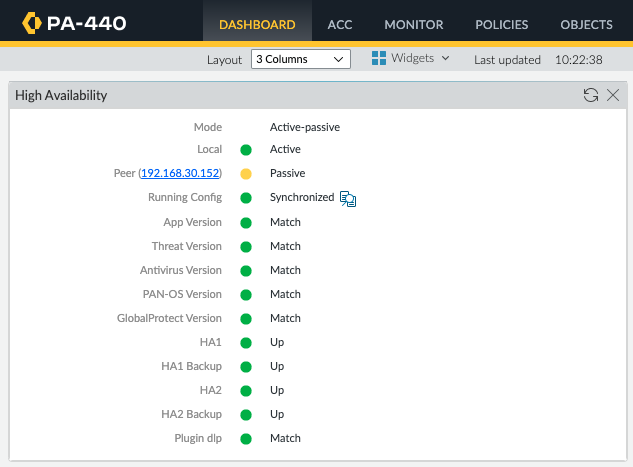

<h2>目錄</h2>

- [1. 環境說明](#1-環境說明)
- [2. HA Communications](#2-ha-communications)
- [3. HA介面設定](#3-ha介面設定)
- [4. HA設定](#4-ha設定)
    - [4.1. General](#41-general)
        - [4.1.1. Setup](#411-setup)
        - [4.1.2. Active/Passive Settings](#412-activepassive-settings)
        - [4.1.3. Election Settings](#413-election-settings)
    - [4.2. HA Communications](#42-ha-communications)
        - [4.2.1. HA1](#421-ha1)
        - [4.2.2. HA1 Backup](#422-ha1-backup)
        - [4.2.3. HA2](#423-ha2)
        - [4.2.4. HA2 Backup](#424-ha2-backup)
    - [4.3. Link and Path Monitoring](#43-link-and-path-monitoring)
        - [4.3.1. Link Monitoring](#431-link-monitoring)
        - [4.3.2. Path Monitoring](#432-path-monitoring)
- [5. HA狀態監控](#5-ha狀態監控)
- [6. 手動切換](#6-手動切換)
  

## 1. 環境說明

- 防火牆型號：PA-440
- 防火牆版本： 11.1.6
- 架構：

| 設備 | 介面 |        IP         |
| :--: | :--: | :---------------: |
| FW1  | MGT  | 192.168.30.151/24 |
| FW1  | E1/8 | 192.168.255.1/24  |
| FW2  | MGT  | 192.168.30.152/24 |
| FW2  | E1/8 | 192.168.255.2/24  |

## 2. HA Communications

Active-Passive HA溝通共需要以下兩種類型的Link，每種類型的Link都可以額外指定Backup Link用於主要Link故障時使用，因為HA1故障會造成Failover故建議一定要設定Backup Link，HA2故障並不會造成Failover故可以不設定Backup Link

- Control Link(HA1)：
    - 用於交換heaerbeats（ICMP）封包確認對方存活狀態
    - 用於發送Hello Message以告知對端目前HA相關設定及狀態
    - 用於同步路由及User-ID資訊
- Data Link(HA2)：
    - 用於同步session table資訊
    - 用於同步forwarding table資訊
    - 用於同步IPSec security associations資訊
    - 用於同步ARP Table

## 3. HA介面設定

!!!note
    1. 部分型號有獨立的HA1、HA1-Backup或HA2 Port，此類型設備在設定時直接選擇專屬的port即可，若沒有的則需要使用in-band port
    2. 若設備沒有HA1 Port則建議使用Management Port當作HA1 Port

選擇要作為HA Port的介面

設定Interface Type為HA

## 4. HA設定

- HA設定並不會同步故需要兩台單獨設定
- HA1 Link是使用ICMP來偵測對端是否存活故設定為HA1的Port一定要允許對端設備IP可以Ping本身

### 4.1. General

#### 4.1.1. Setup

| 編號 |          欄位名稱           | 欄位描述                                                      |
| :--: | :-------------------------: | ------------------------------------------------------------- |
|  1   |        **Enable HA**        | 是否啟用HA                                                    |
|  2   |        **Group ID**         | 用於區別不同的HA Group故要在同一個HA Pair的設備此ID需設定相同 |
|  3   |          **Mode**           | HA類型                                                        |
|  4   |   **Enable Config Sync**    | 是否啟用設定檔同步                                            |
|  5   |   **Peer HA1 IP Address**   | 對端設備HA1 IP Address                                        |
|  6   | **Backup Peer HA1 Address** | 對端設備HA1 Backup IP Address                                 |

#### 4.1.2. Active/Passive Settings

| 編號 |            欄位名稱             | 欄位描述                                                                                                                                                                                                                                                                                           |
| :--: | :-----------------------------: | -------------------------------------------------------------------------------------------------------------------------------------------------------------------------------------------------------------------------------------------------------------------------------------------------- |
|  1   |     **Passive Link State**      | Passive Firewall介面應處於何種狀態，共有兩種設定 1. Shutdown：介面強制關閉，此設定可避免迴圈的可能性。  2. Auto： 介面會是啟用的狀態但是不參與任何封包轉發或ARP學習，此設定可以加快Failover速度但若是Firewall有任何Layer 2介面則不可設定，若沒有則可設定。                                 |
|  2   | **Monitor Fail Hold Down Time** | 若在Link and Path Monitoring設定中的條件有達到時，Active Firewall要進入No-Function狀態多久才會變成Passive。 這樣做可以避免不必要的Failover，例如當有設定監控Ethetnet1/1 Down時要Failover，當切換完成後有可能因為STP關係導致Ethetnet1/1還沒有UP，若無此設定的話就又會Failover一次造成不斷地轉移 |

#### 4.1.3. Election Settings

| 編號 |       欄位名稱        | 欄位描述                                                                                                              |
| :--: | :-------------------: | --------------------------------------------------------------------------------------------------------------------- |
|  1   |  **Device Priority**  | 設備優先級，僅有在有設定Preemptive時才會有作用，數值越低代表越優先成為Active Firewall                                 |
|  2   |    **Preemptive**     | 是否開啟搶佔模式，開啟時需要兩邊均開啟，Priority較低的設備恢復正常功能後會主動接替成為Active Firewall                 |
|  3   | **Heartbeat Backup**  | 是否使用Management Port作為Heartbeat Backup Link。當HA1或HA1 Backup link已經有設定為使用Management Port時就不可以勾選 |
|  4   | **HA Timer Settings** | Hello封包發送間隔以及等待時間等設定。若無特殊需求使用Recommedned即可                                                  |

### 4.2. HA Communications

#### 4.2.1. HA1

本身HA1 Port相關設定

在使用Management Port當作HA Port時不需要額外設定IP，但若是使用其他的Port就需要設定

| 編號 |        欄位名稱        | 欄位描述                                                                                                     |
| :--: | :--------------------: | ------------------------------------------------------------------------------------------------------------ |
|  1   |        **Port**        | 設定HA1要使用的Port                                                                                          |
|  2   | **Encryption Enabled** | 交換的資訊是否加密。若要加密則需要先在Device->Certificates匯出HA Key然後匯入到對端，兩台防火牆都要做相同動作 |
|  3   | **Monitor Hold Time**  | HA1 Port在持續未收到三個Heartbeats或Hello封包後需要等待多久才會宣告Primary HA1 Link fail                     |

#### 4.2.2. HA1 Backup

本身HA1 Backup Port相關設定

| 編號 |       欄位名稱        | 欄位描述                                             |
| :--: | :-------------------: | ---------------------------------------------------- |
|  1   |       **Port**        | 設定HA1 Backup要使用的Port                           |
|  2   | **IPv4/IPv6 Address** | HA1 Backup Port使用的IP                              |
|  3   |      **Netmask**      | HA1 Backup Port使用的Netmask                         |
|  4   |      **Gateway**      | HA1 Backup Port使用的Gateway，若為同網段可以不需設定 |

#### 4.2.3. HA2

本身HA2 Port相關設定

| 編號 |              欄位名稱              | 欄位描述                                                                                                                                            |
| :--: | :--------------------------------: | --------------------------------------------------------------------------------------------------------------------------------------------------- |
|  1   | **Enable Session Synchronization** | 是否要同步session至Passive Firewall以便在切換時不需要重新建立session table                                                                          |
|  2   |              **Port**              | 設定HA2要使用的Port                                                                                                                                 |
|  3   |       **IPv4/IPv6 Address**        | HA2 Port使用的IP，僅有Transport選擇為IP或UDP時才需設定                                                                                              |
|  4   |            **Netmask**             | HA2 Port使用的Netmask，僅有Transport選擇為IP或UDP時才需設定                                                                                         |
|  5   |            **Gateway**             | HA2 Port使用的Gateway，若為同網段可以不需設定                                                                                                       |
|  6   |           **Transport**            | 選擇資料傳輸方式。若為Layer 2選擇Ethernet、Layer 3選擇IP、若需要驗證傳輸完整性則選擇UDP                                                             |
|  7   |         **HA2 Keep-alive**         | 是否要在HA2 Link發送Keep-alive封包，若沒設定則僅有Interface down時才會判定HA2 Link down                                                             |
|  8   |             **Action**             | 當HA2 Link down時要執行的動作。若為Active-Passive模式選擇Log only，因為Split Datapath是在執行Active-Active模式時允許獨立轉發封包而不同步session資訊 |
|  9   |           **Threshold**            | 未收到Keep-alive封包多久才會執行Action                                                                                                              |

#### 4.2.4. HA2 Backup

本身HA2 Backup Port相關設定

| 編號 |       欄位名稱        | 欄位描述                                                    |
| :--: | :-------------------: | ----------------------------------------------------------- |
|  1   |       **Port**        | 設定HA2要使用的Port                                         |
|  2   | **IPv4/IPv6 Address** | HA2 Port使用的IP，僅有Transport選擇為IP或UDP時才需設定      |
|  3   |      **Netmask**      | HA2 Port使用的Netmask，僅有Transport選擇為IP或UDP時才需設定 |
|  4   |      **Gateway**      | HA2 Port使用的Gateway，若為同網段可以不需設定               |

### 4.3. Link and Path Monitoring

HA Failover除了收不到Heartbeat或Hello封包三次會發生外，還可以額外設定監控特定介面或目的地是否可到達來做切換

#### 4.3.1. Link Monitoring

設定監控介面群組是否異常，若異常的話就執行切換

| 編號 |       欄位名稱        | 欄位描述                                                                                 |
| :--: | :-------------------: | ---------------------------------------------------------------------------------------- |
|  1   |      **Enable**       | 是否啟用Link Monitoring                                                                  |
|  2   | **Faliure Condition** | 選擇Any代表任一個設定的介面群組異常時就切換，選擇All代表要所有設定的介面群組異常時才切換 |

一個或多個介面可以組成一個介面群組，針對群組內的介面可以選擇所有介面down才判定為異常或單一介面down就判斷為異常

| 編號 |       欄位名稱        | 欄位描述                                                                                     |
| :--: | :-------------------: | -------------------------------------------------------------------------------------------- |
|  1   |       **Name**        | 介面群組名稱                                                                                 |
|  2   |      **Enable**       | 是否啟用                                                                                     |
|  3   | **Faliure Condition** | 選擇Any代表任一個設定的介面down時就判定為異常，選擇All代表要所有設定的介面down時才判定為異常 |
|  4   |     **INTERFACE**     | 要監控的介面                                                                                 |

#### 4.3.2. Path Monitoring

設定監控路徑群組是否異常，若異常的話就執行切換

| 編號 |       欄位名稱        | 欄位描述                                                                                 |
| :--: | :-------------------: | ---------------------------------------------------------------------------------------- |
|  1   |      **Enable**       | 是否啟用Path Monitoring                                                                  |
|  2   | **Faliure Condition** | 選擇Any代表任一個設定的路徑群組異常時就切換，選擇All代表要所有設定的路徑群組異常時才切換 |

Path Group需依照部署架構新增不同的Group，要監控的路徑是位於Virtual Wire介面者就選擇Add Virtual Wire Path、位於VLAN介面的就選擇Add VLAN Path，若是路由可到達者則選擇Virtual Router Path，其中Virtual Wire及VLAN在新增時需設定來源IP，此IP是用來執行Ping的IP且只需要在此設定不需在其他地方額外設定，IP只要是同網段的都可以

| 編號 |         欄位名稱         | 欄位描述                                                                                                                     |
| :--: | :----------------------: | ---------------------------------------------------------------------------------------------------------------------------- |
|  1   |         **Name**         | 選擇要使用的Virtual Router                                                                                                   |
|  2   |        **Enable**        | 是否啟用                                                                                                                     |
|  3   |  **Faliure Condition**   | 選擇Any代表任一個設定的Destination IP Group異常時就判定為異常，選擇All代表要所有設定的Destination IP Group異常時才判定為異常 |
|  4   |    **Ping Interval**     | 設定多久Ping一次                                                                                                             |
|  5   |      **Ping Count**      | 沒有收到回覆幾次就判定為異常                                                                                                 |
|  6   | **Destination IP Group** | 要測試的IP Group                                                                                                             |

| 編號 |         欄位名稱         | 欄位描述                                                                             |
| :--: | :----------------------: | ------------------------------------------------------------------------------------ |
|  1   | **Destination IP Group** | Destination IP Group名稱                                                             |
|  2   |    **Destination IP**    | 要監控的IP                                                                           |
|  3   |        **Enable**        | 是否啟用                                                                             |
|  4   |  **Faliure Condition**   | 選擇Any代表任一個設定的IP異常時就判定異常，選擇All代表要所有設定的IP異常時才判定異常 |

## 5. HA狀態監控

## 6. 手動切換

要手動切換Active Passive方式就是將Active Firwall HA功能暫停此時就會觸發HA Failover，待確定切換過去後且網路狀態都正常再將原本Active Firewall HA功能恢復作用

