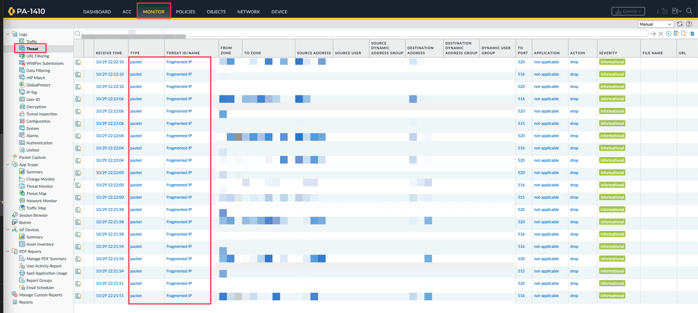

<h2>目錄</h2>

- [1. 環境說明](#1-環境說明)
- [2. 前言](#2-前言)
- [3. 技術原理說明](#3-技術原理說明)
    - [3.1. 什麼是 IP Fragmentation](#31-什麼是-ip-fragmentation)
    - [3.2. 為何 UDP 流量容易有 IP Fragmentation](#32-為何-udp-流量容易有-ip-fragmentation)
    - [3.3. 為何 TCP 流量通常不會有IP Fragmentation](#33-為何-tcp-流量通常不會有ip-fragmentation)
- [4. 如何檢查是否有流量有因 Fragmented traffic 防護功能而被 Drop](#4-如何檢查是否有流量有因-fragmented-traffic-防護功能而被-drop)
- [5. 如何在 GUI 可以看到相關事件](#5-如何在-gui-可以看到相關事件)

<div class="page-break"/>

## 1. 環境說明

- 防火牆型號：PA-1410
- 防火牆版本： 11.1.6-h14

## 2. 前言

Palo Alto 防火牆可利用 Zone Protection Profile 加強入站流量的安全性。其中「Fragmented traffic」功能可自動丟棄所有 IP 層分片封包，有效防止部分 DoS 及碎片滲透攻擊。

<div class="page-break"/>

## 3. 技術原理說明

### 3.1. 什麼是 IP Fragmentation

當 UDP、TCP 或 ICMP 封包內容大小超過 Ethernet MTU（通常是 1500 bytes），IP 層就會將封包分割（fragment）這就是所謂的 IP Fragmentation

### 3.2. 為何 UDP 流量容易有 IP Fragmentation

UDP屬於無連線、沒有「自動分段」機制的協定。UDP傳送資料時，是一次將整個資料內容直接交給IP層。當這個資料內容加上UDP及IP標頭超過 Ethernet MTU，IP層就會自動將大於MTU的UDP封包進行分片（fragmentation）。這種情況常發生在syslog、影音串流、影像監控等應用，因為它們經常需要傳送大量資料，使單一UDP封包容易超過MTU，產生IP分片

### 3.3. 為何 TCP 流量通常不會有IP Fragmentation

MSS（Maximum Segment Size）是 TCP 通訊協定三路握手（SYN/SYN-ACK/ACK）期間由「每一端」在 SYN 封包中單向宣告自己所能接受的單一TCP segment最大資料容量。這個值「不是協商」出來的，每個方向都可以不同，通常由本機網卡的 MTU 減去 IP(20) + TCP(20) header 得出。例如，Ethernet MTU 是 1500 bytes則預設MSS是1460 bytes。
一旦 TCP 連線協定完成，發送資料時發送端就會根據對方宣告的 MSS 把資料切割成多個 segment，確保單一TCP segment payload不會超過這個上限（避免目的端接受不了、或造成IP分片）。而操作系統本身也會確保本機送出封包的大小不會超過本地 MTU，避免產生本地IP Fragmentation。

<div class="page-break"/>

## 4. 如何檢查是否有流量有因 Fragmented traffic 防護功能而被 Drop

可以使用以下指令檢查

```bash
show zone-protection zone <zone名稱>
```

**範例**

顯示的內容中 discard-ip-frag 就是指 Fragmented traffic 防護功能，故可以看到是否有啟用及是否有被drop

```bash
show zone-protection zone trustzone

Zone trustzone, vsys vsys1, profile trustZone Protection
------------------------------------------------------------------------------------------
IPv(4/6) Filter:
  discard-ip-spoof:                           enabled: yes, packet dropped: 0
  discard-ip-frag:                            enabled: yes, packet dropped: 63620
  discard-tcp-syn-with-data:                  enabled: yes, packet dropped: 0
  discard-tcp-synack-with-data:               enabled: yes, packet dropped: 0
IPv4 packet filter:
  discard-strict-source-routing:              enabled: yes, packet dropped: 0
  discard-loose-source-routing:               enabled: yes, packet dropped: 0
  discard-malformed-option:                   enabled: yes, packet dropped: 0
IPv6 packet filter:
  routing-header-0:                             enabled: yes, packet dropped: 0
  routing-header-1:                             enabled: yes, packet dropped: 0
  routing-header-4-252:                         enabled: yes, packet dropped: 0
  routing-header-255:                           enabled: yes, packet dropped: 0
```

<div class="page-break"/>

## 5. 如何在 GUI 可以看到相關事件

預設被 Zone Protection Drop 不會產生相關事件紀錄，但可以於 CLI 執行以下指令後就可以在 Monitor --> Logs --> Threat 看到相關事件

```bash
# 開啟 進階 Threat Log 功能

set system setting additional-threat-log on
```

```bash
# 檢查是否開啟進階Threat Log功能

show system state filter cfg.general.additional-threat-log

# 若顯示以下畫面就代表有開啟

cfg.general.additional-threat-log: True
```

**Threat Log Type 會多出 Packet 類別**

