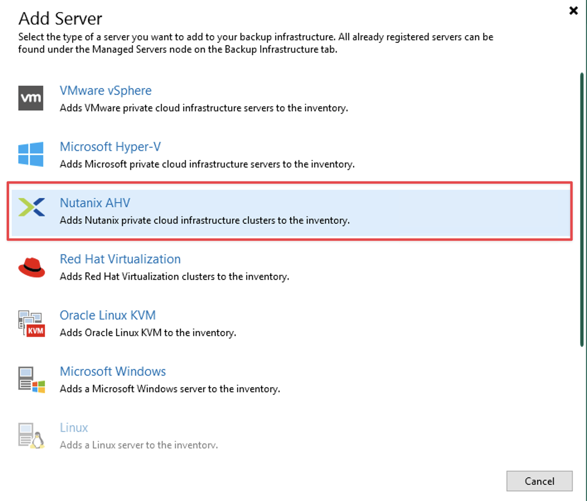
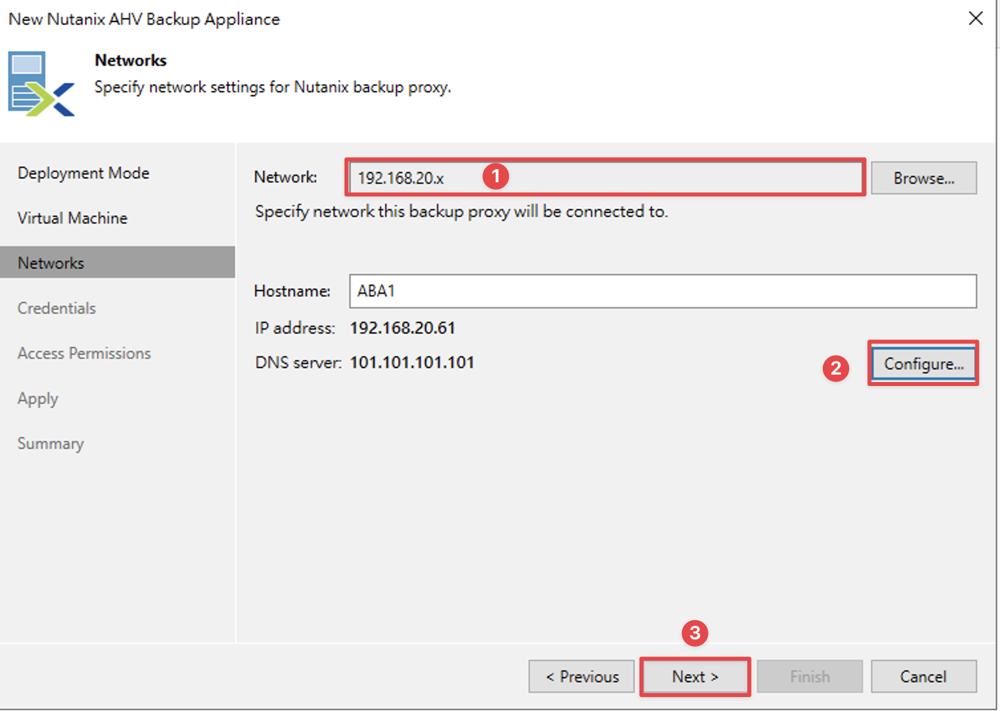
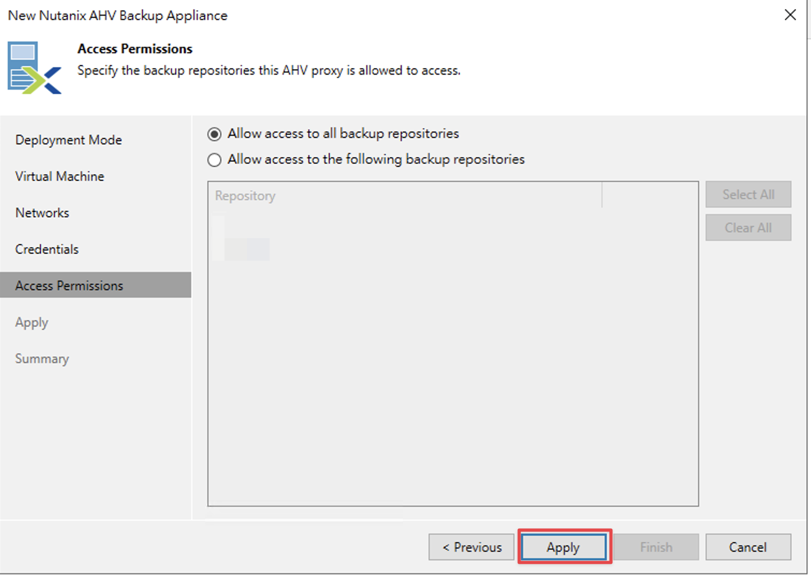
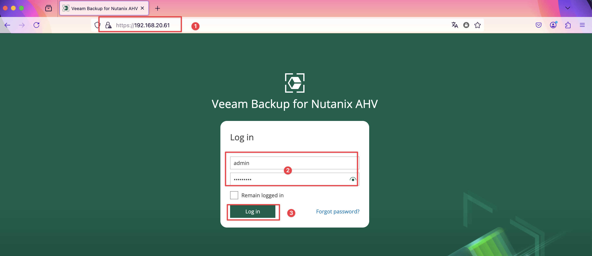
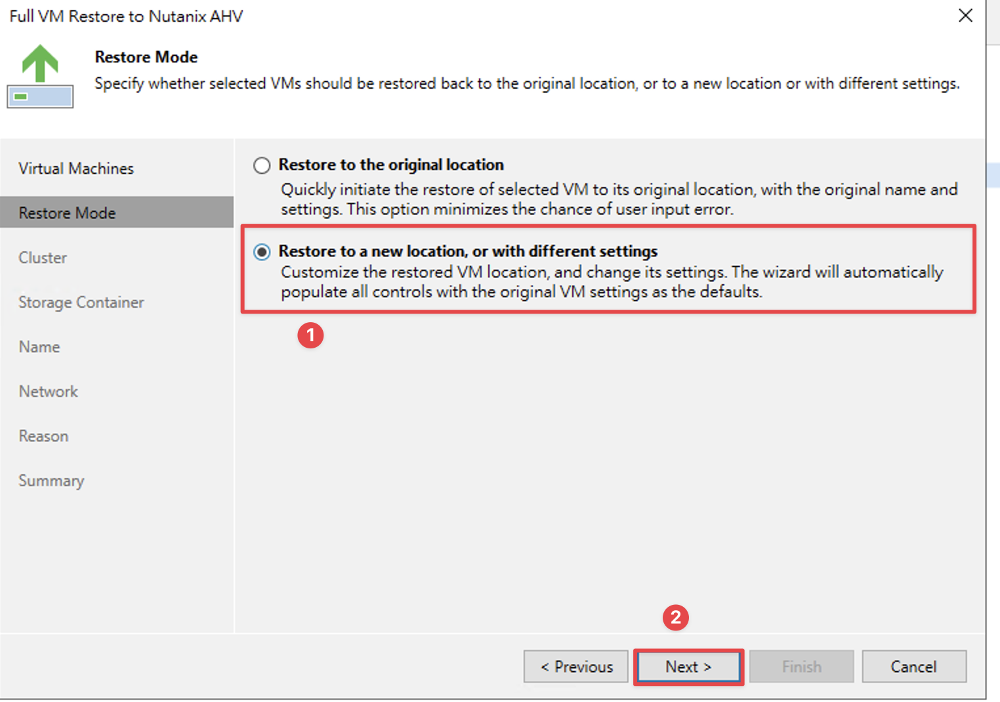

<h2>目錄</h2>

- [1. 環境說明](#1-環境說明)
- [2. 架構說明](#2-架構說明)
- [3. 系統需求](#3-系統需求)
- [4. 設定](#4-設定)
    - [4.1. Nutanix AHV Plug-In](#41-nutanix-ahv-plug-in)
    - [4.2. 新增Managed Servers](#42-新增managed-servers)
    - [4.3. 部署Backup Appliance](#43-部署backup-appliance)
- [5. 管理Backup Appliance](#5-管理backup-appliance)
    - [5.1. 登入方式](#51-登入方式)
    - [5.2. 更新](#52-更新)
- [6. Backup](#6-backup)
- [7. Restore](#7-restore)

## 1. 環境說明

- Veeam版本：12.12
- AHV版本：20230302.103003
- AOS版本：6.10.1

## 2. 架構說明

**Nutanix AHV Cluster**

Nutanix AHV 叢集是一個由 Nutanix Controller VM（CVM）管理的 Nutanix HCI 節點所組成的邏輯群組。在執行備份與還原作業時，Veeam Backup for Nutanix AHV 會使用此 Nutanix AHV 叢集以存取 Nutanix AHV 的資源，例如 VM、磁碟卷群組（volume groups）、儲存容器（storage containers）以及網路。

**Backup Server**

Backup Server是一台安裝了 Veeam Backup & Replication 的 Windows 系統。它是整個備份基礎架構的配置、管理以及核心控制中心，負責協調備份與還原作業、控制工作排程以及管理資源分配。

**Backup Appliance**

Backup Appliance在邏輯層面上位於備份伺服器與其他備份基礎架構元件之間。當備份伺服器負責指派各項任務時，備份虛擬機器則執行管理操作、處理作業並負責傳遞備份流量。這個Backup Appliance是安裝於 Nutanix AHV 叢集上的 Linux 虛擬機器（VM），其中包含以下組件：

- Backup Appliance Web Console：這是一個介面，允許您管理備份和還原作業，並設定 Nutanix AHV 備份虛擬機器的相關設定。

- Veeam Updater：這是一項服務，負責為Backup Appliance安裝與排程更新。

**Nutanix AHV Plug-in**

Nutanix AHV Plug-in 是一個架構組件，可讓Backup Server與Backup Appliance之間進行整合。它也使Backup Server能夠部署並管理Backup Appliance。

**Backup Repositories**

Backup Repositories是一個儲存位置，Veeam Backup for Nutanix AHV 會將受到保護的 Nutanix AHV VM 備份檔案儲存在此。

**Workers**

Workers是一個輔助性質的 Linux Appliance，負責在Backup Appliance與其他備份基礎架構元件之間的互動。當資料在Backup Repositories之間傳輸或接收時，Workers會處理備份工作量並分配備份流量。
預設情況下，Backup Appliance內建一個預先配置好的Workers。在大型環境中，建議部署多個專門的Workers，分散於叢集主機（節點）之間，並在備份或還原程序進行時自動啟動。

## 3. 系統需求

在開始部署 **Veeam Backup for Nutanix AHV** 前，請確保 **Nutanix AHV 叢集**以及**備份基礎架構元件**符合[Veeam Backup for Nutanix AHV Used Guide](https://helpcenter.veeam.com/docs/vbahv/userguide/system_requirements.html)需求，以下為Veeam Backup for Nutanix AHV 7的需求。

| **元件**                | **需求**                                                                                                                                                                                                                                                                                                                                                                                                           |
| -------------------------------- | ------------------------------------------------------------------------------------------------------------------------------------------------------------------------------------------------------------------------------------------------------------------------------------------------------------------------------------------------------------------------------------------------------------------------- |
| **Virtualization Platform**      | - Veeam Backup for Nutanix AHV 與 **Nutanix AOS 版本 6.5.x – 7.0** 以及 **Prism Central 版本 pc.2022.6**（或更高版本）相容。  - 必須在 Nutanix AHV 叢集設定中設定**叢集 IP 位址以及 iSCSI Data Service**。設定方式請參閱[Nutanix Document](https://portal.nutanix.com/page/documents/details?targetId=AHV-Admin-Guide-v6_8:vm-vm-uefi-support-c.html){:target="_blank"}  - Nutanix AHV 環境必須支援 **UEFI 開機**。 |
| **Veeam Software**               | - 需在 Backup Server 上部署 **Veeam Backup & Replication 12.3.0.310 以上** 與 **Nutanix AHV Plug-in 版本 12.7.0.172 以上**。  - 需在 Backup Server 上安裝 **Microsoft .NET Core Runtime 8.0** 與 **Microsoft ASP.NET Core Shared Framework 8.0**。                                                                                                                                                                     |
| **Nutanix AHV Backup Appliance** | Nutanix AHV Backup Appliance 會執行管理操作並處理備份與還原工作（若啟用內建 Worker）。 在部署新 Appliance 或編輯現有 Appliance 的設定時，可依照[Sizing Guidelines](https://helpcenter.veeam.com/docs/vbahv/userguide/sizing_guide.html?ver=7){:target="_blank"}中的建議調整所分配的資源。                                                                                                                              |
| **Workers**                      | Workers 主要在備份過程中處理負載，並在與 Backup Repositories 之間傳輸資料時分配備份流量。 在部署新 Worker 或編輯現有 Worker 的設定時，可依照[Sizing Guidelines](https://helpcenter.veeam.com/docs/vbahv/userguide/sizing_guide.html?ver=7){:target="_blank"}中的建議調整所分配的資源，並修改可同時處理的最大任務數。                                                                                                   |

!!!IMPORTANT  
    Nutanix AHV Backup Appliance 與 Workers 皆為預先配置（最佳化效能）的備份基礎架構元件。**除非 Veeam 技術支援人員要求**，請勿在這些執行 Nutanix AHV Backup Appliance 和 Workers 的 VM 上安裝任何額外軟體或進行任何額外的系統配置調整。

## 4. 設定

### 4.1. Nutanix AHV Plug-In

從Veeam 12.2版起Veeam Backup & Replication就包含Nutanix AHV Plug-In，可至『程式和功能』確認

若沒有Plug-In或需要升級可至[Veeam官網](https://www.veeam.com/availability-nutanix-ahv-download.html){:target="_blank"}下載後執行安裝

### 4.2. 新增Managed Servers

**輸入Prism Cluster IP或Prism Central IP，若是輸入Prism Central IP則被Prism Central納管的Cluster都可被Veeam管控，但不可以兩者混用**

**輸入Prism Cluster或Prism Central帳號密碼**

**File Level Restore(FLR) Helper，是用於當你要執行檔案層級還原且作業系統非Windows時會暫時部署一台Appliance以執行還原程序，當還原完後就會自動刪除**

**此處會詢問是否要部署Proxy(Backup Appliance)，選擇『Yes』就會自動跳轉到部署Proxy頁面或選擇『No』手動部署**

### 4.3. 部署Backup Appliance

| 編號 | 說明                                                                                                    |
| :--: | ------------------------------------------------------------------------------------------------------- |
|  1   | 選擇要部署在哪一個AHV Cluster。                                                                         |
|  2   | 設定此AHV Backup Appliance名稱。                                                                        |
|  3   | 選擇要部署在哪一個Storage Container。                                                                   |
|  4   | 設定此AHV Backup Appliance可同時運行的任務數，任務數越多此AHV Backup Appliance所需的CPU及Memory就越多。 |

**設定此AHV Backup Appliance的Subnet以及IP**

**設定此AHV Backup Appliance的帳號密碼**

**設定此AHV Backup Appliance可以存取的backup repositories**

## 5. 管理Backup Appliance

- AHV Backup Appliance有提供Web console可以用於建立Backup Job、部署Worker、更新AHV Backup Appliance等功能。
- Backup Job不論是在AHV Backup Appliance建立或是使用Veeam Backup & Replication Console建立，相關資訊都會彼此同步
- 部署Worker或更新AHV Backup Appliance僅能在Nutanix AHV backup appliance web console執行
- 當移除Backup Appliance時相關的JOB都會被移除

### 5.1. 登入方式

**https://[ Nutanix AHV backup appliance IP]，帳號密碼為部署時設定的帳密**

### 5.2. 更新

## 6. Backup

Backup job共區分三種類型

|      類型       | 說明            |
| :-------------: | --------------- |
|   Backup job    | 完整VM備份包含VM設定、系統資料、應用程式資料等，此備份檔案是存放於設定的veeam repositories。 |
|  Snapshot job   | 使用AHV內建功能幫VM建立snapshot，此快照檔是存放於AHV Cluster。 |
| PD snapshot job |針對需要同時快照的VM會使用AHV內建功能幫VM建立PD snapshot。|

以下為使用Veeam Backup & Replication Console建立Backup Job方式

| 編號 | 說明            |
| :--: | --------------- |
|  1   | 設定此job名稱。 |
|  2   | 設定此job類型。 |

## 7. Restore

<h2 class="no-print">參考資料</h2>

- [Veeam Backup for Nutanix AHV User Guide](https://helpcenter.veeam.com/docs/vbahv/userguide){:target="_blank" class="no-print"}
- [Veeam Backup and Recovery with Nutanix Best Practices](https://portal.nutanix.com/page/documents/solutions/details?targetId=BP-2017-Veeam-on-Nutanix:BP-2017-Veeam-on-Nutanix){:target="_blank" class="no-print"}