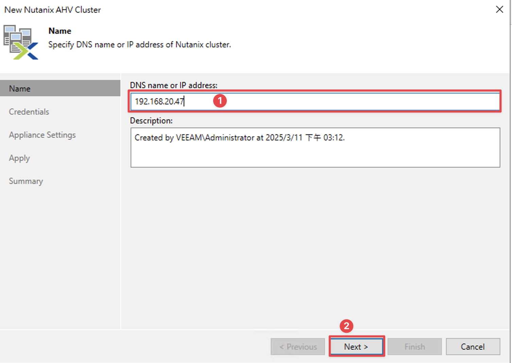
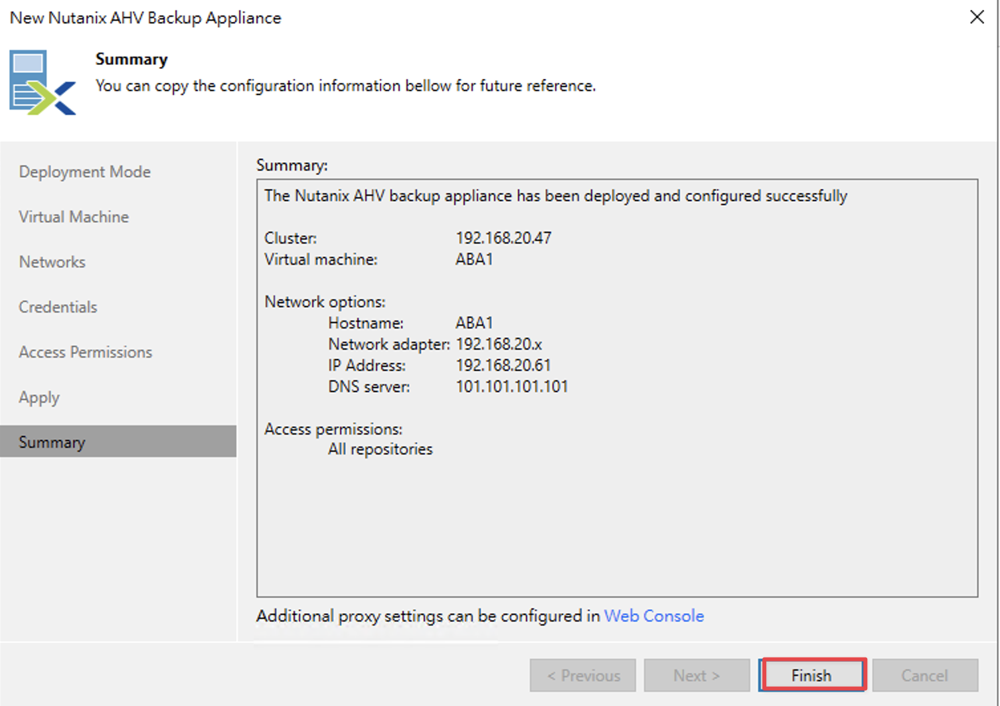
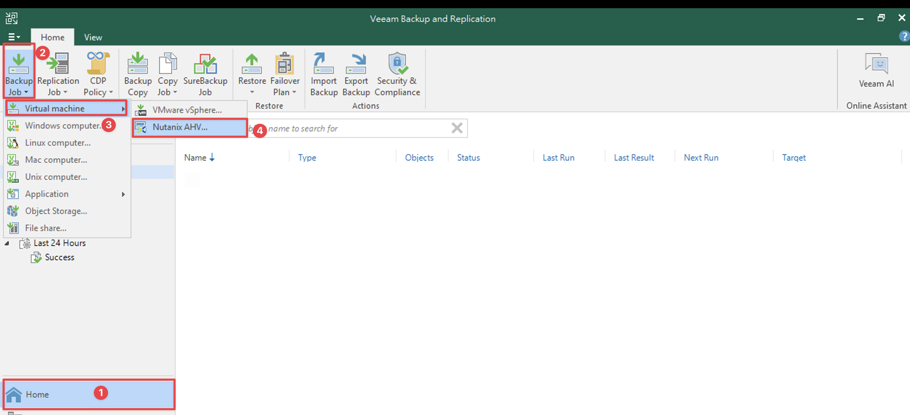

<h2>目錄</h2>
- [1. 環境說明](#1-環境說明)

## 1. 環境說明

- Veeam版本：12.12
- AHV版本：
- PRISM版本：

## 2. 架構說明

**Nutanix AHV Cluster**

Nutanix AHV 叢集是一個由 Nutanix Controller VM（CVM）管理的 Nutanix HCI 節點所組成的邏輯群組。在執行備份與還原作業時，Veeam Backup for Nutanix AHV 會使用此 Nutanix AHV 叢集以存取 Nutanix AHV 的資源，例如 VM、磁碟卷群組（volume groups）、儲存容器（storage containers）以及網路。

**Backup Server**

Backup Server是一台安裝了 Veeam Backup & Replication 的 Windows 系統。它是整個備份基礎架構的配置、管理以及核心控制中心，負責協調備份與還原作業、控制工作排程以及管理資源分配。

**Backup Appliance**

Backup Appliance在邏輯層面上位於備份伺服器與其他備份基礎架構元件之間。當備份伺服器負責指派各項任務時，備份虛擬機器則執行管理操作、處理作業並負責傳遞備份流量。這個Backup Appliance是安裝於 Nutanix AHV 叢集上的 Linux 虛擬機器（VM），其中包含以下組件：

- Backup Appliance Web Console：這是一個介面，允許您管理備份和還原作業，並設定 Nutanix AHV 備份虛擬機器的相關設定。

- Veeam Updater：這是一項服務，負責為Backup Appliance安裝與排程更新。

**Nutanix AHV Plug-in**

Nutanix AHV Plug-in 是一個架構組件，可讓Backup Server與Backup Appliance之間進行整合。它也使Backup Server能夠部署並管理Backup Appliance。

**Backup Repositories**

Backup Repositories是一個儲存位置，Veeam Backup for Nutanix AHV 會將受到保護的 Nutanix AHV VM 備份檔案儲存在此。

**Workers**

Workers是一個輔助性質的 Linux Appliance，負責在Backup Appliance與其他備份基礎架構元件之間的互動。當資料在Backup Repositories之間傳輸或接收時，Workers會處理備份工作量並分配備份流量。
預設情況下，Backup Appliance內建一個預先配置好的Workers。在大型環境中，建議部署多個專門的Workers，分散於叢集主機（節點）之間，並在備份或還原程序進行時自動啟動。

## 3. Backup流程

## 4. Restore流程

## 5. 先決條件

在開始部署 **Veeam Backup for Nutanix AHV** 前，請確保 **Nutanix AHV 叢集**以及**備份基礎架構元件**符合以下需求。

| **Specification**                         | **Requirement**                                                                                                                                                                                                                                                                                                                                                                                                                                                                                                                                                                                                                                                                                                                                                                                           |
|------------------------------------------|------------------------------------------------------------------------------------------------------------------------------------------------------------------------------------------------------------------------------------------------------------------------------------------------------------------------------------------------------------------------------------------------------------------------------------------------------------------------------------------------------------------------------------------------------------------------------------------------------------------------------------------------------------------------------------------------------------------------------------------------------------------------------------------------------------|
| **Virtualization Platform**              | - Veeam Backup for Nutanix AHV 與 **Nutanix AOS 版本 6.5.x – 7.0** 以及 **Prism Central 版本 pc.2022.6**（或更高版本）相容。  - 必須在 Nutanix AHV 叢集設定中設定叢集 IP 位址以及 iSCSI Data Service。設定方式請參閱[Nutanix Document](https://portal.nutanix.com/page/documents/details?targetId=AHV-Admin-Guide-v6_8:vm-vm-uefi-support-c.html){:target="_blank"}  - Nutanix AHV 環境必須支援 **UEFI 開機**。|
| **Veeam Software**                        | - 需在 Backup Server 上部署 **Veeam Backup & Replication 版本 12.3.0.310（或更高）** 與 **Nutanix AHV Plug-in 版本 12.7.0.172（或更高）**。  - 需在 Backup Server 上安裝 **Microsoft .NET Core Runtime 8.0** 與 **Microsoft ASP.NET Core Shared Framework 8.0**。                                                                                                                                                                                                                                                                                                                                                                                                                                                                                                     |
| **Nutanix AHV Backup Appliance**         | Nutanix AHV Backup Appliance 會執行管理操作並處理備份與還原工作（若啟用內建 Worker）。若以預設配置部署 Veeam Backup for Nutanix AHV，將為此 Appliance 分配以下資源：   - **CPU：6 vCPU**  - **Memory：6 GB RAM**  - **Disk Space：100 GB**（用於產品安裝、內部資料庫檔案和日誌） 使用預設配置時，此 Backup Appliance 可在少於 1000 台 VM 的叢集中執行管理操作、處理少於 100 筆工作（Jobs），並同時處理最多 4 筆備份和還原任務。 在部署新 Appliance 或編輯現有 Appliance 的設定時，可依照[Sizing Guidelines](https://helpcenter.veeam.com/docs/vbahv/userguide/sizing_guide.html?ver=7){:target="_blank"}中的建議調整所分配的資源。                                                                                                                                                                                                                 |
| **Workers**                               | Workers 主要在備份過程中處理負載，並在與 Backup Repositories 之間傳輸資料時分配備份流量。若以預設配置部署 Worker VM，將為其分配以下資源：  - **CPU：6 vCPU**  - **Memory：6 GB RAM**  - **Disk Space：100 GB**（用於產品安裝和日誌） 使用預設配置時，單一 Worker 可同時處理最多 4 筆備份和還原任務。 在部署新 Worker 或編輯現有 Worker 的設定時，可依照[Sizing Guidelines](https://helpcenter.veeam.com/docs/vbahv/userguide/sizing_guide.html?ver=7){:target="_blank"}中的建議調整所分配的資源，並修改可同時處理的最大任務數。 |

!!!IMPORTANT  
    Nutanix AHV Backup Appliance 與 Workers 皆為預先配置（最佳化效能）的備份基礎架構元件。**除非 Veeam 技術支援人員要求**，請勿在這些執行 Nutanix AHV Backup Appliance 和 Workers 的 VM 上安裝任何額外軟體或進行任何額外的系統配置調整。

## 6. 設定

在設定前需先確認以下事項已經完成

**Nutanix AHV Cluster IP Address以及 iSCSI Data Service IP Address已完成設定**

**Veeam Backup Server有安裝Nutanix AHV Plug-In**

從Veeam 12.2版起Veeam Backup & Replication就包含Nutanix AHV Plug-In

### 6.1. 新增Managed Servers

輸入Prism Cluster IP或Prism Central IP，若是輸入Prism Central IP則被Prism Central納管的Cluster都可被Veeam管控，但不可以兩者混用

輸入Prism Cluster或Prism Central帳號密碼

<h2 class="no-print">參考資料</h2>

- [Veeam Backup for Nutanix AHV User Guide](https://helpcenter.veeam.com/docs/vbahv/userguide){:target="_blank" class="no-print"}
- [Veeam Backup and Recovery with Nutanix Best Practices](https://portal.nutanix.com/page/documents/solutions/details?targetId=BP-2017-Veeam-on-Nutanix:BP-2017-Veeam-on-Nutanix){:target="_blank" class="no-print"}