<h2>目錄</h2>

- [1. 下載Token](#1-下載token)
- [2. 變更 vCenter 更新儲存庫URL](#2-變更-vcenter-更新儲存庫url)
- [3. 變更 ESXI 更新儲存庫 URL](#3-變更-esxi-更新儲存庫-url)

<div class="page-break"/>

## 1. 下載Token

!!!note
    以下動作使用的帳號必須要擁有該Site的**Product Administrator**權限才可執行，若沒有的話可以依照參考資料連結賦予相關權限。

**登入[Broadcom Support Portal](https://support.broadcom.com/){:target="_blank"}**

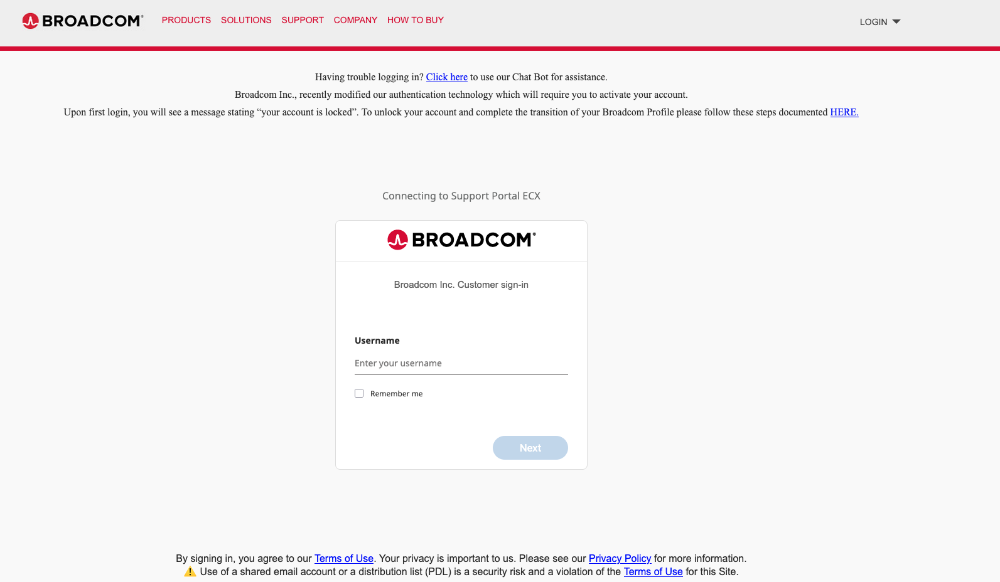

<div class="page-break"/>

**在使用者名稱旁的下拉選單中，選擇 「VMware Cloud Foundation」**

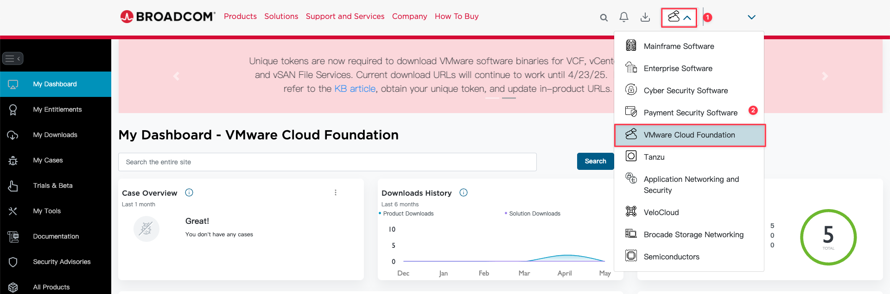

**確認畫面左上方已選取 「My Dashboard」**

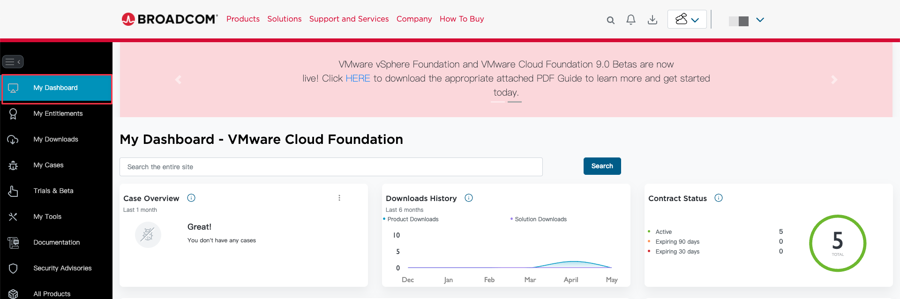

**在畫面右下方 「Quick Links」 區域，點擊 「Generate Download Token」**

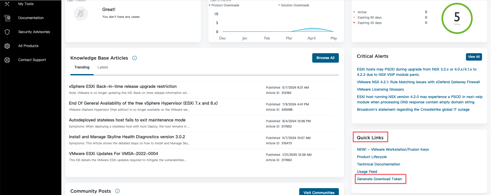

<div class="page-break"/>

**選擇正確的 Site ID，然後按 「Generate Token」**

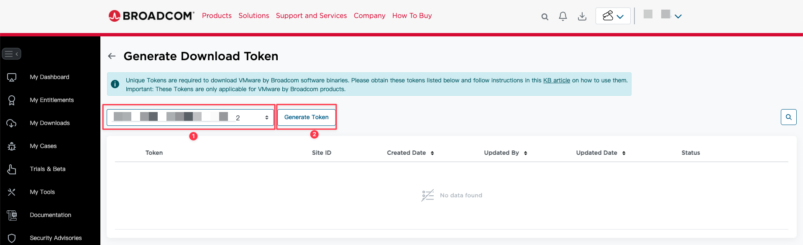

**複製產生的Token**

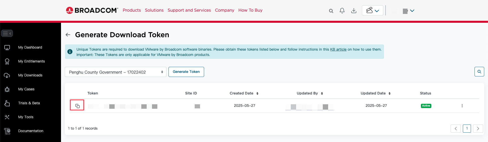

<div class="page-break"/>

## 2. 變更 vCenter 更新儲存庫URL

**登入 VAMI 管理介面**

```cpp
https://<vcenter_server_fqdn_or_IP>:5480
```

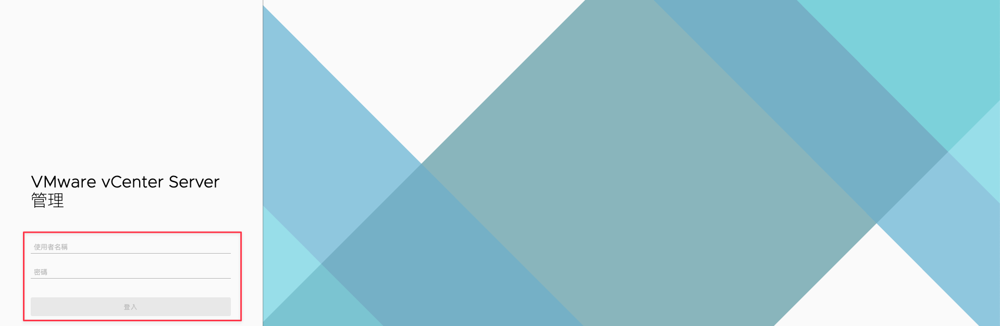

<div class="page-break"/>

點選「更新」分頁，按一下右上角的「設定」

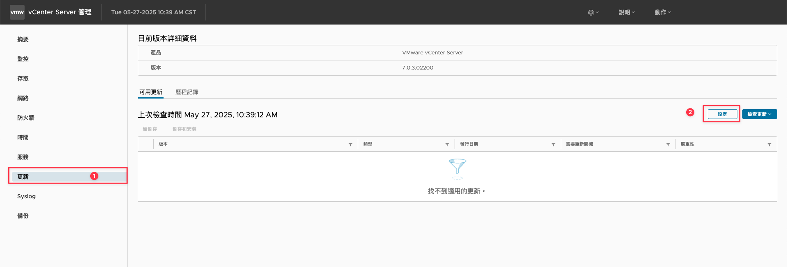

將存放庫設定URL由「預設值」改成「指定」，並依據不同版本輸入不同URL， **<Download Token\>** 要輸入上個步驟獲取的Token

**Vcenter Server 7.x**

```cpp
https://dl.broadcom.com/<Download Token>/PROD/COMP/VCENTER/vmw/8d167796-34d5-4899-be0a-6daade4005a3/7.0.3.02200
```

**Vcenter Server 8.x**

```cpp
https://dl.broadcom.com/<Download Token>/PROD/COMP/VCENTER/vmw/8d167796-34d5-4899-be0a-6daade4005a3/8.0.3.00400

```

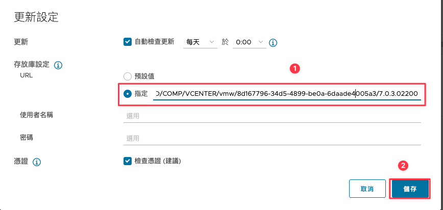

<div class="page-break"/>

**確認可以正確獲得更新清單**

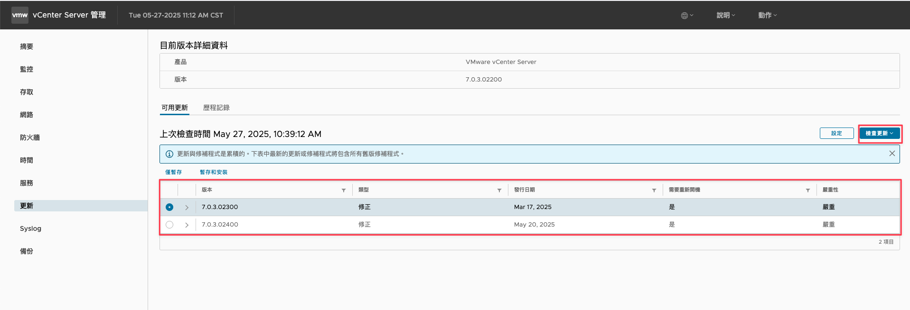

<div class="page-break"/>

## 3. 變更 ESXI 更新儲存庫 URL

**登入 vCenter Server 管理介面**

```cpp
https://<vcenter_server_fqdn_or_IP>
```

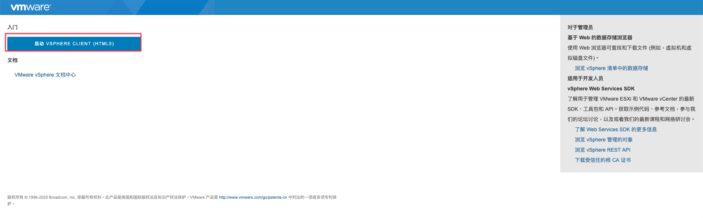

<div class="page-break"/>

**切換至Lifecycle Manager設定頁面**

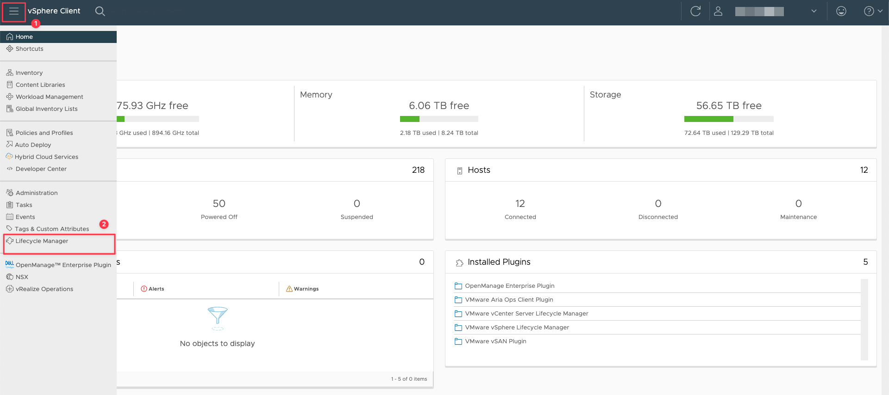

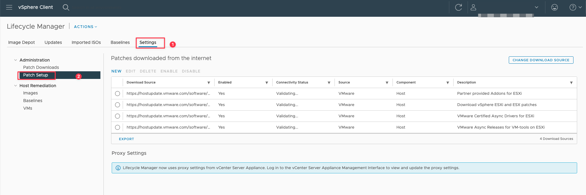

<div class="page-break"/>

**停用預設儲存庫**

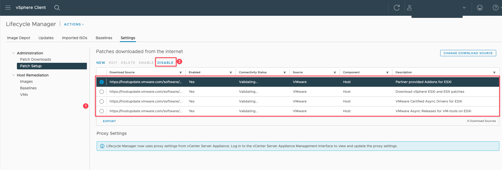

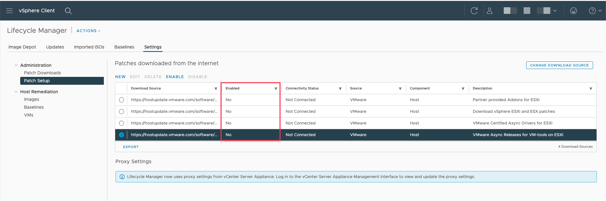

<div class="page-break"/>

**新增自訂儲存庫**

共有四個，步驟相同， **<Download Token\>** 要輸入上個步驟獲取的Token

```cpp
https://dl.broadcom.com/<Download Token>/PROD/COMP/ESX_HOST/main/vmw-depot-index.xml
```

```cpp
https://dl.broadcom.com/<Download Token>/PROD/COMP/ESX_HOST/addon-main/vmw-depot-index.xml
```

```cpp
https://dl.broadcom.com/<Download Token>/PROD/COMP/ESX_HOST/iovp-main/vmw-depot-index.xml
```

```cpp
https://dl.broadcom.com/<Download Token>/PROD/COMP/ESX_HOST/vmtools-main/vmw-depot-index.xml
```

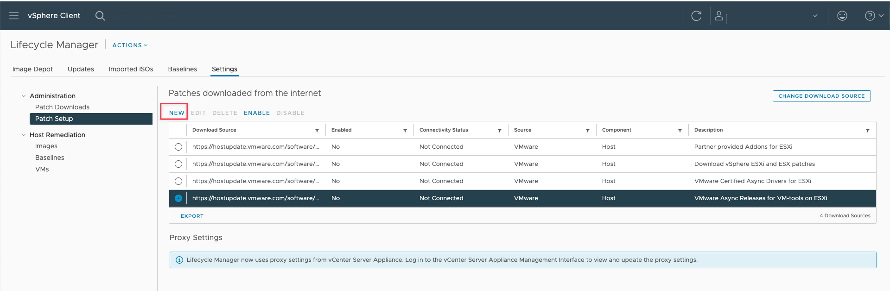

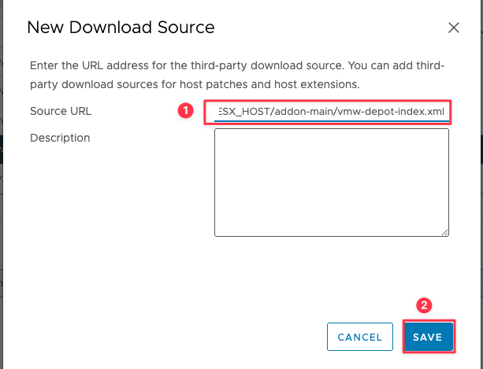

<div class="page-break"/>

**登入 VAMI 管理介面重啟Vmware vSphere Update Manager**

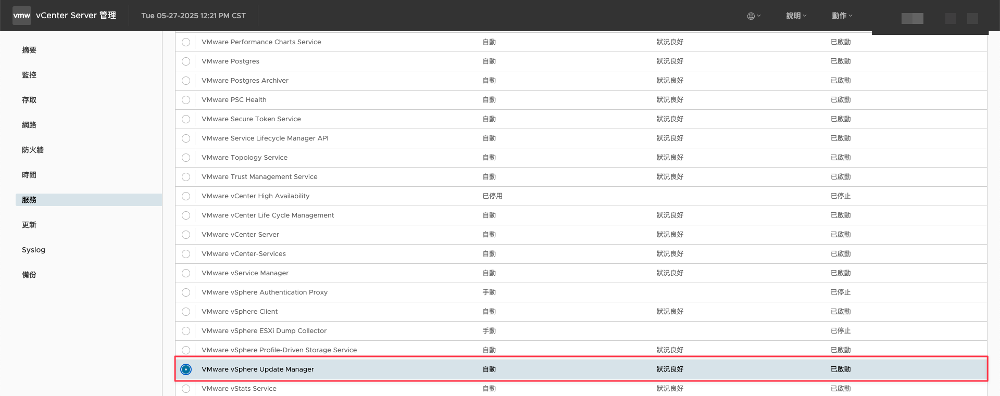

**同步更新資料**

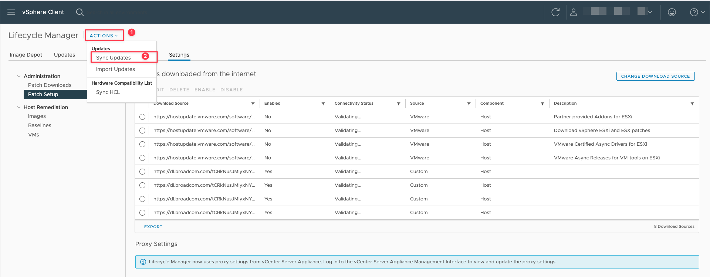

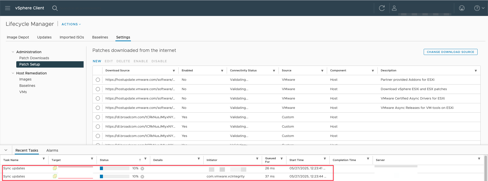

<div class="page-break"/>

<h2>參考資料</h2>

- [VCF authenticated downloads configuration update instructions](https://knowledge.broadcom.com/external/article/390098){:target="_blank"}
- [Unable to patch the vCenter via VAMI as it fails to download the updates from Broadcom public repositories](https://knowledge.broadcom.com/external/article/390120){:target="_blank"}
- [Error: A general system error occurred: Failed to download VIB(s): Error: HTTP Error Code: 403](https://knowledge.broadcom.com/external/article/390121){:target="_blank"}
- [Manage user permissions and Site ID access as a User Administrator](https://knowledge.broadcom.com/external/article/269883/manage-user-permissions-and-site-id-acce.html){:target="_blank"}
- [Request the Product Administrator role to manage Portfolio License Agreement (PLA) products and also to get option for "Generate Download Token"](https://knowledge.broadcom.com/external/article/206833/request-the-product-administrator-role-t.html){:target="_blank"}